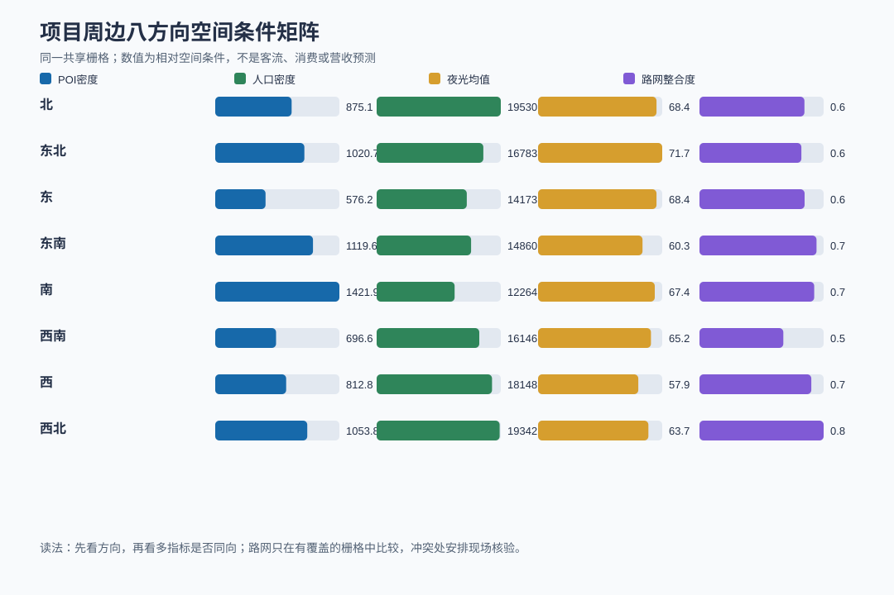
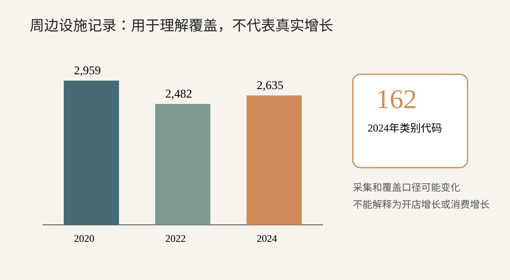
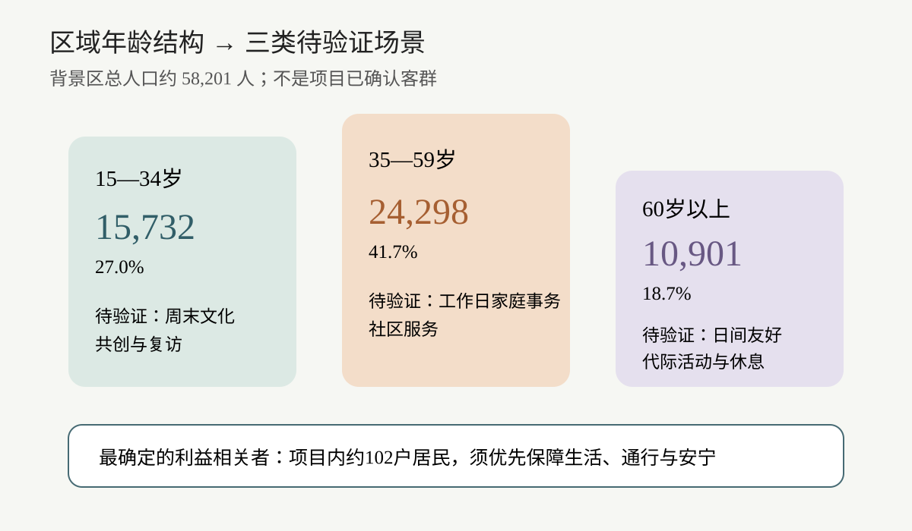
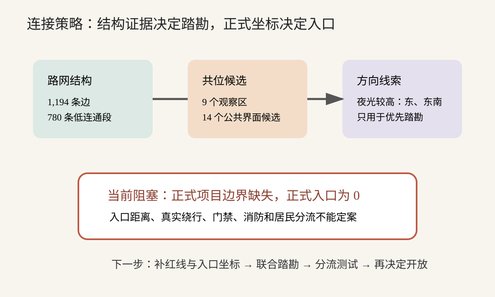

# 原长沙县政府旧址更新：目标、策略与验证报告

## 一句话结论
先守住保护与居民生活底线；空间上先把南侧作为功能集中带、东北作为傍晚界面、北/西北作为日常到达方向去核验，而不是用POI、夜光或人口直接承诺客流。之后再以礼堂、活动中心、主路径和东侧庭院运行低容量内容样板。

## 项目目标与当前要作出的决定
本项目不是先给13栋建筑逐一填功能，而是先回答旧址更新要守住什么、服务谁、形成什么内容与运营方式，再让建筑和空间单元承载这些策略。当前材料足以支持底线、方向与首期试验，但不足以支持终局招商、收入或投资回报承诺。

### 材料明确的目标
- 修复安全与设施问题，保护历史建筑，并保障约102户居民正常生活。
- 盘活原长沙县政府旧址，提高闲置空间利用效率。
- 以“一路、一院、一园”和礼堂核心空间组织公共活动、居民通行和园区运营。

### 基于材料形成的工作判断
- **形成可持续的园区运营能力。**：项目材料同时提出空间盘活、公共活动、文旅联动和居民共生；只有把内容、服务和运营责任一起验证，空间更新才可持续。
- **探索文旅联动、社区服务与居民共生的组合，而不是单一游客商业化。**：保护建筑、现状居民、礼堂公共记忆和周边区域设施共同要求兼顾外来使用与本地日常。

### 必须守住的底线
- 保护建筑先完成测绘、结构、消防和权属核验。
- 住宅、居民花园及居民日常通行不因公共开放而被挤占。
- 缺少客流、消费、成本和收入数据时，不作招商规模、营收或回报承诺。

### 当前需要回答的决策问题
- 首期优先服务哪些真实使用场景？
- 哪些内容和公共服务值得先做低成本试验？
- 外部连接和内部动线应先核验什么？
- 哪些建筑与空间可以承载首期策略，哪些必须暂缓？
- 0—180天用什么数据决定继续、调整或停止？

### 目标之间需要处理的张力
- **提高空间利用率与保护、消防条件之间存在速度张力。**：首期只能选择条件相对清楚、可逆改造的少量空间。
- **园区活力与居民安宁之间存在时段、噪声和动线张力。**：内容、入口和开放时段必须先低容量验证。

### 尚未明确，不能替项目补造
| 待确认事项 | 它会改变什么 | 当前处理方式 |
| --- | --- | --- |
| 商业经营强度、稳定付款方和收入结构是什么？ | 会改变招商比例、团队配置和长期运营模式。 | 需要业主确认后再作终局判断 |
| 投资上限、年度成本和回报要求是什么？ | 会改变修缮范围、分期速度和停止条件。 | 需要业主确认后再作终局判断 |
| 目标客流、开放时段和居民可接受边界是什么？ | 会改变容量、入口、活动频率和安保方案。 | 先作为验证条件，不阻塞可独立分析 |

### 项目应形成的整体
- 共同栅格显示不同方向的设施、人口、亮度和道路条件并不同步；因此方向只用于安排白天/傍晚踏勘和连接核验，不直接替代入口测绘或经营判断。
- 项目的首期价值不是一次性“填满13栋楼”，而是证明公共文化、社区服务和居民共生能否形成重复使用与明确运营责任。
- 区域设施、人口、夜光和路网用于选择试验方向；项目级客流、消费、收入和回报仍未知，不能由代理数据补造。

### 本轮怎么比较
- 使用同一351格共享栅格，以项目中心划分八方向和0—500m、500—1,000m、1,000—1,600m距离带；比较POI密度/类别、人口密度、夜光均值、路网覆盖和有覆盖单元的路网密度/整合度。
- 比较15—34岁、35—59岁、60岁以上三个年龄组，并与项目内约102户居民这一确定利益相关者对照。
- 将路网结构、POI—路网共位、夜光方向与入口就绪度交叉比较；结构指标只用于筛选踏勘方向。
- 把区域设施多样性与年龄场景、居民底线对照，区分可立即试验、需伙伴共创和暂不承诺三类产品。
- 逐一核对13栋建筑、主路径、3个庭院、居民花园、入口和后勤接口；比较建议推进、条件未满足暂缓、本阶段不纳入。
- 按0—30天、31—90天、91—180天比较证据成熟度、投入不可逆性和停止成本。

### 核心待验证假设
| 当前假设 | 它会改变什么决策 | 怎么验证 |
| --- | --- | --- |
| 首期以公共文化、社区服务和低强度文旅体验组合，比直接大规模招商更符合现有证据。 | 决定首批内容、建筑数量与活动容量。 | 用90天真实到访、复访、居民反馈和全成本记录验证。 |
| 东、东南方向更值得优先踏勘外部联系，但不能据此直接确定入口。 | 决定现场踏勘和入口测绘优先级。 | 补齐红线与入口坐标后进行真实路径、门禁和消防校核。 |

## 区域方向：先看哪里，为什么
**本章要点：南侧先看功能集中，东北侧先看傍晚界面，北侧和西北侧先看日常到达；东、东南和西南的冲突或薄弱条件要先核验，不能直接导流。**

这次空间数据真正帮助项目回答的是“先去哪个方向核验什么”，而不是证明哪一侧一定有客流。把POI、人口、夜光和路网放到同一批栅格后，可以看出不同方向的条件并不同步。

### 同一批栅格让四类数据可以放在一起看
这次不是只看“周边有多少设施”。我们把351个共同栅格作为同一张底图：每个格子同时记录POI、人口、夜光和路网条件，再按项目中心划分八个方向和三个距离带。这样才能知道某个方向是“设施多但路不好”，还是“人口和道路同时较强”。

### 南侧是设施最集中的方向，但不等于项目客流最高
南侧POI密度约1,421.9个/平方公里，是八个方向中最高的，餐饮、购物、住宿和医疗较集中；但人口密度只有约12,264人/平方公里。它适合优先去看公共界面和周边功能如何与项目衔接，不适合直接写成“南侧客流最大”。

### 东北侧最亮，应该在傍晚去看，但不能只看亮度
东北侧夜光均值约71.7，为八方向最高；POI密度也高于总体平均，且约80.8%的栅格有路网覆盖。不过，有路网栅格的整合度反而低于总体平均，说明“亮”不一定等于“好走”。这里最值得做的是工作日傍晚的步行踏勘。

### 北侧和西北侧更像日常使用核验方向
北侧和西北侧的人口密度都接近1.95万人/平方公里。西北侧POI密度较高、路网整合度也较高，但只有约62.8%的栅格有路网数据。因此可以先验证社区服务、日常到达和低强度共享场景，同时核对道路是否真的接到项目边界。

### 东、东南、西南的矛盾不能被平均掉
东侧亮度较高但POI和人口不强；东南侧设施较多、道路覆盖较广，却是夜光最低且路网密度偏低的方向；西南侧POI较少、道路整合度最低。它们不是简单的“机会低”，而是提醒项目先补齐人行、界面和时段证据，再决定是否导流。

### 这轮数据能支持与不能支持的判断
| 数据 | 真实结果 | 可以怎样使用 | 不能直接推出 |
| --- | --- | --- | --- |
| 共同空间单元 | 351个栅格；2.665平方公里；POI、人口、夜光和路网同一格对齐 | 比较项目周边不同方向 | 不能替代正式红线和入口测绘 |
| 2024 POI | 已分配2,541个；约953.5个/平方公里；餐饮、购物、公司最多 | 看现有功能供给和类别差异 | 不能当作客流、消费或项目需求 |
| 2026人口 | 共同栅格平均约16,581人/平方公里 | 识别日常使用条件和居民核验方向 | 不能直接当作项目客群 |
| 2025夜光 | 共同栅格平均约66.0；东北约71.7最高 | 安排傍晚/夜间现场核验 | 不能证明夜间消费 |
| 路网 | 253/351个栅格有覆盖；有覆盖栅格整合度均值约0.663 | 判断道路覆盖和连接核验优先级 | 不能证明入口可用或人行体验 |

### 项目周边八个方向：先看哪里，为什么
| 方向 | POI密度（个/平方公里） | 人口密度（人/平方公里） | 夜光均值 | 路网覆盖 | 有覆盖单元路网密度（公里/平方公里） | 有覆盖单元整合度 | 普通语言读法 | 首要验证动作 |
| --- | --- | --- | --- | --- | --- | --- | --- | --- |
| 北 | 875.1 | 19,530.7 | 68.4 | 71.2% | 36.6 | 0.646 | 人口和道路密度较高，适合日常服务核验 | 核对社区到达、安静时段和居民边界 |
| 东北 | 1,020.7 | 16,783.9 | 71.7 | 80.8% | 23.4 | 0.627 | 最亮且功能较多，但道路结构未同步领先 | 安排工作日傍晚步行，核对界面连续性 |
| 东 | 576.2 | 14,173.4 | 68.4 | 70.0% | 18.5 | 0.647 | 亮度较高但功能和人口不强，存在解释冲突 | 现场确认亮度对应的实际公共界面 |
| 东南 | 1,119.6 | 14,860.0 | 60.3 | 83.3% | 11.3 | 0.720 | 设施存在，但亮度和道路密度不强；条件不同步 | 核对夜间可见性、人行连接和是否适合导流 |
| 南 | 1,421.9 | 12,264.4 | 67.4 | 74.1% | 18.9 | 0.706 | 设施最密，但居住人口较低；更像外部功能集中带 | 踏勘公共界面、同类设施和到达体验 |
| 西南 | 696.6 | 16,146.9 | 65.2 | 63.2% | 15.7 | 0.516 | POI较少且道路结构弱，不宜先做主导流方向 | 核对最后一段到达和居民边界修复 |
| 西 | 812.8 | 18,148.6 | 57.9 | 74.5% | 15.0 | 0.688 | 人口较高但夜间亮度最低，宜低扰动 | 优先核对居民生活和夜间安静边界 |
| 西北 | 1,053.8 | 19,342.5 | 63.7 | 62.8% | 23.7 | 0.764 | 日常使用和道路结构可能叠加，但覆盖不完整 | 核对具体道路是否接到项目边界 |

> 接下来需要关注：方向矩阵只给出核验优先级；下一步要把这些空间条件转成人群场景、连接方式和低承诺试验。

## 人群场景：先验证谁在什么时间使用
**本章要点：先把人群变成可验证场景，而不是把58,201人写成项目客群。**

本项目最确定的人群是现状居民；周边年龄结构只帮助设计不同时间和内容的试验。

### 三个年龄组对应三种待验证场景
35—59岁规模最大，可测试工作日家庭事务和社区服务；15—34岁可测试周末文化活动；60岁以上要求无障碍、休息和低噪声。三者都是待验证假设。

### 约102户居民先于外来流量
居民不是“潜在客群”概念，而是日常生活直接受项目影响的人。公共开放必须先明确居民通行、安静时段和投诉响应。

### 人群不是标签，而是待验证使用场景
| 证据对象 | 已知规模 | 先验证的场景 | 主要边界 |
| --- | --- | --- | --- |
| 35—59岁 | 24,298人，41.7% | 工作日家庭事务与社区服务 | 不是已确认到访者 |
| 15—34岁 | 15,732人，27.0% | 周末文化与共创活动 | 不能推断消费能力 |
| 60岁以上 | 10,901人，18.7% | 日间友好、休息与代际活动 | 需要无障碍和低噪声 |
| 现状居民 | 约102户 | 居民议事、便民和日常共享 | 优先保障生活与通行 |

> 接下来需要关注：人群场景明确后，首期内容必须转成可运行、可计数的小样。

## 内容与运营：首期先跑通四类小样
**本章要点：首期不是“给每栋楼找业态”，而是先跑通四类可验证内容。**

把礼堂和活动中心作为小样载体，先验证真实使用与运营责任，再决定是否扩大到更多建筑。

### 两个明确载体先起步
礼堂可承担低容量历史文化活动，活动中心可承担居民议事、便民、亲子和代际活动。两者的依据比其他楼名更充分。

### 四类内容小样代替一个大主题
历史文化解释、居民服务、青年共创和代际活动分别测试不同人群、时段和组织伙伴。它们可以组合，但不要求一次做大。

### 经营未知就先做可逆试验
付款方、收入目标和成本上限未明确。首期要记录每场活动的人员、复访、投诉、伙伴投入和全成本，避免用热闹代替可持续。

### 首期内容产品组合
| 产品小样 | 主要服务场景 | 首选载体 | 验证重点 |
| --- | --- | --- | --- |
| 历史文化解释 | 公众、学校、小团队 | 礼堂与东侧庭院 | 理解度、停留、组织伙伴 |
| 居民日常服务 | 现状居民与家庭 | 活动中心 | 使用频率、满意度、投诉 |
| 青年文化共创 | 15—34岁待验证场景 | 礼堂小型时段 | 复访、伙伴投入、噪声 |
| 代际活动 | 家庭与老年友好场景 | 活动中心与中部庭院 | 无障碍、重复参与、时段 |

> 接下来需要关注：内容组合被接受后，再由建筑和空间单元承担，不反过来按楼名找业态。

## 连接与动线：先踏勘，再定入口
**本章要点：先把“哪里值得看”与“哪里可以开入口”分开。**

现有数据足以安排踏勘优先级，但正式边界和入口坐标缺失，任何入口结论都不能定案。

### 路网强弱用于安排现场工作
1,194条路网边显示背景区连接条件并不均匀。高整合、高选择度与低连通段应一起看，避免只看主路而忽略最后一段到达障碍。

### 14个候选不是14个入口
共位结果只是观察区和公共界面候选。它的作用是缩小现场范围，而不是替代门禁、消防、产权和居民通行判断。

### 当前最大缺口是正式坐标
正式边界和入口均未提供，因此报告不会给出虚假的米数、绕行比或入口容量。

### 连接证据如何转成现场任务
| 证据 | 真实结果 | 本轮用途 | 定案前缺口 |
| --- | --- | --- | --- |
| 路网结构 | 1,194边；300高整合；300高选择；780低连通 | 筛选强廊道与断点 | 真实人流与入口条件 |
| 共位候选 | 9个观察区；14个公共界面候选 | 安排踏勘清单 | 项目红线叠加 |
| 入口就绪度 | 正式边界缺失；正式入口0 | 明确计算被阻塞 | 坐标、门禁、消防、居民分流 |

> 接下来需要关注：连接分析先给踏勘优先级，正式入口仍需坐标、消防和居民分流校核。

## 建筑与空间：谁来承载前面的策略
**本章要点：建筑表放在策略之后：先知道要做什么，再决定谁来承载。**

13栋建筑都被纳入判断，但只有礼堂、活动中心和主要空间骨架适合进入首期小样；资料不足不是遗漏，而是明确暂缓。

### 首期只启动少量清楚载体
礼堂承接公共文化小样，活动中心承接居民服务，主路径和东侧庭院承担安全到达与低容量活动。这样可以用较小投入验证内容。

### 其他保护建筑不按楼名猜用途
县委楼、民政楼、宣教楼等名称只能说明历史身份，不能证明结构、消防、权属和运营适配。它们需先完成一栋一表。

### 居民端与后勤端必须单独守边界
住宅和居民花园不纳入首期公共运营；西端入口和后勤接口等待正式坐标、居民协商与专项设计。

### 承载策略的分层原则
| 对象层级 | 当前安排 | 为什么 | 下一步 |
| --- | --- | --- | --- |
| 礼堂、活动中心 | 首期建议推进 | 材料依据最清楚，能承接已验证内容 | 完成专项核验后小样运行 |
| 其他保护建筑 | 条件未满足，暂缓 | 逐栋证据不足，不能按楼名猜用途 | 完成一栋一表后再分配 |
| 住宅与居民花园 | 本阶段不纳入公共运营 | 保障约102户居民生活 | 保持居民优先边界 |
| 路径、庭院、入口、后勤 | 先定角色再定工程 | 正式坐标和专项条件不足 | 测绘、消防、门禁和居民协商 |

> 接下来需要关注：承载对象确定后，所有建议进入有继续和停止条件的180天验证。

## 实施闸门：180天内如何继续或停止
**本章要点：把不确定性变成时间表、责任人和停止条件。**

本报告不要求现在决定终局业态，而要求在180天内用真实证据逐步减少不确定性。

### 0—30天：先把能不能做查清楚
完成红线入口、13栋一栋一表、居民与权属问题、消防和后勤接口。没有这些，任何扩容都没有可靠基础。

### 31—90天：让少量空间真实运行
礼堂、活动中心、主路径和东侧庭院运行低容量样板，逐场记录使用、复访、投诉、安全和全成本。

### 91—180天：只依据闸门扩大
只有内容出现重复使用、责任主体稳定、居民冲突可控且全成本可承受，才讨论更多建筑和更高频率。

### 0—180天决策闸门
| 阶段 | 必须完成 | 继续条件 | 停止或调整条件 |
| --- | --- | --- | --- |
| 0—30天 | 底图、入口、一栋一表、居民与权属清单 | 首期载体通过安全与责任核验 | 安全、权属或居民边界无法闭合 |
| 31—90天 | 四类内容低容量样板 | 至少两类出现重复使用且投诉可控 | 无复访、依赖赠送或责任缺失 |
| 91—180天 | 全成本与扩展评审 | 成本在确认上限内且运营责任稳定 | 成本超限、冲突持续或安全事件 |

## 建筑、空间与关键对象怎么安排

### 建筑单元
| 对象 | 当前建议 | 做什么 | 服务谁 | 整体角色 | 判断理由 | 启动前要满足什么 |
| --- | --- | --- | --- | --- | --- | --- |
| 县委楼 | 条件未满足，暂缓 | 完成核验后再按已验证内容分配，不依据楼名预设用途 | 待确认 | 后续内容与配套储备 | 县委楼缺少足够逐栋证据，过早指定业态会制造虚假确定性。 | 逐栋测绘；结构与消防评估；权属和现状使用核验；与运营内容需求匹配；仍需补齐：当前不得启动不可逆改造或招商。 |
| 民政楼 | 条件未满足，暂缓 | 完成核验后再按已验证内容分配，不依据楼名预设用途 | 待确认 | 后续内容与配套储备 | 民政楼缺少足够逐栋证据，过早指定业态会制造虚假确定性。 | 逐栋测绘；结构与消防评估；权属和现状使用核验；与运营内容需求匹配；仍需补齐：当前不得启动不可逆改造或招商。 |
| 宣教楼 | 条件未满足，暂缓 | 完成核验后再按已验证内容分配，不依据楼名预设用途 | 待确认 | 后续内容与配套储备 | 宣教楼缺少足够逐栋证据，过早指定业态会制造虚假确定性。 | 逐栋测绘；结构与消防评估；权属和现状使用核验；与运营内容需求匹配；仍需补齐：当前不得启动不可逆改造或招商。 |
| 农水楼 | 条件未满足，暂缓 | 完成核验后再按已验证内容分配，不依据楼名预设用途 | 待确认 | 后续内容与配套储备 | 农水楼缺少足够逐栋证据，过早指定业态会制造虚假确定性。 | 逐栋测绘；结构与消防评估；权属和现状使用核验；与运营内容需求匹配；仍需补齐：当前不得启动不可逆改造或招商。 |
| 历史宿舍楼 | 条件未满足，暂缓 | 完成核验后再按已验证内容分配，不依据楼名预设用途 | 待确认 | 后续内容与配套储备 | 历史宿舍楼缺少足够逐栋证据，过早指定业态会制造虚假确定性。 | 逐栋测绘；结构与消防评估；权属和现状使用核验；与运营内容需求匹配；仍需补齐：当前不得启动不可逆改造或招商。 |
| 礼堂 | 建议推进 | 小规模历史文化解释、公共活动和学校合作试验 | 公众、学校、居民和文化伙伴 | 首期公共文化核心 | 材料对礼堂的历史记忆和集体活动价值最明确。 | 结构与消防核验；容量与噪声上限；明确每场责任人；采用可撤除设施 |
| 档案楼 | 条件未满足，暂缓 | 完成核验后再按已验证内容分配，不依据楼名预设用途 | 待确认 | 后续内容与配套储备 | 档案楼缺少足够逐栋证据，过早指定业态会制造虚假确定性。 | 逐栋测绘；结构与消防评估；权属和现状使用核验；与运营内容需求匹配；仍需补齐：当前不得启动不可逆改造或招商。 |
| 活动中心 | 建议推进 | 居民议事、便民、亲子和代际活动 | 现状居民、家庭与社区组织 | 居民日常服务核心 | 靠近居民日常需求，适合验证高频低强度服务。 | 居民共创日历；无障碍与消防核验；设置安静时段和投诉响应 |
| 一号住宅楼 | 本阶段不纳入 | 保持居住与居民日常使用，不纳入首期公共运营 | 现状居民 | 居民生活底线 | 三栋住宅合计约102户，公共开放不能挤占生活空间。 | 确认权属和住户；保障独立通行、消防和安宁边界 |
| 二号住宅楼 | 本阶段不纳入 | 保持居住与居民日常使用，不纳入首期公共运营 | 现状居民 | 居民生活底线 | 三栋住宅合计约102户，公共开放不能挤占生活空间。 | 确认权属和住户；保障独立通行、消防和安宁边界 |
| 三号住宅楼 | 本阶段不纳入 | 保持居住与居民日常使用，不纳入首期公共运营 | 现状居民 | 居民生活底线 | 三栋住宅合计约102户，公共开放不能挤占生活空间。 | 确认权属和住户；保障独立通行、消防和安宁边界 |
| 一号辅助建筑/简易仓库 | 条件未满足，暂缓 | 核验后再判断后勤、设备、储藏或拆除 | 项目运维 | 待核验配套 | 正式编号、结构、合法性和可用性不足。 | 编号与测绘；结构和合法性核验；后勤需求清单；仍需补齐：不得假设可直接改造成商业空间。 |
| 二号辅助建筑/简易仓库 | 条件未满足，暂缓 | 核验后再判断后勤、设备、储藏或拆除 | 项目运维 | 待核验配套 | 正式编号、结构、合法性和可用性不足。 | 编号与测绘；结构和合法性核验；后勤需求清单；仍需补齐：不得假设可直接改造成商业空间。 |

### 庭院、花园与路径
| 对象 | 当前建议 | 做什么 | 服务谁 | 整体角色 | 判断理由 | 启动前要满足什么 |
| --- | --- | --- | --- | --- | --- | --- |
| 约120米主路径 | 建议推进 | 连续无障碍导览主轴、居民通行与消防骨架 | 居民、公众和运维人员 | 串联建筑与庭院的基础骨架 | 先保证连续、安全、可识别，再叠加活动。 | 测绘宽度和坡度；校核消防与无障碍；明确居民和公众分时边界 |
| 东侧庭院 | 建议推进 | 低容量到达前厅、集合和历史解释 | 公众、学校和导览团队 | 公共开放前厅 | 适合承接首批到达和解释，但需等待入口核验。 | 核定入口关系和疏散容量；采用可撤除设施；设置人数上限 |
| 中部庭院 | 建议推进 | 居民共享、小型工作坊和代际活动 | 居民、社区组织和预约公众 | 公共与居民共享区 | 适合低噪声、分时和预约使用。 | 居民共同制定时段；噪声和人数上限；投诉响应 |
| 西侧庭院 | 建议推进 | 安静休憩、居民缓冲与必要通行 | 现状居民 | 公共强度缓冲端 | 靠近居民端，应降低而不是叠加游客活动。 | 确认住宅与西端入口边界；不设置高噪声或夜间活动 |
| 二号与三号住宅楼之间居民花园 | 本阶段不纳入 | 保持居民自主园艺、休闲和邻里交往 | 现状居民 | 居民专属日常空间 | 现有日常价值高于对外展示价值。 | 由居民共同维护；不纳入公共游线 |

### 入口、配套与其他对象
| 对象 | 当前建议 | 做什么 | 服务谁 | 整体角色 | 判断理由 | 启动前要满足什么 |
| --- | --- | --- | --- | --- | --- | --- |
| 主入口 | 条件未满足，暂缓 | 完成坐标、门禁和消防核验后作为受控公共主入口候选 | 公众与预约团队 | 公共到达候选 | 当前没有正式入口坐标，不能定案。 | 正式坐标；权属与门禁；消防疏散；到主路径的无障碍连接；仍需补齐：入口距离和真实绕行尚不可计算。 |
| 西端第二入口候选 | 条件未满足，暂缓 | 优先保障居民通行，是否兼作第二入口待协商与专项核验 | 现状居民 | 居民优先入口候选 | 西端靠近住宅，应先保护生活边界。 | 正式坐标；居民协商；门禁和消防核验；仍需补齐：不得先设为游客入口。 |
| 后勤、消防、门禁接口 | 条件未满足，暂缓 | 形成独立后勤、消防、垃圾、设备和装卸接口 | 运营、消防和物业人员 | 后台保障接口 | 开放建筑必须有不干扰居民与公众的后台系统。 | 专项设计；物业责任；垃圾与装卸时段；消防接口；仍需补齐：当前接口位置未确认。 |

## 0—180天行动与验证闸门

| 判断责任 / 优先级 | 下一步行动 | 时点与责任方 | 何时继续 | 何时停止或调整 |
| --- | --- | --- | --- | --- |
| 区域方向与外部机会 / 高优先级 | 用半天现场踏勘核对南侧公共界面、周边同类内容和到达体验。 | 0—30天；项目策划与空间团队 | 至少形成一个安全、连续、不扰民的公共联系候选，并能说明项目与周边功能的差异。 | 若界面不连续、无法合法到达或内容高度重复，则不以南侧POI密度推动主入口或招商。 |
| 区域方向与外部机会 / 高优先级 | 安排工作日傍晚步行核对东北、东南方向的亮度、人行连续性、入口可见性和居民影响。 | 0—30天；项目策划与空间团队 | 形成一个可解释的傍晚到达路径，且安全、居民边界和运营时段均可接受。 | 若亮度高但无法连续步行或居民影响不可控，则不安排夜间导流。 |
| 区域方向与外部机会 / 中优先级 | 先核验北、西北方向的日常到达和社区服务场景，不把统计上的道路整合度直接当作入口结论。 | 0—30天；空间与居民协同团队 | 居民认可且至少有一条连续安全路径可以支持低强度服务。 | 若道路未接边界或居民生活受影响，则只保留居民优先使用，不导入公共导流。 |
| 人群、需求场景与使用时段 / 高优先级 | 开展两周居民访谈与三类场景小样测试，分别记录到访原因、时段、停留和反馈。 | 0—30天；社区工作与运营团队 | 至少两类场景出现重复参与，且居民投诉可控。 | 若活动依赖大量赠送仍无复访，或连续出现居民安宁冲突，则调整内容与时段。 |
| 空间结构、可达性与对外连接 / 高优先级 | 补齐正式红线、主入口、西端入口候选、消防与后勤接口坐标，并完成一次联合踏勘。 | 0—30天；测绘、设计、物业与居民代表 | 形成一条公众主线、一条居民优先线和一条后勤接口，且责任明确。 | 若入口与消防、产权或居民通行冲突无法消解，则缩小开放范围或暂停公共开放。 |
| 文化内容、公共服务与运营产品 / 高优先级 | 在礼堂和活动中心设计90天内容日历，每类内容至少两次，并为每次活动设置容量、时段、责任人和成本记录。 | 31—90天；运营主体、社区伙伴与文化内容团队 | 至少两类内容出现复访或稳定伙伴，居民投诉和安全事件在可控范围。 | 若内容仅依赖补贴赠送、无复访、责任主体缺失或居民冲突持续，则停止扩容并调整产品。 |
| 建筑与空间单元承载 / 高优先级 | 30天内完成13栋建筑一栋一表、主路径与庭院测绘、正式红线入口和后勤接口底图。 | 0—30天；业主、测绘、保护、消防和物业团队 | 首期载体全部通过安全与责任核验，且不占用住宅、居民花园和居民通行。 | 任一首期载体存在无法控制的结构、消防、权属或居民冲突，则暂缓该载体并缩小样板。 |
| 分期行动与验证闸门 / 高优先级 | 建立0—180天单一验证台账，按底图合规、内容使用、居民影响、运营责任和全成本五类记录。 | 0—180天；业主牵头，设计、运营、物业和居民代表共同负责 | 基础核验闭合；至少两类内容重复使用；居民冲突可控；责任主体明确；全成本在业主确认上限内。 | 任一安全或权属底线不通过，或连续两个复盘周期无重复使用、投诉不可控、责任主体缺失、成本超上限，则停止扩展。 |

## 最终行动优先级
- 0—30天完成正式红线入口、13栋一栋一表、居民与权属问题、消防和后勤接口。
- 31—90天仅在礼堂、活动中心、主路径和东侧庭院运行四类低容量内容小样。
- 91—180天只在重复使用、居民冲突可控、责任主体明确且全成本可承受时扩大。

## 专业分析依据
以下内容用于说明主要判断如何从真实材料和分析结果推出。它不是执行记录，也不要求普通读者先理解指标代码。

### 区域方向与外部机会
- **判断**：在同一共享栅格范围内，2024年已分配到栅格的POI为2,541个，密度约953.5个/平方公里；餐饮、购物、公司、医疗和交通是数量最多的类别。
  - 比较基准：351个共同栅格的总体平均；POI按栅格面积归一为个/平方公里。
  - 为什么影响项目：周边功能不是均匀铺开，而是沿不同方向形成不同的类别组合；因此项目应先选择要补充的场景，而不是把所有方向都当成同一个市场。
  - 会改变什么决定：首期优先验证历史解释、社区服务和小型活动等能与现有餐饮零售错位的组合。
  - 依据：POI、人口、夜光与路网共同栅格、2024 POI 设施结构
- **判断**：项目南侧0—1,600米的POI密度最高，约1,421.9个/平方公里，餐饮、购物、住宿和医疗较集中；但人口密度约12,264人/平方公里，低于共同栅格平均值16,581人/平方公里。
  - 比较基准：南侧八方位汇总与351个共同栅格总体平均比较；同一方向内再按0—500米、500—1,000米、1,000—1,600米拆分。
  - 为什么影响项目：设施供给强但居住人口并不高，说明这里更像需要核验的外部功能集中带，不能把POI密度直接解释成项目客流。
  - 会改变什么决定：把南侧列为公共到达、内容联动和同类设施踏勘的优先方向，但不以此直接决定主入口或夜间营业。
  - 依据：八方向与距离带融合分析、POI、人口、夜光与路网共同栅格
- **判断**：项目东北侧的夜光均值最高，约71.7；POI密度约1,020.7个/平方公里，路网覆盖约80.8%，但有路网栅格平均整合度约0.627，低于共同栅格平均0.663。
  - 比较基准：东北侧与总体平均及其他方向比较；路网整合度只在有路网覆盖的栅格中比较。
  - 为什么影响项目：东北侧同时表现为较亮、功能较多、道路覆盖较广，但道路结构指标没有同步领先；夜间环境和实际步行连接可能不是同一件事。
  - 会改变什么决定：优先核验东北侧工作日到傍晚的界面连续性、人行路径和可识别性，不把夜光直接写成夜间消费机会。
  - 依据：八方向与距离带融合分析、POI、人口、夜光与路网共同栅格、2025 区域夜光画像
- **判断**：北侧和西北侧人口密度较高，分别约19,531和19,343人/平方公里；西北侧POI密度约1,053.8个/平方公里、路网整合度约0.764，高于总体0.663，但路网覆盖率约62.8%。
  - 比较基准：北侧、西北侧与共同栅格总体平均比较；覆盖率和整合度分开报告。
  - 为什么影响项目：这里更接近日常居住和外部到达条件叠加的方向，但不是每个栅格都有可用路网结果，必须核对道路是否真正接到项目边界。
  - 会改变什么决定：先验证社区服务、日常到达和低强度共享场景；现场若发现道路未连接项目边界，则不把统计上的高整合度转成入口结论。
  - 依据：八方向与距离带融合分析、POI、人口、夜光与路网共同栅格、2026 区域人口裁剪、路网句法廊道与断点
- **判断**：东侧POI密度最低，约576.2个/平方公里，但夜光均值约68.4；东南侧POI密度约1,119.6个/平方公里，路网覆盖率约83.3%，却是夜光最低方向，约60.3，且有路网栅格路网密度约11.3公里/平方公里。
  - 比较基准：东、东南与共同栅格总体平均及八方向之间比较；夜光仅表示亮度，路网密度只在有覆盖单元中统计。
  - 为什么影响项目：功能、亮度和道路条件并未同步：东侧是亮度较高但功能较少，东南是设施较多但亮度和路网密度较低。冲突本身说明需要现场核验，而不是做单一机会评分。
  - 会改变什么决定：把东、东南作为界面、连接和时段核验方向；在没有人行、入口和时段证据前，不安排高强度导流或夜间经营。
  - 依据：八方向与距离带融合分析、POI、人口、夜光与路网共同栅格、路网句法廊道与断点、2025 区域夜光画像

### 人群、需求场景与使用时段
- **判断**：背景区约58,201人，其中35—59岁24,298人占41.7%，15—34岁15,732人占27.0%，60岁以上10,901人占18.7%。
  - 比较基准：在同一背景范围内比较三个年龄组人数与占比。
  - 为什么影响项目：年龄结构提示工作日家庭事务、青年文化和老年友好可能同时存在，但尚未证明这些人会到项目。
  - 会改变什么决定：首期同时设计三类低成本场景测试，不把其中任何一组直接定义为核心客群。
  - 依据：2026 区域人口裁剪
- **判断**：项目内约102户居民是确定的利益相关者，而区域人口只是潜在使用背景。
  - 比较基准：项目内已记录居民与背景区人口的证据等级比较。
  - 为什么影响项目：居民承受开放带来的通行、噪声和安全影响，权重高于未经验证的外来客群假设。
  - 会改变什么决定：居民日常服务、安宁边界和协商机制必须先进入首期方案。
  - 依据：项目文档约束提取、三份项目文档的 21 条空间事实摘录

### 空间结构、可达性与对外连接
- **判断**：区域路网保存结果含1,194条边、1,138个节点和43.3169公里路段；300段高整合、300段高选择度与780段低连通说明外部结构存在强弱差异。
  - 比较基准：在同一背景路网内比较高整合、高选择度与低连通路段数量。
  - 为什么影响项目：路网结构可以筛选更可能承担穿行或到达的廊道，但不能证明项目入口可用。
  - 会改变什么决定：现场踏勘先覆盖结构较强廊道与断点，不直接据此布置入口。
  - 依据：路网句法廊道与断点
- **判断**：POI—路网分析识别9个共位观察区和14个公共界面候选，只能用于缩小踏勘范围。
  - 比较基准：在同一规则网格内比较设施与路网条件叠加的候选单元。
  - 为什么影响项目：设施与路网同时较强的地方更值得观察公共界面，但缺少项目红线叠加。
  - 会改变什么决定：把14个候选压缩为现场核验清单，核验后再决定连接策略。
  - 依据：POI—路网共位与界面候选
- **判断**：正式项目边界缺失、正式入口为0，入口距离计算被阻塞。
  - 比较基准：将中心点背景范围与正式边界、入口就绪度比较。
  - 为什么影响项目：没有可确认的入口坐标，就无法计算真实到达、绕行、门禁、消防和居民分流。
  - 会改变什么决定：任何入口、开放线路和容量建议都保持候选状态，先补底图。
  - 依据：边界与入口就绪度

### 文化内容、公共服务与运营产品
- **判断**：项目材料明确礼堂具有集体活动和历史记忆价值，活动中心更适合承接居民日常服务。
  - 比较基准：在13栋建筑中比较材料明确程度、公共记忆价值与现状居民关系。
  - 为什么影响项目：礼堂与活动中心的功能依据来自材料和现有使用关系，比根据楼名猜测其他建筑用途更可靠。
  - 会改变什么决定：首期内容以礼堂小型历史文化活动和活动中心居民服务为双核心。
  - 依据：三份项目文档的 21 条空间事实摘录、项目文档约束提取
- **判断**：区域设施类别多样、年龄结构复合，支持“小规模、多场景、分时段”试验，而不支持单一大客流产品。
  - 比较基准：将162类设施覆盖与三个年龄组场景、约102户居民底线对照。
  - 为什么影响项目：不同使用场景需要不同频率、容量和空间，不应由一个泛化商业主题覆盖。
  - 会改变什么决定：首期产品分为历史文化解释、居民服务、青年共创和代际活动四类小样。
  - 依据：2024 POI 设施结构、2026 区域人口裁剪
- **判断**：商业经营强度、付款方、收入和成本尚未明确，因此首期运营产品必须可撤回、可计数、可核算。
  - 比较基准：将材料中的空间愿景与缺失的经营约束对照。
  - 为什么影响项目：没有经营目标和全成本，扩大空间与活动会先增加固定成本，不能证明可持续。
  - 会改变什么决定：不签大规模长期招商承诺；先用90天样板记录真实使用、组织成本与伙伴投入。
  - 依据：三份项目文档的 21 条空间事实摘录、项目文档约束提取

### 建筑与空间单元承载
- **判断**：项目材料报告13栋建筑、8栋保护建筑、3栋住宅约102户；保护建筑面积约13,071.78平方米，项目总面积约20,000平方米。
  - 比较基准：比较保护建筑、住宅、辅助建筑与项目整体面积和居民约束。
  - 为什么影响项目：保护和居住条件决定大多数建筑不能仅凭名称直接分配商业用途。
  - 会改变什么决定：首期只选择礼堂、活动中心、主路径和少量庭院作为可逆载体，其余按证据成熟度暂缓或排除。
  - 依据：项目文档约束提取
- **判断**：除礼堂、活动中心和主要室外骨架外，多数建筑缺少逐栋测绘、结构、消防、权属和现状使用资料。
  - 比较基准：比较各对象材料明确度与启动所需合规条件。
  - 为什么影响项目：功能越具体、投入越不可逆，越需要逐栋证据；楼名不构成功能依据。
  - 会改变什么决定：其他保护建筑不预设业态，完成“一栋一表”后再按已验证内容分配。
  - 依据：三份项目文档的 21 条空间事实摘录、项目文档约束提取
- **判断**：正式边界和入口未就绪，主路径、庭院、入口和后勤接口只能先做角色安排，不能形成施工或开放定案。
  - 比较基准：将空间愿景与正式坐标、入口和专项条件比较。
  - 为什么影响项目：内部空间角色依赖真实边界、消防、无障碍、门禁与居民分流。
  - 会改变什么决定：主路径优先作为安全连续骨架；住宅、居民花园和西端保持居民优先。
  - 依据：边界与入口就绪度、三份项目文档的 21 条空间事实摘录

### 分期行动与验证闸门
- **判断**：当前最关键的阻塞不是缺少更多概念，而是正式边界、入口、逐栋安全权属和运营成本数据未闭合。
  - 比较基准：比较空间概念完整度与实施所需底图、合规和经营证据。
  - 为什么影响项目：继续增加概念不会消除基础数据缺口，反而可能提前锁定不可逆投入。
  - 会改变什么决定：0—30天优先补底图、合规、居民和责任清单。
  - 依据：项目文档约束提取、边界与入口就绪度
- **判断**：现有区域指标只能帮助选择试验方向，最终扩展必须依赖项目自身的真实使用、投诉、安全和全成本记录。
  - 比较基准：将区域代理结果与项目级经营数据缺口比较。
  - 为什么影响项目：代理数据适合筛选，真实运营数据才适合决定扩大。
  - 会改变什么决定：31—90天运行低容量样板；91—180天只在通过闸门后扩大。
  - 依据：POI—路网共位与界面候选、项目文档约束提取

## 限制与待验证事项
- 15分钟步行范围以历史中心点生成，不是正式项目红线。
- 区域人口、设施、夜光与路网均为背景或代理，不能替代项目客流和经营数据。
- 正式边界、入口坐标、逐栋测绘、结构、消防、权属和居民协商仍缺失。
- 商业经营强度、稳定付款方和收入结构是什么？
- 投资上限、年度成本和回报要求是什么？
- 目标客流、开放时段和居民可接受边界是什么？
- 谁承担长期运营主体责任？
- 居民协商和投诉处理机制如何设置？
- 首期预算、修缮范围与年度全成本上限是多少？
- 正式项目红线和入口坐标仍缺失，方向结果只能安排踏勘优先级，不能直接定入口。
- POI为2024年、夜光为2025年、人口为保存数据年份2026年；共同栅格完成空间对齐，但不消除年份和采集口径差异。
- POI、人口、夜光与路网描述空间条件，不代表客流、消费、营收或投资回报。
- 对象用途为首期策略安排，不是施工图或最终招商方案。
- 当前不得启动不可逆改造或招商。
- 不得假设可直接改造成商业空间。
- 入口距离和真实绕行尚不可计算。
- 不得先设为游客入口。
- 当前接口位置未确认。
