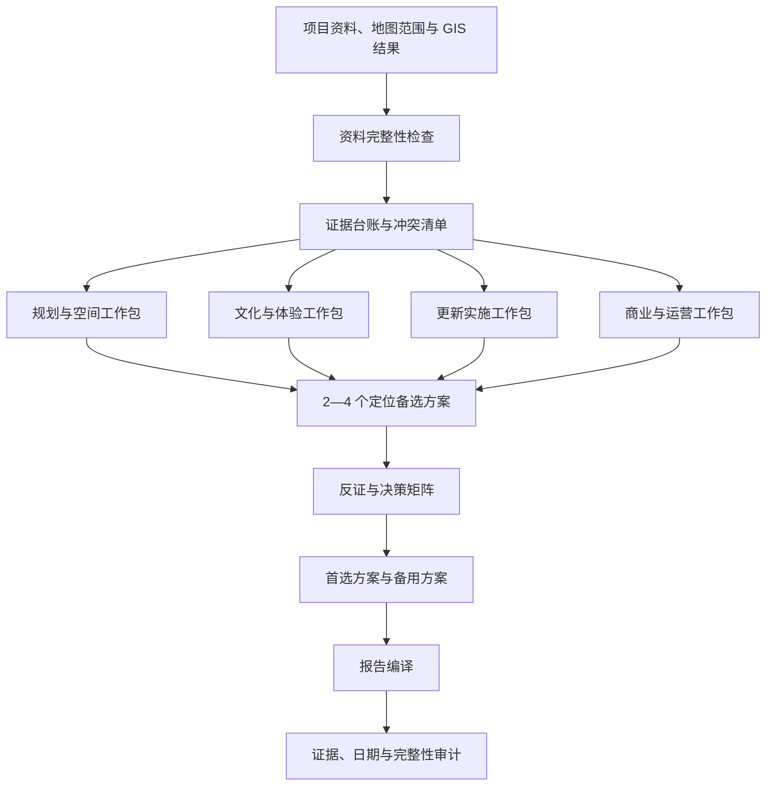

# AI 城市更新分析质量诊断与改造建议

> 面向高德地图城市空间分析工作台的产品与技术改造备忘录
> 更新时间：2026-07-11

## 1. 文档目的

本文总结“长沙县政府原址城市更新项目”两类 AI 产出的差异，解释当前系统为什么容易生成谨慎、数据化但不够完整的商业摘要，并给出从通用 GIS 问答 Agent 升级为可配置、可审计的城市更新策划工作台的改造方向。

核心结论是：

> 当前 AI 并非不会分析，而是被设计成了“谨慎的 GIS 商业问答 Agent”；对比样例承担的却是“城市更新策划团队 + 报告主笔”的任务。质量差距主要来自模型档位、任务契约、工作流和交付结构，而不只是提示词或文笔。

---

## 2. 两类产物的本质差异

### 2.1 当前系统产物

当前主 Agent 更接近一份管理层决策备忘录：

- 以 POI、人口、夜光、H3 网格等指标为主要骨架；
- 强调证据边界、数据缺口和风险提示；
- 避免把代理指标直接解释成客流、消费力或经营结果；
- 输出集中在结论、证据、风险和下一步验证；
- 篇幅较短，缺少完整的空间、产品、运营和实施展开。

### 2.2 对比样例产物

对比样例更接近一份咨询式初步策划报告：

- 先建立项目叙事，再把数据嵌入叙事；
- 将建筑、庭院、道路、客群、业态和活动建立对应关系；
- 覆盖定位、文化主题、功能组团、文旅产品、夜游、运营、收入、居民共生和分期实施；
- 通过章节完整性形成较强的专业感和可执行感；
- 允许在证据不足的位置进行更多策划性推演。

因此，当前比较实际上是：

> 商业决策摘要 vs. 城市更新初步策划报告。

两者并非同一任务契约，不能仅用“哪一篇写得更长、更像报告”判断模型能力。

---

## 3. 当前 AI 输出显得一般的原因

### 3.1 模型档位与任务复杂度不匹配

当前环境使用 Flash 类模型，并关闭 Thinking：

```text
AI_MODEL=DeepSeek-V4-Flash
AI_THINKING_ENABLED=false
```

Flash 模型适合分类、摘要、工具选择、数据转述和普通问答，但完整城市更新策划要求模型长距离维持并综合：

- 项目事实和资料冲突；
- 建筑保护与改造约束；
- 空间结构和公共动线；
- 客群、消费和文旅体验；
- 商业模式与运营机制；
- 居民产权和治理边界；
- 分期实施和风险验证。

在这类任务中，Flash 模型容易把复杂问题压缩成安全、正确但缺少展开的总结。

### 3.2 任务指令要求的是“决策口径”，不是“完整报告”

系统收到的典型指令是：

> 请把当前分析整理成商业决策口径，突出结论、证据、风险和建议。

该指令自然会产生短摘要，而不会主动补齐文化主题、产品体系、建筑分配、运营日历、收入结构和实施计划。即使更换更强模型，如果任务契约仍是“摘要”，结果也不会自动变成正式策划报告。

### 3.3 当前工作流是一次性综合

现有链路大致为：


最后一次模型调用需要同时完成证据筛选、矛盾处理、项目定位、空间配置、商业判断和报告写作。模型没有稳定的中间产物，也没有专业角色之间的交叉审查，最终往往优先保证“不出错”，牺牲方案深度和报告完整度。

### 3.4 GIS 数据被当成报告骨架，而不是证据层

当前报告通常沿着以下结构展开：

> POI → 人口 → 夜光 → H3 → 客群 → 风险 → 建议。

这适合数据分析说明，却不适合城市更新策划。城市更新报告更需要围绕项目决策组织：

> 项目价值 → 核心矛盾 → 定位方案 → 空间策略 → 产品与业态 → 运营治理 → 分期与验证。

GIS 应支撑或反驳策划判断，而不应直接替代项目叙事。

### 3.5 缺少“空间—客群—业态—运营”的闭环

当前系统已经识别礼堂、三个庭院、潘家坪路界面和住宅花园等空间，但没有继续完成：

- 每栋建筑适合承担什么功能；
- 保护建筑与非保护建筑分别承载哪些业态；
- 白天、晚间、工作日和周末如何切换；
- 游客、社区居民、办公人群和后勤动线如何分离；
- 哪些业态负责引流，哪些负责收入，哪些承担公共服务；
- 哪些动作先试运营，哪些必须等待产权和工程条件明确。

结果是“识别了结构”，但尚未进入“配置和运营策略”。

### 3.6 缺少真正的方案竞争与反证

单一定位容易形成顺滑但未经比较的故事。正式策划至少需要生成两个明显不同的定位方向，并回答：

- 各自依赖哪些事实和前提；
- 与周边供给相比是否差异化；
- 对保护、消防、产权和居民扰动的要求；
- 收入能力和公共价值如何平衡；
- 为什么推荐主方案，为什么淘汰或保留其他方案。

没有方案竞争，就难以形成真正的商业决策。

### 3.7 内部证据治理没有充分转化为用户可见价值

当前系统在以下方面反而优于对比样例：

- 主动暴露住宅户数和建筑数量冲突；
- 不把 POI、夜光和 H3 gap_score 伪装成真实客流或消费力；
- 强调产权、消防、结构和停车等前置验证；
- 尝试保留工具调用和证据来源。

但这些优势没有形成清晰的“证据台账、冲突清单、引用附录和结论置信度”，用户只感受到报告比较保守，没有感受到系统在证据治理上的专业性。

### 3.8 日期状态缺少统一校验

原材料中的“计划于 2025 年 10 月底前完成入户调研”等表述，在当前日期 2026 年 7 月 11 日已经是历史计划，不能继续作为未来动作直接引用。系统应自动将其转换为：

- 已完成：要求补充完成结果；
- 未完成：说明延期原因与新节点；
- 状态未知：列为必须核验的历史计划事项。

---

## 4. 对比样例值得学习但不能照搬的部分

### 4.1 值得学习

- 先建立项目故事，再使用数据；
- 把建议落到具体建筑、庭院和道路界面；
- 补齐文旅产品、活动体系、运营机制和分期实施；
- 形成面向决策者的完整章节结构；
- 用清晰主题统一空间、文化和消费体验。

### 4.2 不能照搬

- “城市文化会客厅”等定位仍可能过于通用，地方独占性不足；
- 缺少不同定位方案之间的系统比较；
- 收入结构没有落实到可运营面积、租金承担空间、活动频率和成本；
- 缺少文件、页码、GIS artifact、年份和证据等级等可追溯引用；
- 一些内容属于合理策划推演，但容易被读者误认为已验证事实。

正确目标不是让系统“更大胆地编一份长报告”，而是：

> 在保留证据严谨性的同时，获得完整的策划推演、空间配置和运营表达能力。

---

## 5. 建议的目标架构

仓库中的 `skills/urban-strategy-stage1/SKILL.md` 已经定义了更适合城市更新策划的 Stage 1 工作流。建议将其正式接入主 Agent，而不是继续让通用 Synthesizer 独立承担整篇报告。

目标流程：



最终报告应是结构化中间成果的“编译结果”，而不是模型在最后一次调用中现场自由发挥。

---

## 6. Skill 与模型的产品设计

### 6.1 Skill 通过斜杠命令选择

用户可在对话框输入：

```text
/urban-strategy-stage1
```

交互要求：

- 输入 `/` 时展示可用 Skill 列表、名称和用途；
- 选择后显示 Skill 标签，并从实际问题文本中移除命令；
- 默认仅对当前轮生效；
- 用户可以选择“固定到本对话”；
- 固定后，对话后续轮次默认沿用该 Skill，直到取消或切换；
- 未选择 Skill 时使用通用 Agent 默认工作流；
- 未知或不可用 Skill 应明确提示，不能静默退回通用流程；
- Skill 必须对应真实执行器和输出契约，不能只是把 `SKILL.md` 文本拼进提示词。

### 6.2 模型选择入口

模型名称常驻显示在对话输入框右下角、发送按钮左侧。点击模型名后弹出模型菜单：

- 系统预置模型；
- 用户自己配置的模型；
- 当前对话正在使用的模型；
- “配置模型”入口；
- 个人默认模型设置。

模型切换规则：

- 切换后成为当前对话的默认模型；
- 新对话使用个人默认模型；
- Skill 与模型彼此独立，选择 Skill 不自动修改模型；
- 每一轮必须记录实际使用的模型；
- 历史对话恢复时显示该轮实际模型，而不是当前全局模型；
- 模型不可用时应在发送前或调用初期明确报错，不得静默换模型。

### 6.3 模型配置范围

同时支持两类模型：

1. **系统预置模型**：由部署配置提供，用户可选择但不能查看密钥；
2. **个人配置模型**：用户可维护显示名称、Provider、Base URL、模型 ID 和 API Key。

当前项目没有登录和账号体系，本阶段按“当前部署为单用户”处理：

- 个人配置存储在后端数据库；
- API Key 必须加密保存；
- API 返回只显示掩码，不返回明文密钥；
- 前端不使用 `localStorage` 保存 API Key；
- 删除或更新配置时需要显式确认；
- Thinking 暂时沿用系统全局开关，不增加每模型独立控制。

### 6.4 每轮执行元数据

每轮对话建议记录：

```json
{
  "requested_skill": "urban-strategy-stage1",
  "effective_skill": "urban-strategy-stage1",
  "skill_scope": "turn",
  "requested_model_id": "model-profile-id",
  "effective_model_id": "model-profile-id",
  "effective_model_name": "DeepSeek V4",
  "execution_mode": "deep",
  "started_at": "...",
  "completed_at": "..."
}
```

审计信息应随流式响应返回，并写入会话快照或轮次历史，用于：

- 历史回放；
- 结果复现；
- 成本和性能分析；
- 对比不同模型的产出；
- 判断问题来自模型、Skill 还是证据不足。

---

## 7. 模型分工建议

不建议所有阶段统一使用最昂贵模型，也不建议所有阶段继续使用 Flash。

| 阶段 | 推荐执行方式 | 主要任务 |
|---|---|---|
| 资料抽取 | Flash / 小模型 | 文档分类、字段抽取、日期和事实识别 |
| 证据整理 | Flash + 规则代码 | EvidenceNode、来源、年份、口径、冲突归并 |
| 专业工作包 | 中高级模型 | 空间、文旅、实施、商业运营的专业推演 |
| 方案竞争 | 高级推理模型 | 备选方案、反证、决策矩阵、淘汰理由 |
| 最终报告 | 强推理或强写作模型 | 统一叙事、章节编译和管理层表达 |
| 质量审计 | 规则代码 + 小模型 | 日期、引用、完整性、虚假精确、证据越界检查 |

模型升级的最高价值节点是：

1. 方案生成；
2. 方案反证与决策；
3. 最终报告综合。

---

## 8. 必须建立的质量门槛

正式 Stage 1 报告至少满足：

1. 生成两个以上真正不同的定位方案，并说明推荐和淘汰理由；
2. 每项核心业态建议连接客群、空间载体、运营方式和验证动作；
3. 区分项目事实、GIS 证据、代理指标、策划推演和待核验假设；
4. 所有历史计划日期转换为当前状态，不继续把过期计划写成未来事项；
5. 产权、消防、结构、排污、停车等硬约束必须进入方案筛选；
6. 报告必须包含来源、年份、口径、证据等级和冲突说明；
7. 对可运营面积、租金能力、活动频率和运营成本未知时，不输出伪精确收益结论；
8. 主报告、证据附录和设计任务书之间保持一致。

---

## 9. 建议实施优先级

### P0：统一 Skill/模型执行契约

- 建立服务端 Skill 目录和模型目录；
- 在每轮请求中传递独立的 Skill 与模型选择；
- 后端统一解析默认值、斜杠命令和对话固定设置；
- 禁止通过修改全局 `settings.ai_model` 实现单轮切换；
- 将有效 Skill、模型和执行模式写入历史。

### P0：将 Stage 1 接入真实执行链路

- 不再只停留在 `source_readiness.json`；
- 完成证据台账、四个工作包、定位方案、决策矩阵和报告编译；
- 产出 `stage1_report.md`、`evidence_appendix.md` 和 `design_handoff.json`；
- 对资料不足的项目返回“缺口与补充任务”，而不是强行生成完整报告。

### P1：完成模型选择和配置 UI

- 对话框右下角显示当前模型；
- 点击切换系统模型或个人模型；
- 提供模型配置面板和连接测试；
- 支持设置个人默认模型；
- 显示当前轮 Skill 标签和“固定到本对话”操作。

### P1：建立报告质量审计

- 检查过期日期、冲突事实、无来源数字和代理指标越界；
- 检查方案数量、空间映射、运营闭环和验证动作；
- 将审计结果显示在报告和执行轨迹中。

### P2：建立模型与 Skill 对比评估

- 使用同一项目资料运行不同模型和 Skill；
- 对比事实准确性、证据覆盖、方案差异度、报告完整性、耗时和成本；
- 用真实评测决定模型分工，而不是仅凭主观阅读感受。

---

## 10. 验收标准

完成改造后，应能演示以下完整流程：

1. 用户在输入框输入 `/`，选择 `urban-strategy-stage1`；
2. 用户点击右下角模型名，从预置或个人模型中选择当前对话模型；
3. 用户可将 Skill 固定到当前对话，也可仅执行一次；
4. 后端按有效 Skill 路由到专用 Stage 1 工作流；
5. Gate、工具循环、专业推演和最终综合均使用本轮解析后的模型配置，不依赖全局模型突变；
6. 流式界面显示当前 Skill、模型和执行阶段；
7. 最终生成主报告、证据附录、设计任务书和质量审计；
8. 历史对话恢复后，每轮仍能显示当时实际使用的 Skill 和模型；
9. 模型配置密钥不出现在前端历史、日志、响应或数据库明文字段中；
10. 未知 Skill、失效模型和缺失密钥均返回可理解、可修复的错误。

---

## 11. 最终结论

当前系统的问题不是“数据不够多”或“提示词不够长”，而是：

> 使用关闭推理的 Flash 模型和通用问答 Synthesizer，承担了本应由多阶段城市策划工作流完成的任务。

下一步也不应只是让模型写得更长，而应同时完成三项升级：

1. **任务升级**：区分快速回答、决策摘要和 Stage 1 正式报告；
2. **工作流升级**：从一次性综合改为证据台账、专业工作包、方案竞争、报告编译和质量审计；
3. **产品升级**：允许用户独立选择 Skill 和模型，在对话级保存模型、在轮次级记录实际执行信息，并支持系统模型与个人模型配置。

系统应保留现有的证据边界、冲突暴露和代理指标治理优势，同时补齐策划叙事、空间配置、运营闭环和正式报告能力。这样产生的结果才会既“像一份专业报告”，又经得起项目决策和证据审计。
