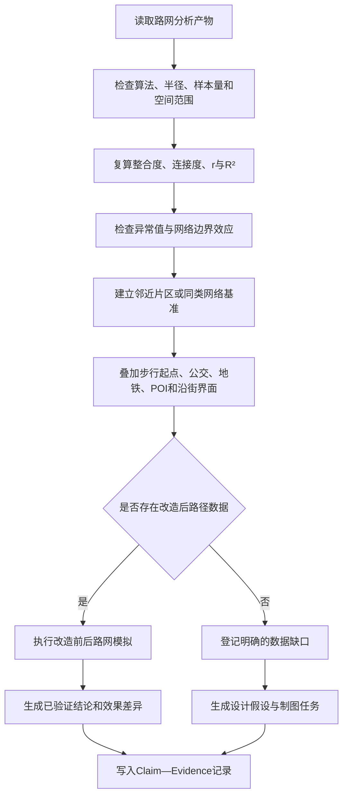

# Agent 自主验证与证据闭环规范

## 1. 文档目的

本规范解决 Agent 分析中的一个核心质量问题：**Agent 给出看似专业的判断后，把关键事实核验、指标解释和结论验证再次交还给用户。**

典型表达包括：

- “需要进一步验证。”
- “建议核实该指标。”
- “需要实地确认。”
- “需验证其与外部路网的衔接效率。”

这些表达本身并非错误，但如果所需数据、工具或计算能力已经在系统内，Agent 仍然只告诉用户“怎么验证”，就等于把分析责任转移给用户。对于城市空间分析工作台，用户期望的不是一份待办清单，而是：

1. Agent 先尽可能完成验证；
2. 明确区分事实、计算结果、推断和假设；
3. 只有确实超出系统能力时，才提出人工或实地验证任务；
4. 每个无法完成的验证都必须说明缺少什么，而不是笼统地说“需要验证”。

因此，本项目应把“自主验证”作为 Agent 默认行为，而不是额外能力或可选提示词。

---

## 2. 核心原则

### 2.1 能由系统验证的，不交给用户验证

只要当前会话、项目资料或已注册工具能够完成以下动作，Agent 就应自动执行：

- 查询现有分析结果；
- 读取指标定义和算法元数据；
- 重新计算或交叉计算指标；
- 检查空间范围、样本量、时间和坐标系；
- 与邻域、全市、同类项目或前后方案进行比较；
- 检索项目文档中的事实冲突；
- 调用 GIS、路网、POI、人口、夜光、RAG 或网络检索工具；
- 对设计方案进行前后模拟；
- 检查结论是否超出证据能够支持的范围。

禁止在具备上述条件时，仅输出“建议用户进一步验证”。

### 2.2 先验证，后解释，再建议

标准顺序应当是：

```text
发现指标或主张
→ 定位原始数据和计算方法
→ 自动复算或交叉验证
→ 判断证据强度
→ 解释指标的实际含义
→ 形成商业或空间建议
```

不能采用：

```text
看到一个数字
→ 直接做商业解释
→ 最后补一句“仍需验证”
```

### 2.3 不允许用“需要验证”掩盖证据不足

如果系统无法验证，必须说明具体原因：

```text
无法验证，因为当前项目缺少改造后路网方案的中心线数据，
因此不能计算改造前后的整合度、连接度和可理解度变化。
```

而不是：

```text
需要进一步验证动线效率。
```

前一种表达说明了缺口、边界和下一步动作；后一种表达只是把责任推回用户。

### 2.4 验证状态必须成为结构化结果

每一个关键结论必须具有明确状态：

- `verified`：已由数据、工具或计算直接验证；
- `cross_checked`：已通过第二来源或替代指标交叉验证；
- `inferred`：由已验证事实推导，但不是直接观测事实；
- `hypothesis`：待测试的设计或商业假设；
- `blocked`：系统缺少必要输入，当前无法验证；
- `fieldwork_required`：只有现场观察、访谈、测绘或产权核查才能完成。

最终报告不能把 `inferred` 或 `hypothesis` 写成确定事实。

---

## 3. Agent 的验证责任边界

## 3.1 第一类：必须自动完成的验证

以下验证不得默认交还用户：

### 指标一致性

- 指标名称、单位和算法是否一致；
- 原始数值与派生数值是否匹配；
- 均值、极值、中位数、分位数是否被混淆；
- 相关系数、决定系数、标准化值是否被混写；
- 数据范围是否为分析范围、缓冲区、行政区或全市范围。

### 数据质量

- 样本数量是否足够；
- 是否存在空值、重复路段、断裂路网或异常值；
- 坐标系和空间范围是否一致；
- 数据时间是否适合当前结论；
- 分析结果是否由真实数据产生，而非演示占位值。

### 比较基准

如果使用“高、低、极低、稀疏、活跃”等相对词，Agent 必须自动寻找比较基准：

- 相对研究区均值；
- 相对邻近片区；
- 相对同类项目；
- 相对历史方案；
- 相对算法建议阈值。

没有比较基准时，只能陈述数值，不得直接定性为“高”或“极低”。

### 推论强度

Agent 必须检查：

- 路网指标是否真的能支持商业结论；
- POI 数量是否被错误等同于真实消费需求；
- 夜光是否被错误等同于客流或支付能力；
- 人口年龄结构是否被直接推导为消费偏好；
- 空间整合度是否被直接等同于实际步行流量；
- 相关关系是否被写成因果关系。

## 3.2 第二类：应自动调用工具完成的验证

如果工具已经注册，Agent 应直接调用，不应只给验证方法：

- 路网句法重新计算；
- 步行路径与目标设施可达性分析；
- 改造前后路网模拟；
- POI、人口、夜光和交通站点叠加；
- 项目文档 RAG 检索；
- 同类项目和公开资料检索；
- 来源冲突检测；
- claim—evidence 对照检查。

工具调用失败时，应报告工具失败原因和受影响结论，而不是假装结论已经验证。

## 3.3 第三类：允许交给人工或现场的验证

只有以下类型可明确要求人工处理：

- 私有产权、户数和权属关系逐户核查；
- 建筑结构检测和材料检测；
- 消防审批口径确认；
- 高峰时段真实人流观察；
- 商户访谈、居民访谈和消费意愿调查；
- 现场标识可见性、坡度、遮挡、照明和体感安全；
- 尚未数字化的设计方案测绘。

即使需要人工验证，Agent 也应先完成桌面研究，并输出结构化任务：

```json
{
  "status": "fieldwork_required",
  "question": "潘家坪路沿线导视是否能被首次到访者在30米外识别",
  "reason": "现有数据只有路网中心线，没有现场照片、标识尺寸和视线遮挡信息",
  "method": "工作日与周末各进行一次现场视线记录",
  "owner": "现场调研人员",
  "impact": "影响非目的性客流导入判断"
}
```

---

## 4. Claim—Evidence 验证契约

每个关键主张应在内部形成以下记录：

```json
{
  "claim": "研究区外部路网通达性较强",
  "claim_type": "spatial_performance",
  "status": "inferred",
  "metric": "normalized_integration",
  "value": 0.63,
  "scope": "项目周边研究路网",
  "method": "space_syntax",
  "source_artifact_id": "network-analysis-2026-07-11",
  "comparison_baseline": null,
  "confidence": "low",
  "limitation": "缺少同口径邻近片区或全市分位数，不能仅凭0.63判断为高",
  "next_action": "调用同口径邻域基准计算",
  "executor": "agent"
}
```

最低字段要求：

- 主张是什么；
- 使用了什么指标；
- 指标来自哪个空间范围；
- 使用什么算法产生；
- 是否存在比较基准；
- 当前属于事实、推断还是假设；
- 证据强度；
- 限制条件；
- 下一步由 Agent 还是人工执行。

历史报告应保存这一快照，避免数据、模型或算法更新后无法解释旧结论。

---

## 5. 路网分析案例诊断

用户提供的原始分析为：

> 路网整体整合度较高（平均0.63），说明区域与城市主干道的连接良好，外部可达性强。可理解度仅0.22（R²=0.05），这是极低的值。平均连接度2.55，可能意味着商业界面不连续。项目的“一路”设计愿景回应了这一短板，但需要验证其与外部路网的衔接效率。

这段文字的问题并不是最后一句出现了“需要验证”，而是前面的多个判断也尚未完成验证。

### 5.1 “平均整合度0.63，所以外部可达性强”证据不足

必须先回答：

- 0.63 是哪一种整合度：全局整合度、局部整合度还是标准化整合度；
- 使用的半径是多少；
- 使用轴线、线段还是道路中心线模型；
- 0.63 相对哪个基准属于“较高”；
- 研究网络边界是否造成边缘效应；
- “路网结构可达性”是否被错误写成现实交通通达性。

仅凭平均值0.63不能直接推出“与城市主干道连接良好”。如果没有比较基准，应改为：

> 研究范围内路网平均整合度为0.63。当前缺少同算法、同半径的邻近片区基准，因此尚不能将其定性为较高；该指标反映的是路网拓扑潜力，不等同于真实步行时间或交通流量。

然后由 Agent 自动调用邻域基准分析，而不是让用户核实。

### 5.2 “可理解度0.22（R²=0.05）”需要先澄清指标定义

如果0.22表示连接度与整合度之间的相关系数 `r`，那么：

```text
0.22² ≈ 0.0484 ≈ 0.05
```

此时0.22与R²=0.05在数学上是一致的，但报告必须明确：

- `r = 0.22` 是相关系数；
- `R² = 0.05` 是决定系数；
- 两者不能都被模糊称作“可理解度”；
- “极低”仍需要同类网络基准或明确阈值来源。

更准确的表达是：

> 路网连接度与整合度的相关系数约为0.22，对应R²约为0.05，说明局部连接信息只能解释约5%的整体整合度差异。在本研究网络中，行人仅凭局部路口结构较难推断整体路网层级。该指标提示空间认知风险，但不能单独证明行人一定会迷路，仍需结合转向次数、视线、标识和现场行为观察。

Agent 应自动复算 `r²`，检查样本量、显著性和异常值，不应只要求用户验证。

### 5.3 “连接度2.55，所以商业界面不连续”属于跨层推断

连接度描述路段或空间单元之间的拓扑连接关系。商业界面连续性还取决于：

- 沿街店铺长度与空白界面长度；
- 首层开口密度；
- 围墙、停车场和封闭院落；
- 道路宽度与过街条件；
- 实际步行起点；
- 活跃界面比例；
- POI 是否真正临街。

因此“连接度2.55”可以支持“路网分支有限”的判断，但不能直接证明“商业界面不连续”。后者应标记为 `hypothesis`，并由 Agent继续调用沿街界面、POI贴边或街景数据验证。

### 5.4 “一路回应短板”是设计假设，不是已验证结论

“一路”是否改善可逛性，必须比较改造前后至少以下指标：

- 步行起点到礼堂和主要院落的最短路径；
- 路径转向次数；
- 关键节点选择度；
- 局部整合度；
- 死胡同比例；
- 路径闭环率；
- 导视可见性；
- 与外部公交、地铁和主要人行方向的连接关系。

如果设计方案已有可计算的中心线或路径数据，Agent 必须直接模拟。如果没有，结论应明确写为：

> “一路”可能形成更清晰的内部空间骨架，但当前项目资料未包含可计算的改造后路径中心线，因此尚不能验证其对转向次数、整合度和路径衔接的改善幅度。该判断属于设计假设，而不是已验证效果。

---

## 6. 该案例应采用的自动验证流程



Agent 在正常情况下应完成到 `Claim—Evidence` 写入，再输出报告。

---

## 7. 推荐的报告表达

经过自主验证后，报告不应继续采用一整段混合事实和推测的表达，而应分层呈现。

### 已验证发现

> 路网连接度与整合度的相关系数约为0.22，其平方约为0.05，与当前结果中的R²基本一致。这说明在本次分析样本中，局部连接度对整体整合度差异的解释比例约为5%。该结果支持“局部结构不容易反映整体层级”的判断。

### 暂不能定性的指标

> 路网平均整合度为0.63，但当前分析产物缺少同算法、同半径的邻近片区基准。因此不能仅凭该数值认定整合度“较高”，也不能直接将拓扑整合度等同于现实交通通达性。

### 有依据的推断

> 平均连接度为2.55，说明多数路段的直接拓扑连接数量有限，可能增加路径选择对少数关键节点的依赖。但该指标本身不能证明商业界面不连续。

### 待测试设计假设

> “一路”有机会形成清晰的内部空间骨架。其实际改善效果需要通过改造前后路径中心线模拟，比较转向次数、局部整合度、选择度、闭环率和路径衔接。目前如果系统已获得方案路径数据，应由Agent自动完成该模拟；只有缺少数字化方案时，才登记为设计输入缺口。

这样用户可以直接看出：什么已经验证，什么只是推断，什么因为缺少数据尚未完成，而不是得到一句笼统的“你还需要去验证”。

---

## 8. Agent 行为规则

建议在普通 Agent 和专业 Skill 中统一加入以下策略：

```text
你对分析结论负有主动验证责任。

当结论可以通过当前上下文、项目资料、已注册工具、重新计算或检索完成验证时，
必须先执行验证，不得把验证任务交还给用户。

在输出每个关键结论前：
1. 定位原始数据、空间范围、时间、算法和指标定义；
2. 检查数值与公式是否一致；
3. 为“高、低、强、弱”等定性判断寻找比较基准；
4. 区分直接事实、计算结果、交叉验证、推断和假设；
5. 对可调用工具完成的缺口立即调用工具；
6. 只有系统缺少必要数据、权限或现实世界观测能力时，才标记为人工验证；
7. 不得只说“需要进一步验证”，必须说明缺少的具体输入、无法验证的原因、
   受影响的结论、验证方法和执行责任人。

最终答案优先交付验证后的结果，而不是验证教程。
```

这套规则不应只依赖提示词，还应由后端执行策略和结果结构共同保证。

---

## 9. 产品与技术实现建议

## 9.1 默认自动验证，而不是增加一个普通开关

“自动验证”应当是 Agent 的默认质量底线，不建议做成默认关闭的 UI 选项。可以通过执行深度控制验证范围：

- 快速模式：复算关键指标、检查范围和明显冲突；
- 深度模式：增加多来源交叉验证、基准比较和方案模拟。

无论哪种模式，都不能允许未经标记的推断伪装成事实。

## 9.2 在 Agent Domain 内建立验证编排

建议由 Agent 领域模块拥有以下能力：

- 解析候选主张；
- 判断主张需要哪些证据；
- 查找已有分析产物；
- 调用对应工具补充证据；
- 执行公式和一致性检查；
- 生成验证状态；
- 把状态交给最终 Synthesizer。

路由层只负责接收请求和发送流事件，不应包含指标验证规则。

## 9.3 建立 Claim—Evidence Ledger

每轮执行保存不可变的主张—证据账本：

```json
{
  "claims": [
    {
      "id": "claim-network-001",
      "text": "局部路网难以反映整体空间层级",
      "status": "verified",
      "evidence_ids": ["metric-intelligibility-001"],
      "confidence": "medium"
    }
  ],
  "evidence": [
    {
      "id": "metric-intelligibility-001",
      "source": "network-analysis-artifact",
      "metric": "connectivity_integration_correlation",
      "value": 0.22,
      "derived": {"r_squared": 0.0484}
    }
  ]
}
```

最终报告中的高置信度结论必须能追溯到该账本。

## 9.4 为工具注册验证能力标签

每个工具除名称和参数外，应声明能验证的主张类型：

```json
{
  "tool_id": "network_syntax_analysis",
  "verifies": [
    "network_integration",
    "network_connectivity",
    "network_intelligibility",
    "before_after_network_change"
  ],
  "required_inputs": ["network_geometry", "analysis_radius"],
  "produces": ["metrics", "diagnostics", "map_artifact"]
}
```

这样 Agent 能根据待验证主张选择工具，而不是只靠模型猜测工具名称。

## 9.5 最终合成前增加证据门控

Synthesizer 输出最终报告前应检查：

- 高置信度结论是否存在直接证据；
- 相对判断是否有基准；
- 推断是否被标记；
- 设计效果是否经过前后模拟；
- 无法验证的事项是否说明了具体缺口；
- 是否仍出现无责任主体的“建议进一步验证”。

不满足要求时，应退回验证阶段补充工具调用或降低结论强度，而不是直接生成完整报告。

---

## 10. 验收标准

### 行为验收

- 当现有分析产物包含原始指标时，Agent 自动复算派生指标；
- 当报告使用“高、低”等词时，Agent 自动查询或计算比较基准；
- 当结论跨越指标含义时，Agent 自动降级为推断或调用其他工具；
- 当存在方案数据时，Agent 自动执行前后对比，不再要求用户验证；
- 只有缺少数字化数据或必须现场观测时，才输出人工验证任务；
- 人工验证任务必须包含原因、方法、责任人和影响；
- 最终报告明确区分已验证、推断、假设和阻塞项。

### 路网案例验收

- 自动检查 `0.22² ≈ 0.05`；
- 明确区分相关系数 `r` 与决定系数 `R²`；
- 没有基准时不把0.63直接描述为“较高”；
- 不把拓扑整合度直接等同于实际交通通达性；
- 不把连接度2.55直接等同于商业界面不连续；
- 有方案路网时自动模拟“一路”的改善效果；
- 无方案路网时明确指出缺少可计算的路径中心线，而不是只写“需要验证”。

### 测试建议

- 单元测试：指标复算、状态分类、基准缺失和推断降级；
- Domain测试：主张识别、工具选择、证据账本写入；
- API测试：流式事件包含验证阶段和验证结果；
- 集成测试：从路网指标到最终报告的完整证据闭环；
- 回归测试：确保普通问答不会因验证流程产生无意义工具调用。

---

## 11. 最终产品判断

用户真正需要的不是 Agent 告诉他：

> “这个结论以后还要验证。”

而是 Agent 明确告诉他：

> “我已经检查了公式、数据范围和比较基准。相关系数0.22与R²约0.05一致；但整合度0.63缺少同口径基准，因此我没有把它定性为高。连接度2.55只能支持拓扑分支有限，不能直接证明商业界面不连续。当前尚缺改造后路径中心线，所以‘一路改善可逛性’仍属于设计假设；一旦方案数据进入系统，应由Agent自动完成改造前后模拟。”

这就是本项目应建立的自主验证体验：

```text
能验证的，Agent直接验证；
能交叉检查的，Agent主动检查；
只能推断的，明确标记推断；
确实无法验证的，说明具体缺口；
只有必须接触现实世界的事项，才交给人工。
```
