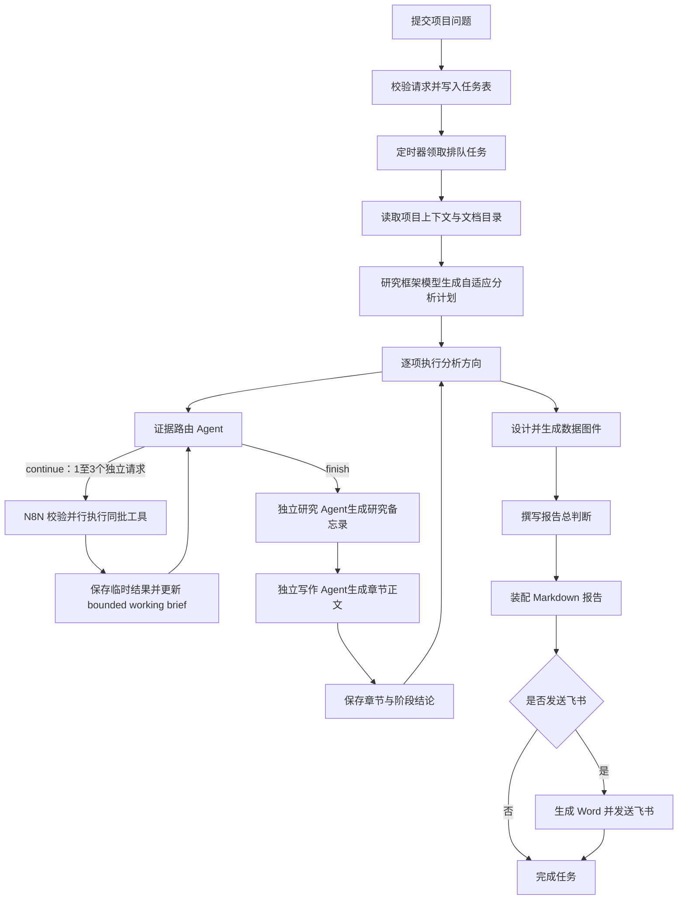

# N8N 区域分析工作流：阶段、工具与执行方式

## 1. 先说结论

当前“城市更新决策支持 Agent”工作流由生成器实际产出 81 个 N8N 节点。节点数量是编排实现细节，核心链路可以压缩成四层：

1. **计划层**：先读取项目上下文，由研究框架模型把项目问题整理成自适应分析方向。默认十二个方向只是常用模板，不是必须执行的固定章节。
2. **证据路由层**：每个分析方向先交给低成本、严格 JSON 的证据路由 Agent。它只返回 `continue / finish`、原因和最多三个相互独立的下一工具请求；N8N 校验后将同批请求并行执行，有依赖的请求则跨轮串行。它不写结论，也不决定研究观点。
3. **研究与写作层**：路由 Agent 判断证据已经足够后，独立的高推理研究 Agent 使用工作简报完成自由形式研究备忘录；随后独立的高推理写作 Agent 把备忘录写成 `decision_brief` 和面向读者的章节正文。这两个 Agent 不调用工具，也不受路由 Agent 的 JSON 结构约束。
4. **报告层**：所有分析方向完成后，系统用真实项目数据生成图件，撰写总判断，装配 Markdown/Word 报告，并按请求发送到飞书。

这里的“限制”只作用于工具选择、参数校验、单轮调用和上下文大小；正常研究分析和写作不被限制为固定模板，也不会被要求输出工具路由 JSON。

## 2. 整体执行链



## 3. 每个章节共享的工具箱

这些工具只暴露给**证据路由 Agent**。研究 Agent 和写作 Agent 不带工具，它们只消费已经取得并压缩过的证据上下文。这样可以把“查什么”与“如何分析、如何写”分开，避免工具调用格式限制正常研究表达。

### 3.1 项目目录：随章节初始输入提供

作用：章节开始时直接提供项目问题、研究框架、本章问题、前序阶段结论和轻量项目文档目录。

这不是模型工具。N8N 会先根据章节标题、`research_brief` 和项目问题选择一份最相关的已解析文档，并自动预读前 4 个 Docling 正文块。文档目录和这段正文一起进入初始上下文；如果后续判断依赖尚未读取的内容，证据路由 Agent 再调用 `read_project_document` 分页继续读取。

它解决的是“先让 Agent 确实看到项目材料”，但不会把整份 PDF 或全部附件一次塞入上下文。空间指标目录仍通过 `analyze_spatial_evidence` 的 `scope` 模式发现。

### 3.2 `analyze_spatial_evidence`：分析空间数据

作用：通过一个深接口分析 POI、人口、道路、夜光和 H3，不向模型暴露数据表、原始字段或完整几何。

支持七种分析语义：

- `scope`：发现可用指标、年份和数据状态。
- `distance`、`direction`：按距离带或方向分组。
- `neighborhood`、`rank`、`relationship`、`inspect`：分析邻域、排序、跨指标关系或具体记录。

工具内部完成空间关联、面积或长度加权、H3 对齐和缺失值处理。返回给模型的是经过安全投影的事实结果：聚合组、具名 POI/道路、`record_ref`、类别、地址、道路等级、距离、方向和指标值；Polygon、LineString、FeatureCollection、数据库连接和本地文件路径不会进入模型上下文。

### 3.3 `read_project_document`：读取项目文档原文

作用：按文档 ID、页码或文本块读取项目材料原文，例如政策任务、权属、保护、建筑、居民、运营和资金材料。

使用方式：先从初始输入的 `project_documents` 找到目标文档，再按需读取。若 `complete=false`，依赖完整上下文的判断应通过 `next_start_block` 继续读取。项目事实必须通过该工具读取原文。

### 3.4 `read_previous_chapter`：回看前序章节

作用：按阶段键或顺序读取已经完成的章节正文和阶段性结论。

使用方式：每个新章节会先收到前序章节的简短 `decision_brief`。只有需要核对完整论证时，才调用该 MCP 工具读取全文。调用方传入已完成章节目录和当前阶段序号；MCP 在工具内部校验只能读取当前阶段之前的章节，不能读取当前或未来章节。

### 3.5 `search_literature_evidence`：按需检索论文与规范

作用：查询已经进入 GraphRAG 的开放获取论文和 UNESCO/ICOMOS 官方文件。它与实时互联网搜索是两个独立工具。

- `focused` 是默认模式，使用本地 Jina 查询向量和 GraphRAG LanceDB 直接返回相关 PDF 原文、文献标题、文本单元和页码估计，不调用生成模型。
- `synthesis` 用于规范比较、跨文档机制和文献分歧，执行完整 GraphRAG Global Search，并同时返回由 focused 检索得到的可核验原文。

证据路由 Agent 根据 `research_brief` 和已有结果判断是否需要文献。文献问题必须抽象表达，不能把未公开项目材料发送给综合模型。GraphRAG 的综合答案只用于分析；需要形成可核验文献判断时，必须同时取得返回的 PDF 原文证据。

### 3.6 `search_public_web`：检索当前互联网

作用：通过 AnySearch 搜索当前公开互联网，补充尚未进入本地知识库的政策、统计、交通、机构和同类项目信息。

互联网搜索不是每章必经步骤。只有当前判断需要最新政策、当地机构或当前公开事实时，证据路由 Agent 才调用它。查询词只能包含已公开地名、项目名和公共议题，不能发送未公开文档、住户信息、权属细节或个人信息。

搜索结果只用于发现候选网址，不能直接进入引用。

### 3.7 `fetch_public_web_page`：抓取候选网页全文

作用：按需读取搜索发现的网页正文。Agent 只有准备把候选网页用于判断时才需要调用，不由工作流强制执行。

只有成功取得的正文会以 `public_web_fulltext` 进入本次运行的证据集合。`extract_target_blocked`、`extract_fetch_failed`、空正文和被抽取策略拦截的页面只形成临时运行诊断，不会被当作证据。

### 3.8 各类证据怎样路由

章节开始时不自动执行 GraphRAG 或互联网搜索。证据路由 Agent 先收到项目问题、总体研究框架、当前 `research_brief`、前序阶段结论、项目文档目录和预读正文，然后按判断需要选择：

1. `search_literature_evidence`：论文、规范、研究方法和跨案例机制。
2. `search_public_web` / `fetch_public_web_page`：最新政策和当地公开事实。
3. `analyze_spatial_evidence`：POI、人口、路网、夜光和 H3。
4. `read_project_document`：项目自己的事实材料。
5. `read_previous_chapter`：前序章节的完整论证。

每一轮允许一至三个相互独立的工具请求。`parallel_tool_calls` 仍固定为 `false`，因为路由模型输出的是结构化决策而不是原生函数调用；真正的并行发生在 N8N：`next_tools` 被拆成多个 item，由同一个 HTTP Request 节点同时发出。N8N 会校验工具名、参数白名单、必填参数、批内重复和 `history_id` 注入规则；完全相同的跨轮请求不会把同一份结果反复塞进模型上下文。

参数在本轮开始前已经完整确定的请求可以并行，例如同时查询空间数据、读取项目文档和检索 focused 文献。必须依赖上一结果的链路继续串行，例如：

- `search_public_web → fetch_public_web_page`
- `scope → 具体空间指标查询`
- `rank → inspect`
- 当前文档页 → `next_start_block`

实际取得的证据在运行期间保留不同的 `source_type`。成功保存章节时只持久化最小来源元数据，不再保存证据正文：

- `literature_evidence_count`：GraphRAG PDF 原文数量。
- `live_web_fulltext_count`：成功抓取的互联网全文数量。
- `project_evidence_count`：项目文档和空间证据数量。

某一工具不可用时，路由 Agent 可以选择真实存在的替代入口；没有明确替代入口时就结束取证。后续研究 Agent 只基于已经取得的材料分析，不能编造缺失来源，也不能声称已经完成对应核验。

### 3.9 空间工具结果如何进入模型

空间工具不能无限返回原始记录，但压缩也不能把“长沙简牍博物馆”这类真正有分析价值的具名事实抹掉。当前链路采用“完整临时结果 + 语义化工作简报”两层结构：

```text
完整安全工具结果
→ research_result_store（仅当前 N8N 执行内临时保存）
→ 空间语义投影与字符预算压缩
→ named_spatial_records + bounded cards
→ working_research_brief + latest_tool_results
→ 丢弃旧 function_call_output 历史
→ 研究 Agent
→ 写作 Agent
```

`research_result_store` 不是新增的外部数据库，也不是长期知识库。它只是当前章节执行过程中的临时 N8N 状态，最多保留最近 24 个去重后的完整安全结果。真正送回模型的不是全部历史，而是：

- `working_research_brief.named_spatial_records`：为具名 POI、道路等事实单独预留约 4,200 字符，最多保留 20 条近期具名记录。
- `working_research_brief.cards`：最多 16 张、连同具名记录约 14,000 字符的有界卡片，保留摘要、指标、有限分组、覆盖度和必要文档片段。
- `latest_tool_results`：只包含本轮最新结果；重复请求只返回 `duplicate_request` 提示。

具名记录不是再交给一个摘要模型改写，而是由确定性的语义投影器从空间工具 `highlights` 中直接复制名称和身份字段，因此不会在“总结”时被改成“周边存在若干文化设施”。边界也很明确：它不会把范围内所有 POI 全部送给模型；当候选超过 20 条时，证据路由 Agent 应先用 `rank`、筛选或 `inspect` 收窄问题，让真正需要比较的记录进入近期结果。

具名空间记录的模型侧形态类似：

```json
{
  "record_ref": "current:dataset:poi/poi-1",
  "name": "长沙简牍博物馆",
  "identity": {
    "category": "科教文化服务",
    "subcategory": "博物馆",
    "address": "白沙路92号"
  },
  "distance_m": 438.2,
  "direction": "西北",
  "values": {
    "poi.count": 1
  }
}
```

压缩优先级是：先删除几何、内部路径和数据库信息；再压缩方法、来源实现和重复文本；然后减少聚合组数量。具名记录、名称、`record_ref`、类别/道路等级、距离、方向和指标值被单独保留。即使空间结果过大，也不会再退化成只剩一段泛化摘要的结果。

## 4. 默认十二阶段的取数重点

下表分为两层：

- “优先数据”是依据当前阶段问题和后端阶段数据映射整理的建议重点。
- 证据路由 Agent 仍可根据当前研究问题调用共享工具箱；主工作流没有按阶段设置“只能查某些指标”的代码白名单。

| 阶段 | 要作出的核心判断 | 优先使用的项目工具与数据 | 公共证据重点 | 交给下一阶段的结果 |
|---|---|---|---|---|
| 1. 政策与场地 | 现有材料和空间数据支持什么公共任务判断，已知场地约束允许和排除什么 | `read_project_document` 读取政策、保护、建筑与安全材料；`analyze_spatial_evidence` 辅助查看 POI 和道路 | 法定规划、保护条例、政府政策和正式审批要求 | 公共任务、已知约束、禁止路径及结论边界 |
| 2. 区域角色 | 项目与中心、交通节点、景区、商圈、社区和同类设施是什么关系 | `read_previous_chapter`；`analyze_spatial_evidence` 查询 POI、道路和人口；必要时读取区位材料 | 城市或片区规划、官方交通与公共设施资料 | 可承担的区域角色、不应声称的角色、比较对象 |
| 3. 市场与流动 | 基于等时圈、人口、POI、路网和夜光代理，哪些人可能在什么时间和机制下接近项目 | 查询人口、道路、交通相关 POI；读取已有项目材料；回看政策与区域角色 | 官方人口、旅游、交通班次和可比流动资料 | 候选人群、到达链、时间条件，以及不能从接近性推出实际到访的边界 |
| 4. 供给与空位 | 周边供给满足了什么，还遗漏了什么 | POI 分类聚合与具名记录并用；回看区域角色和市场流动；必要时读取业态材料 | 同类项目和替代设施的官方资料 | 真实供给、替代方案、候选空位及“假空位”风险 |
| 5. 客群与使用 | 基于现有代理数据，一期应优先服务谁、在什么情境下使用 | 查询人口、POI、道路和夜光；读取已有使用材料；回看前四步 | 只使用可比、可核验的客群与公共服务资料 | 候选客群、使用情境、到达机制、时间预算、阻碍和结论边界 |
| 6. 主题与资源 | 哪些地方资源能形成持续使用机制 | 重点读取项目历史、建筑、文化和地方资源原文；查询具名 POI；回看供给与客群 | 官方地方志、遗产名录、机构官网和权威历史资料 | 主题候选、资源关系、可持续机制、被排除的符号化主题 |
| 7. 项目定位 | 哪种定位最符合上游证据和项目能力 | 主要使用 `read_previous_chapter` 综合 1-6 步；按缺口补读项目文档或查询数据 | 同类项目定位与政策边界 | 首选定位、备选定位、非目标、成立条件和改判条件 |
| 8. 产品组合 | 如何把定位变成一期可运行的产品组合 | 回看定位、客群和供给；查询 POI 与人口；读取建筑容量和运营条件材料 | 同类产品的正式运营信息，不能用宣传文案替代经营证据 | 引流、体验、服务等产品组合，一期最小可运行组合和淘汰项 |
| 9. 空间布局 | 入口、集散、体验、服务、后勤、居民和安全边界如何组织 | 查询道路、POI、人口、夜光；读取总平、建筑、消防、居民和保护材料；回看产品组合 | 适用的规划、消防、无障碍和保护要求 | 入口与流线、功能关系、运营边界、工程核验任务 |
| 10. 运营模式 | 现有材料和空间关系支持哪些运营责任分配 | 读取已有组织、合作和运营材料；回看产品与空间章节；空间数据用于判断服务半径和供给关系 | 同类项目的公开运营主体和合作机制 | 主体分工、权责关系、能力缺口及条件性建议 |
| 11. 财务校验 | 用现有规模、容量代理、供给和成本线索判断投入与收入变量的方向 | 读取已有工程量、容量、报价、采购、资金和运营材料；回看产品、空间和运营结论 | 正式采购价格、资金政策和可比项目公开数据 | 关键变量、情景区间、不可计算项及其对建议强度的影响 |
| 12. 分期实施 | 怎样用一期部署验证前面最重要的假设 | 回看全部阶段；读取审批、施工和资源时序材料；按缺口补查数据 | 审批时序、实施约束和可核验的同类阶段资料 | 前置任务、一期行动、记录字段、责任人、继续/调整/扩大/停止规则 |

## 5. 各阶段内部是怎样执行的

十二阶段虽然研究问题不同，但内部使用同一条执行链。

### 5.1 检查是否已经完成

N8N 先从 PostgreSQL 读取 `decision_state`。若该阶段已有结果，则直接复用，避免恢复任务时重复生成。未完成时，把 `analysis_step_outputs` 标记为 `running`。

### 5.2 预读项目文档并构建路由请求

系统把项目问题、总体研究框架、当前 `research_brief`、前序阶段结论和项目文档目录放入初始输入。若存在已解析项目文档，N8N 会先自动读取最相关文档的前 4 个 Docling 正文块并一同注入。此时不会自动执行 GraphRAG 或互联网搜索。

### 5.3 证据路由 Agent 逐轮选择工具

证据路由 Agent 使用低推理配置和严格 JSON Schema。它每轮只能作出一次路由决策：

- 返回 `continue`，并在 `next_tools` 中给出一至三个相互独立的请求；或
- 返回 `finish`，并把 `next_tools` 设为空数组。

它不能输出研究摘要、关键发现、章节正文或最终观点。N8N 会在执行前校验工具名和参数，并注入当前项目的 `history_id`。工具执行后，完整安全结果进入临时 `research_result_store`，模型上下文则只更新为 `working_research_brief` 和本轮 `latest_tool_results`；旧的 `function_call_output` 历史被丢弃。

工具循环的边界只用于控制调用成本和上下文：

- 上下文总预算 24,000 tokens，并保留 6,000 tokens 给后续输出。
- 每个分析方向最多执行 12 个工具请求；同一批的三个请求按三个计算。
- 连续两轮没有新结果时停止。
- 连续工具错误达到两轮时停止。
- 请求和结果指纹最多各保留 32 条，用于识别重复调用。
- 单批最多并行三个请求；批内部分失败不会丢弃其他成功结果，只有整批失败才累计一次连续失败。

停止条件触发时，路由 Agent 只能返回 `finish`。这不会限制研究 Agent 的分析深度，只是停止继续取数。

### 5.4 独立研究 Agent 完成研究备忘录

证据路由结束后，系统启动一个独立的高推理研究 Agent。它没有工具，也不使用路由 Agent 的简短 JSON 格式。输入包括：项目问题、研究框架、当前任务、前序结论、项目文档预读正文和有界证据简报。

研究 Agent 可以自由选择最适合问题的结构，比较空间、文档、文献和网页证据，解释关系与取舍，并输出自由文本研究备忘录。它不再建议调用工具，也不负责适配最终报告格式。

### 5.5 独立写作 Agent 生成章节

研究备忘录完成后，另一个高推理写作 Agent 根据备忘录、工作简报、项目上下文和前序结论成稿。它同样没有工具，只返回：

- `decision_brief`：供后续分析方向承接的简短结论。
- `reader_chapter`：面向甲方、政府决策者、投资人和非技术评审者的完整章节正文。

这不是“初稿失败就回退”或“再把同一稿件润色一次”，而是研究与写作职责分离：前者负责把证据想清楚，后者负责把已经形成的研究判断写清楚。

### 5.6 校验、持久化与执行清理

章节校验通过后，`analysis_step_outputs` 和 `analysis_runs.decision_state` 只保存后续业务真正会消费的结果：正文、`decision_brief`、最小来源元数据和必要质量状态。证据正文不会随成功章节持久化，成功诊断列表也会清空；运行期间的 `research_result_store` 和工具回填历史随本次执行结束而消失。

N8N 的执行历史配置为：

- 成功执行不保存完整 execution history。
- 失败执行保存完整过程用于排错。
- 执行记录自动清理，最长保留 168 小时，即 7 天。

因此，系统保留可交付的业务结果和最小来源信息，但不会把每次成功取证过程永久堆积在数据库中。

## 6. 图件和最终报告使用什么工具

### 6.1 图件设计

十二阶段完成后，图件设计模型读取项目问题、研究框架、全部阶段结论和可用数据集，提出 3 至 5 张图的设计方案。系统会拒绝重复图件、全量道路节点图和缺少决策问题的装饰性图件。

### 6.2 确定性绘图

图件通过后端接口 `/analysis/spatial-strategy/visuals` 生成。地图和统计图读取真实项目数据，由 `modules/spatial_strategy/visuals.py` 确定性绘制，不让图像生成模型伪造 POI、道路、人口或夜光分布。

### 6.3 报告总判断与装配

报告叙事模型根据全部阶段结论和图件撰写“总判断”。校验器会拒绝阶段键、N8N、内部状态字段、节点编号和运行 ID 等工程信息泄漏到甲方正文。

随后，后端 `/analysis/spatial-strategy/reports/compose` 将总判断、图件、各阶段正文和引用装配为 Markdown。若用户要求飞书交付，则 `/analysis/spatial-strategy/reports/deliver` 继续生成 Word，上传报告和图件并发送飞书。最终报告与资产清单保存到 `analysis_reports`。

## 7. 当前实现与十二个 Skill 设计的差异

理解现状时需要区分“Skill 设计”与“N8N 已实现行为”。

1. 当前 N8N 不会在每个阶段运行时读取对应的 `SKILL.md`。它使用研究框架模型生成的问题，或使用代码中内置的十二个默认问题。因此，阶段思想来自十二步方法，但专项 Skill 的全部质量门并没有逐条注入当前 N8N。
2. 当前 N8N 将 GraphRAG 文献检索、AnySearch 实时搜索与网页全文抓取作为独立按需工具；某一路不可用时，运行期间会把失败信息交给路由 Agent，但成功章节不长期保存这些运行诊断。
3. Skill 设计中有条件触发的夜生活 `baseline` 和 `product_check` 两轮检查；当前固定十二阶段中没有这两个显式分支。研究框架模型可以生成夜间分析方向，但代码没有保证它必然触发和复核。
4. 后端仍有非模型代码使用的项目数据服务，但证据路由 Agent 只通过 `analyze_spatial_evidence` 选择空间分析语义和指标。研究 Agent 与写作 Agent 不接触底层数据字段和 GIS 几何。
5. 对 Agent 而言主要是四类外部证据：空间数据库、文献知识库、项目文档和互联网；`read_previous_chapter` 是工作流内部的跨章节读取能力，不是第五个外部事实源。
6. 当前系统只保存正文、阶段结论、最小来源元数据和必要业务状态，不持久化完整 `tool_trace`、证据正文或成功诊断。因此可以确认报告使用了哪些来源，但不能仅凭业务数据库逐轮重放当时的全部工具过程；失败执行可在 7 天的 N8N 留存期内排查。

这些差异不意味着工作流不可用，但论文或系统说明中应准确表述为“共享工具箱下的自适应多阶段分析”，不能写成“十二个 Skill 已在 N8N 中被逐项完整执行”。

## 8. 对 proposal 最合适的简写

> 当前 N8N 参考实现先读取项目上下文并预读相关项目文档，由研究框架模型生成自适应分析计划。每个分析方向由独立证据路由 Agent 按需、逐轮选择空间数据库、GraphRAG 文献、项目原文或实时互联网工具；完整安全结果仅在当前执行中临时保存，模型只接收保留具名空间事实的有界工作简报。取证结束后，高推理研究 Agent 独立形成研究备忘录，再由独立写作 Agent生成面向读者的章节。全部章节完成后，系统基于真实项目数据生成图件，装配 Markdown/Word 报告并可发送飞书。默认十二个方向只是常用模板，运行时可以根据具体项目形成自适应分析队列。

## 9. 主要代码位置

- 主工作流生成器：`n8n/workflow-generators/urban-renewal-agent.workflow.mjs`
- 章节决策基础组件：`n8n/workflow-components/decision-step.json`
- 项目工具代理：`modules/spatial_strategy/mcp_agent.py`
- 空间证据深接口：`modules/spatial_action/spatial_evidence.py`
- 文献证据服务：`modules/spatial_strategy/literature_evidence.py`
- MCP 工具注册：`modules/spatial_projects/mcp_server.py`
- Docling 文档解析：`modules/documents/docling_parser.py`
- 图件生成：`modules/spatial_strategy/visuals.py`
- 报告装配和飞书交付：`modules/spatial_strategy/reporting.py`
- HTTP 路由：`router/domains/spatial_strategy.py`
