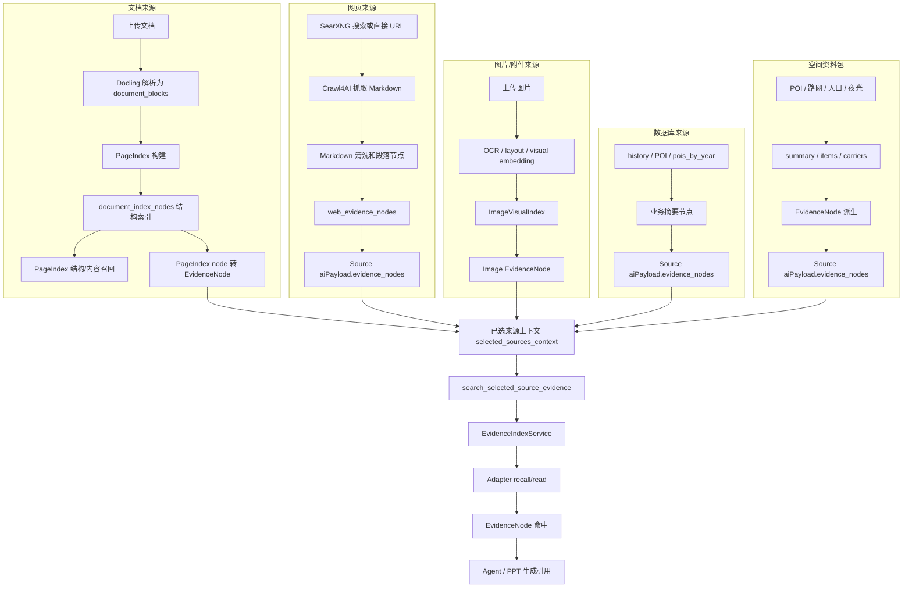
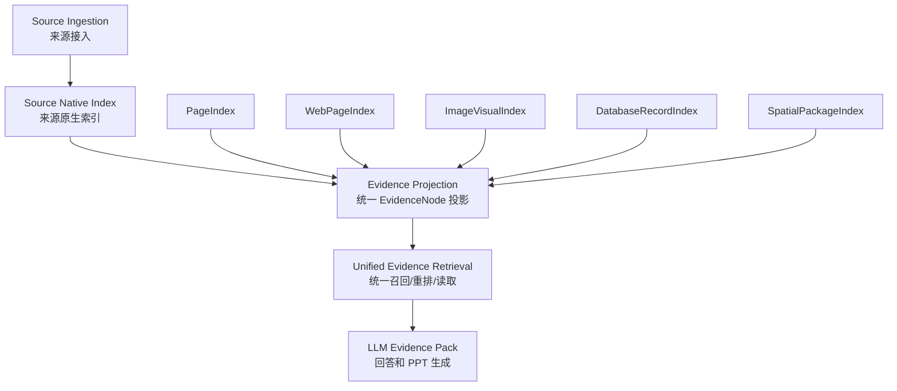
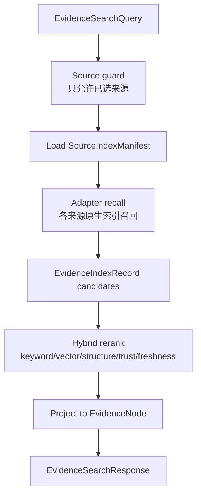
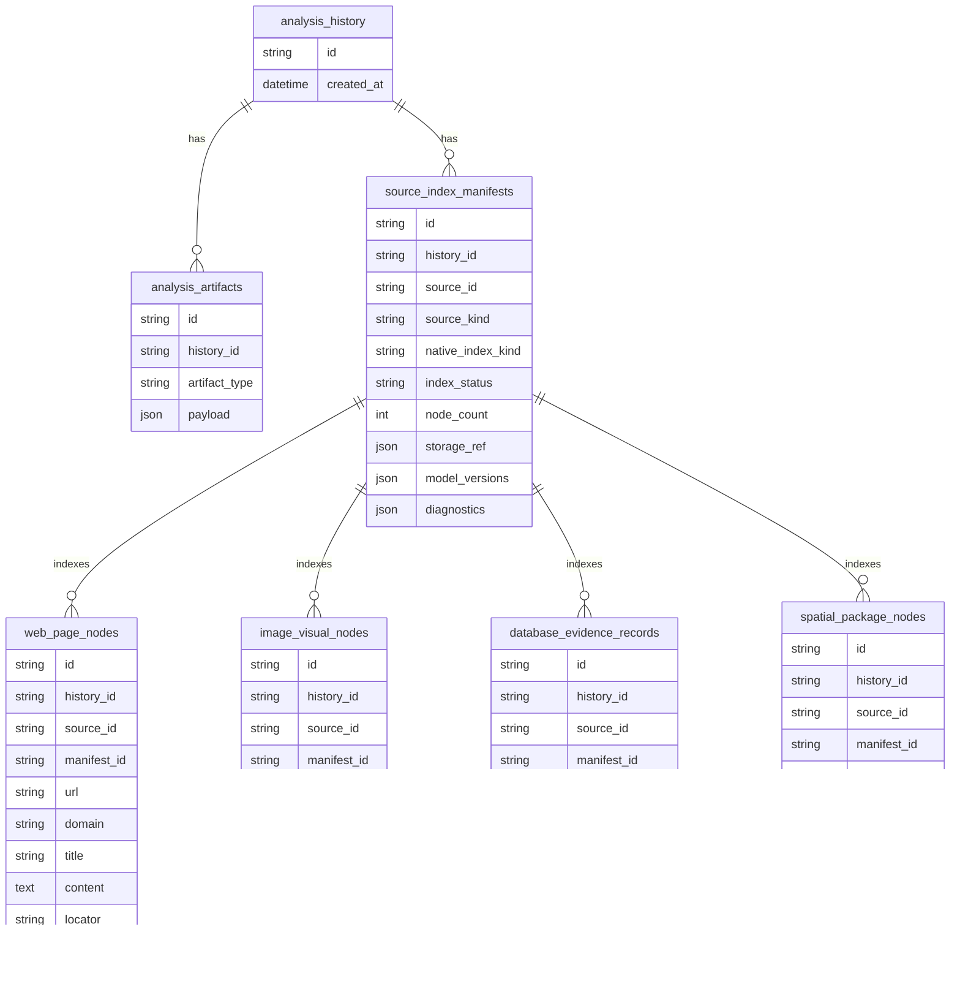

# RAG 来源索引与检索现状及改造建议

本文面向 RAG 来源索引与检索改造，说明当前已经落地的统一索引层、检索层和仍需后续增强的 native index 能力。重点是明确每类来源如何完成解析、node parsing、manifest 登记、index 和 retrieval，以及这些能力如何通过统一证据层暴露给 Agent / PPT。

## 1. 结论摘要

当前系统已经收敛为“统一索引门面 + 各来源 native adapter”的 RAG 来源层：

- 文档来源已经有 PageIndex，`document_index_nodes` 本身就是可召回的结构化索引。
- 网页、数据库、空间资料包已经声明 `webpage_index`、`database_record_index`、`spatial_package_index` manifest；当前 native 节点仍主要从 artifact/source payload 投影，后续可落表增强。
- 图片/附件 ingest 阶段已经从 RAGAnything + LightRAG 迁出，当前按 `ImageVisualIndex` contract 写入图片索引节点；目标执行器是 PaddleOCR/PP-Structure + OpenCLIP + Qdrant。
- 当前 Agent 的已选来源检索走 `search_selected_source_evidence`，内部通过 `EvidenceIndexService.search/read/manifests` 统一分发到各来源 adapter。
- 已持久化来源会额外写入 `source_index_manifest` artifact，作为短期的 manifest registry；未来可迁移为独立 `source_index_manifests` 表。
- 运行时分析上下文还有一套 `RuntimeKnowledgeIndex + rank_chunks`，服务当前会话分析/报告上下文，不等同于 PPT 来源索引。

所以现在的统一点已经从单纯 `EvidenceNode` contract，升级为 `SourceIndexManifest + EvidenceIndexService + EvidenceSourceAdapter + EvidenceNode projection`。剩余主要是 native node 物理表、向量索引和 hybrid rerank 的增强。

## 2. 当前端到端链路



## 3. 按来源的现状表

| 来源 | 解析 / 抽取 | Chunking / Node Parsing | 当前 Index | 当前 Retrieval | 主要代码 |
| --- | --- | --- | --- | --- | --- |
| 文档 `document` | `parse_document_with_docling` 把文件解析为 `document_blocks` | PageIndex 根据标题、block、页码生成层级节点 | `document_index_nodes` 表，含 `node_id`、`parent_node_id`、`level`、`ordinal`、`page_start`、`summary`、`text` | `search_evidence` 对 PageIndex structure 做关键词打分，再用 `get_pageindex_page_content` 取内容；PPT 侧也会把前 40 个 PageIndex 节点转为 EvidenceNode | `modules/documents/service.py`、`modules/documents/pageindex.py`、`store/ai_models.py` |
| 网页 `web` | SearXNG 找 URL，Crawl4AI 抓 Markdown | Markdown 清洗后按标题/段落切为 `web_evidence_nodes`，每页最多若干段 | `webpage_index` manifest；当前仍以 artifact/source payload 保存页面段落投影 | 已选来源内通过统一 `WebPageIndexAdapter` 轻量文本匹配；无 embedding、无网页全文索引 | `modules/web_crawler/crawler.py`、`modules/ppt_web_source/service.py`、`modules/evidence_index/adapters/web_page.py` |
| 图片 `image` | 当前按 ImageVisualIndex contract 登记图片索引节点；OCR/layout/caption/vector 处理器目标为 PaddleOCR/PP-Structure + OpenCLIP + Qdrant | 目标按 OCR 文本块、layout 区域、caption、visual objects、图表/表格理解结果生成图片节点 | 项目持久消费层保存 `chunks.json` 和 `image_visual_index.json`；PPT 来源声明 `image_visual_index` manifest | 当前附件检索用 `rank_chunks` 处理投影节点；目标支持 OCR 文本检索、CLIP 图文向量检索、按 image region 精确读取 | `modules/retrieval/attachments.py`、`modules/evidence_index/adapters/image_visual.py`、`modules/ppt_planning/data_tools.py` |
| 数据库 `database` | 读取 `history_repo` 的 detail、POI summary、pois_by_year | 手写业务摘要节点，不暴露原始数据库行 | `database_record_index` manifest；数据库资料包 artifact 保存 EvidenceNode payload | 已选来源内通过统一 `DatabaseEvidenceAdapter` 轻量文本匹配，支持按 record/locator 读取 | `modules/ppt_database/service.py`、`modules/evidence_index/adapters/database_record.py` |
| 空间资料包 `package` | 由 POI、路网、人口、夜光等分析结果构建 package | 从 `summary`、代表 `items`、`carriers` 派生 EvidenceNode | `spatial_package_index` manifest；资料包 artifact 保存 package 和 EvidenceNode payload | 按 `carrier_id`、`item_id`、locator 读取，检索先用关键词，后续可接结构过滤/向量重排 | `modules/ppt_planning/data_tools.py`、`modules/evidence_index/adapters/package.py` |
| 当前分析上下文 `system/runtime` | 从当前 `AnalysisSnapshot` 和 artifacts 生成运行时知识片段 | `build_analysis_chunks`、`build_report_chunks` 生成 `KnowledgeChunk` | 内存态 `RuntimeKnowledgeIndex`，不持久化为统一来源索引 | `rank_chunks` 的 BM25-like token 打分 | `modules/retrieval/index_store.py`、`modules/retrieval/ranker.py` |

## 4. 当前统一层

当前统一层包括四个契约：

| 契约 | 作用 | 代码 |
| --- | --- | --- |
| `SourceIndexManifest` | 声明每个 source 的 native index 类型、状态、读写模式、诊断和 storage_ref | `modules/evidence_index/schemas.py` |
| `EvidenceIndexService` | 对上层统一提供 `search`、`read`、`manifests` | `modules/evidence_index/service.py` |
| `EvidenceSourceAdapter` | 每个来源隐藏自己的索引和读取细节 | `modules/evidence_index/adapters/` |
| `EvidenceNode` | 面向 Agent/PPT 的统一证据投影 | `modules/evidence_retrieval/schemas.py` |

`EvidenceNode` schema 仍是最终给 Agent/PPT 的稳定输出：

| 字段 | 作用 |
| --- | --- |
| `id` | 节点唯一 ID，用于 search 命中后 read by node_id |
| `source_id` | 所属来源 ID |
| `source_type` | 来源类型：`system`、`document`、`image`、`web`、`database`、`package` |
| `title` | 节点标题 |
| `content` | 可传给 LLM 的主体文本 |
| `summary` | 列表和命中展示用摘要 |
| `metadata` | 页码、URL、图片信息、record id、carrier id 等来源定位信息 |
| `locator` | 人可理解的定位符，如 PageIndex 行、URL、数据库记录、图片页码 |
| `score` | 当前检索打分 |
| `evidence_level` | 证据层级，如 `pageindex_node`、`research_web_evidence` |
| `citation` | 引用文本 |

旧的 `modules/evidence_retrieval` 已经退成 facade，外部 API 仍可调用 `search_evidence`，内部转到 `EvidenceIndexService.search`。这样路由层、Agent 工具和 PPT 来源问答不需要知道 PageIndex、网页、图片、数据库或资料包的内部索引细节。

## 5. 当前 Retrieval 行为

### 5.1 已选来源检索

`search_selected_source_evidence` 只检索本轮 Agent 收到的 `selected_sources_context`，不会自动访问所有数据库、所有网页或所有文档。

流程：

1. 从 artifacts 读取已选来源。
2. 把每个来源的 `aiPayload.evidence_nodes` 转成 `SourceRecord`。
3. 调 `search_evidence`，内部进入 `EvidenceIndexService.search`。
4. `EvidenceAdapterRegistry` 根据 `index_manifest.native_index_kind` 选择 adapter。
5. 各 adapter 使用自己的 recall/read 规则，例如文档查 PageIndex，网页查 `webpage_index` 投影节点，图片查 `image_visual_index` 投影节点。
6. 返回 hits 和 EvidenceNode。
7. `read_selected_source_evidence_node` 优先从本轮缓存按 `node_id` 读取；缓存未命中时通过 `EvidenceIndexService.read` 走统一 read。

这是一套 source-scoped evidence search，不是完整的 embedding RAG。

### 5.2 PageIndex 检索

文档来源特殊。它有持久化 PageIndex：

- `document_blocks` 保存解析后的页/block。
- `document_index_nodes` 保存结构化章节节点。
- `get_pageindex_document_structure` 返回结构。
- `get_pageindex_page_content` 按 PageIndex line/page 取正文。

因此 PageIndex 已经可以直接召回。后续设计不应把它降级成普通 chunk，而应把它作为文档来源的主索引，并通过统一接口暴露。

### 5.3 附件/图片检索

图片和附件 ingest 阶段此前调用 RAGAnything：

- parser 可配置为 `mineru`、`docling`、`paddleocr`。
- 使用 OpenAI-compatible LLM 和 embedding。
- `enable_image_processing=True`，模型具备图像识别能力时可以直接理解图片内容。
- 当前代码还会把图片以 base64 data URL 传给 vision model function。

但 PPT 来源侧没有持续使用 RAGAnything 的索引做查询，而是把一次 hybrid query 的 context 切成 `AttachmentChunk` 并写入 `chunks.json`。现在代码已移除 RAGAnything 执行链路，图片来源改为 `ImageVisualIndex` contract；如果图片链路只负责建立图片索引，应继续接入专门的图片索引栈：

| 能力 | 推荐开源组件 | 作用 |
| --- | --- | --- |
| OCR / 版面分析 | PaddleOCR / PP-Structure | 提取中文 OCR、文本区域、表格、图片区域、版面结构 |
| 图文向量 | OpenCLIP | 为整图、crop、caption、OCR 文本建立同一语义空间的 embedding |
| 向量检索 | Qdrant | 保存 image/crop/text embedding，支持相似图片和自然语言检索 |
| 调试与离线评估 | FiftyOne，可选 | 用于检查图片样本、embedding 聚类、相似检索质量，不一定进入生产链路 |

目标图片链路应是：上传图片 -> OCR/layout/crop -> OpenCLIP embedding -> `ImageVisualIndex` -> EvidenceNode projection。已有多模态模型仍保留直接传图能力，但只在视觉问题、索引证据不足或需要核验图像细节时使用；常规召回走图片索引。

## 6. 问题与设计味道

| 问题 | 表现 | 影响 |
| --- | --- | --- |
| native node 物理层仍有过渡 | 文档有 PageIndex，图片已声明 ImageVisualIndex，网页/数据库/package 已声明 native manifest，但部分来源仍是 artifact/payload 过渡层 | 后续需要落表才能更好支持增量更新、字段过滤和诊断 |
| hybrid rerank 尚未统一 | 目前各 adapter 主要是 keyword/structure 召回，向量和 trust/freshness/facet rerank 还未统一 | 复杂问题的召回质量和排序解释仍可提升 |
| 图片能力未完全沉淀为稳定索引 | 已有 ImageVisualIndex contract 和 adapter，但默认 processor 只登记元数据，OCR/layout/caption/vector 仍需接入 PaddleOCR/OpenCLIP/Qdrant | 真实 OCR、图片区域和图像描述召回质量依赖后续 processor |
| 网页缺少索引 | Crawl4AI 结果只保留有限段落和 excerpt | 网页正文无法稳定重查、重排、去重和诊断 |
| 数据库/package 缺少结构化检索索引 | 当前是摘要节点，更多依赖构建时挑选 | 对具体指标、载体、记录的定位能力弱 |
| EvidenceNode 与 index record 边界不清 | 有的节点是索引记录，有的是传输 payload，有的是运行时 chunk | 后续维护者需要记住每个来源的例外规则 |

## 7. 建议目标架构

建议把后续目标拆成三层，而不是把所有来源强行做成同一种 chunk：



关键原则：

- 文档保留 PageIndex，不把它退化成普通文本 chunk。
- 图片保留可直接传图给 AI 的能力，同时把 OCR、caption、视觉对象、图表信息建立为可召回索引。
- 网页保留 Crawl4AI Markdown，同时建立网页段落索引、URL 元数据和抓取诊断。
- 数据库和空间资料包应建立结构化 record index，而不是只保存展示摘要。
- EvidenceNode 是统一投影，不一定是唯一底层索引格式。

## 8. 建议改造表

| 来源 | Chunking / Node Parsing 应调整为 | Index 应调整为 | Retrieval 应调整为 | 技术栈建议 |
| --- | --- | --- | --- | --- |
| 文档 | 保持 PageIndex 章节/页码/层级节点；补充表格、图片、图注节点 | PageIndex 作为 primary index；可补充 embedding/hybrid index | 先结构检索 PageIndex，再按节点内容重排；支持 read by node_id/page | 保留 Docling + PageIndex；可加统一 hybrid ranker |
| 网页 | Crawl4AI Markdown 按标题、段落、列表、表格切节点；保留 URL、抓取时间、可信等级 | 新增 WebPageIndex，持久化页面、段落、hash、domain、抓取状态 | URL/domain/source tier 过滤 + keyword/vector hybrid + freshness/可信度重排 | Crawl4AI + SearXNG；可加入统一 embedding store |
| 图片 | OCR、caption、visual objects、chart/table interpretation 分层节点；必要时保留图片区域 locator | 新增 ImageVisualIndex，保存整图/crop、bbox/页码、OCR、caption、embedding、模型版本 | 文本问题查 OCR/caption；视觉问题先查 CLIP 图文向量，必要时 read 节点后携带原图或 crop 给多模态模型 | 移除 RAGAnything 作为图片目标链路；采用 PaddleOCR/PP-Structure + OpenCLIP + Qdrant；FiftyOne 仅作离线评估可选 |
| 数据库 | 按 record、metric、aggregation、diagnostic 生成结构化节点 | 新增 DatabaseEvidenceIndex 或复用 scope dataset record index | 结构化过滤优先，文本检索辅助；支持按 record_id 精确读取 | SQLAlchemy repo + typed schema；避免 LLM 直接看原始表 |
| 空间资料包 | carrier、representative item、metric summary、evidence ref 分层节点 | 新增 SpatialPackageIndex，保存 carrier_id、geometry locator、metric refs | 先按 intent/metric/carrier_type 过滤，再文本/向量重排 | 复用 package builder；补稳定 record ids |
| 当前分析上下文 | 保持 runtime chunks，但区分临时上下文和持久来源 | Runtime index 仍可内存态；重要结果应投影为 Source index | Agent 当前态用 runtime retrieval；PPT/复盘用持久 Source retrieval | 保留 `RuntimeKnowledgeIndex`，不要和 Source index 混淆 |

## 9. 推荐统一接口

后续可以把接口收敛到一个较深的模块，例如 `modules/evidence_index`：

```text
SourceIndexer.ingest(source) -> SourceIndexManifest
SourceIndexer.project(source_id, native_hit) -> EvidenceNode
EvidenceRetriever.search(query, source_ids, filters) -> EvidenceSearchResponse
EvidenceRetriever.read(node_id) -> EvidenceNode
EvidenceRetriever.explain(node_id) -> retrieval trace / source diagnostics
```

每个来源只实现自己的 adapter：

| Adapter | 负责隐藏的细节 |
| --- | --- |
| `DocumentPageIndexAdapter` | PageIndex 表结构、line/page 映射、章节树 |
| `WebPageIndexAdapter` | Crawl4AI 结果、Markdown 清洗、URL/domain 元数据 |
| `ImageVisualIndexAdapter` | PaddleOCR/PP-Structure 输出、OpenCLIP embedding、bbox、caption、原图/crop locator、必要时的 vision model 输出 |
| `DatabaseEvidenceAdapter` | record schema、聚合口径、SQL/仓储访问 |
| `SpatialPackageAdapter` | carrier、metric、geometry locator、证据引用 |

这样上层只知道 Source 和 EvidenceNode，不需要知道 PageIndex、Crawl4AI、PaddleOCR/OpenCLIP/Qdrant、SQL row 或 package 内部结构。

## 10. 统一 Index 层和 Retrieval 层设计

统一不是把所有来源强行塞进同一个物理表，也不是废掉 PageIndex。更稳的做法是：统一上层 index contract 和 retrieval API，底层允许每个来源保留 native index。也就是“统一门面，保留深模块”。

### 10.1 目标模块边界

建议新增或重构为一个明确的证据索引域：

```text
modules/evidence_index/
  schemas.py          # SourceIndexManifest, EvidenceIndexRecord, EvidenceSearchQuery, EvidenceSearchHit
  service.py          # EvidenceIndexService: ingest/search/read/explain
  registry.py         # source_kind -> adapter
  adapters/
    document_pageindex.py
    web_page.py
    image_visual.py
    database_record.py
    spatial_package.py
    runtime_context.py
  rankers/
    keyword.py
    vector.py
    hybrid.py
```

旧的 `modules/evidence_retrieval` 可以先作为 facade 保留，对外 API 不急着改名；内部逐步切到 `EvidenceIndexService`。

### 10.2 统一 Index Contract

每个来源 ingest 后必须产出一个 `SourceIndexManifest`。它不要求所有节点都复制进一个表，但必须说明这个来源的索引在哪里、怎么查、怎么读。

| 字段 | 含义 | 示例 |
| --- | --- | --- |
| `source_id` | 来源 ID | `document:abc` |
| `source_kind` | 来源类型 | `document`、`web`、`image` |
| `native_index_kind` | 原生索引类型 | `pageindex`、`webpage_index`、`image_visual_index` |
| `index_status` | 索引状态 | `ready`、`building`、`failed` |
| `node_count` | 可投影 EvidenceNode 数量 | `42` |
| `retrieval_modes` | 支持的召回方式 | `structure`、`keyword`、`vector`、`hybrid` |
| `read_modes` | 支持的读取方式 | `node_id`、`page`、`url`、`bbox`、`record_id` |
| `storage_ref` | 原生索引定位 | PageIndex document id、artifact id、Qdrant collection |
| `model_versions` | parser / OCR / embedding / vision 模型版本 | `docling`, `openclip`, `paddleocr` |
| `diagnostics` | 索引诊断 | 空索引、OCR 低质、抓取失败 |

再定义一个轻量 `EvidenceIndexRecord`，作为统一检索层内部的“候选记录”：

| 字段 | 含义 |
| --- | --- |
| `record_id` | 原生索引记录 ID，如 PageIndex node、web paragraph、image crop、database record |
| `source_id` | 来源 ID |
| `source_kind` | 来源类型 |
| `title` | 候选标题 |
| `summary` | 候选摘要 |
| `content_ref` | 完整内容读取定位，不一定直接放全文 |
| `metadata` | 页码、URL、bbox、record id、carrier id 等 |
| `scores` | keyword/vector/structure/freshness/trust 等分项分数 |

`EvidenceNode` 则作为最后投影给 Agent/PPT 的稳定输出。这样 PageIndex node、图片 crop、网页段落、数据库记录可以保留自己的原生结构，但对上层统一表现为 EvidenceNode。

### 10.3 统一 Retrieval API

当前对上层暴露这些操作：

```python
class EvidenceIndexService:
    def index_source(self, source: SourceRecord) -> SourceIndexManifest: ...
    def manifests(self, query: EvidenceSearchQuery) -> list[SourceIndexManifest]: ...
    async def search(self, query: EvidenceSearchQuery) -> EvidenceSearchResponse: ...
    async def read(self, node_id: str, query: EvidenceSearchQuery) -> EvidenceNode | None: ...
    async def explain(self, node_id: str, query: EvidenceSearchQuery) -> EvidenceTrace: ...
```

`EvidenceSearchQuery` 至少需要这些字段：

| 字段 | 含义 |
| --- | --- |
| `question` | 用户问题或检索短语 |
| `source_ids` | 必须受已选来源约束 |
| `source_kinds` | 可选来源类型过滤 |
| `retrieval_mode` | `auto`、`keyword`、`structure`、`vector`、`hybrid` |
| `top_k` | 返回数量 |
| `filters` | URL domain、page range、bbox、record type、carrier type 等 |
| `include_diagnostics` | 是否返回诊断 |

统一 search 的内部流程：



### 10.4 Adapter 职责

每个 adapter 必须实现同一组语义，而不是让上层知道来源细节：

```python
class EvidenceSourceAdapter:
    source_kind: str
    def manifest(self, source: SourceRecord) -> SourceIndexManifest: ...
    async def recall(self, query: EvidenceSearchQuery, manifest: SourceIndexManifest) -> list[EvidenceIndexRecord]: ...
    async def read(self, record_id: str, manifest: SourceIndexManifest) -> EvidenceNode | None: ...
```

| Adapter | 原生索引 | recall 规则 | read 规则 |
| --- | --- | --- | --- |
| `DocumentPageIndexAdapter` | `document_index_nodes` | PageIndex structure/title/summary/page + 可选 embedding | 按 PageIndex node/page 读取完整文本 |
| `WebPageIndexAdapter` | `web_pages` / `web_paragraphs` 或 artifact 过渡层 | keyword/vector + domain/trust/freshness | 按 URL + paragraph id 读取清洗段落 |
| `ImageVisualIndexAdapter` | `image_visual_nodes` + Qdrant collection | OCR keyword + OpenCLIP text-image vector | 按 image/crop/bbox 读取 OCR/caption，必要时返回原图 locator |
| `DatabaseEvidenceAdapter` | database record/metric index | record type/metric/year/source filter 优先，文本辅助 | 按 record_id/metric_id 精确读取 |
| `SpatialPackageAdapter` | package carrier/item index | intent、carrier_type、metric、source ref 过滤 + rerank | 按 carrier_id/item_id 读取节点并回到地图 locator |
| `RuntimeContextAdapter` | `RuntimeKnowledgeIndex` | 当前会话内存 chunk keyword | 按 chunk_id 读取，不能当持久来源 |

### 10.5 统一物理存储建议

短期不要一次性改成一个大表。建议两层存储：

1. 统一 manifest / registry 表：所有来源都必须登记。
2. 来源原生索引表或外部 collection：按来源保留深模块。

建议新增表或 artifact 类型：

| 存储 | 用途 |
| --- | --- |
| `source_index_manifests` 或 `analysis_artifact:source_index_manifest` | 每个 Source 的索引状态、模式、诊断 |
| `web_page_nodes` 或 `analysis_artifact:web_page_index` | 网页页面和段落索引 |
| `image_visual_nodes` 或 `analysis_artifact:image_visual_index` | 图片 OCR/layout/caption/bbox 节点 |
| `database_evidence_records` 或 scope dataset index | 数据库结构化证据记录 |
| Qdrant collections | web/image/package 可选向量索引 |

文档 PageIndex 继续使用 `document_index_nodes`，只需要登记 manifest 并实现 adapter，不需要迁移表结构。当前代码已先通过 `analysis_artifact:source_index_manifest` 落地 manifest registry；后续如果需要更强查询能力，再迁移为独立 `source_index_manifests` 表。

#### 10.5.1 表和历史记录的归属关系

这些表不是另起一套“全库 RAG 数据库”，而是挂在已跑过的 `history_id`、已选 `source_id` 和可复盘的 artifact 下面。推荐关系是：



核心链路应保持为：

```text
analysis_history
  -> selected source / analysis_artifact
  -> source_index_manifest
  -> native index nodes
  -> EvidenceNode projection
```

因此所有持久索引节点至少需要这些归属字段：

| 字段 | 作用 |
| --- | --- |
| `history_id` | 属于哪次已保存分析历史；避免变成全库乱搜 |
| `source_id` | 属于哪个 PPT 来源或系统来源 |
| `manifest_id` | 属于哪个索引版本和索引状态 |
| `record_id` / `node_id` | 原生索引记录 ID，用于 read |
| `content` / `text` | 可检索文本或节点摘要 |
| `locator` | 回到原始对象的位置，如 URL、bbox、carrier、page |
| `metadata` | bbox、year、domain、metric_id 等来源特有字段 |

#### 10.5.2 `source_index_manifests` 草案

最先应该落表的是 manifest。它是所有来源统一入口的登记表，告诉检索层“这个 source 怎么查、怎么读、状态如何”。当前实现先用 `analysis_artifacts.artifact_type = source_index_manifest` 承载同样结构，避免 demo 阶段新增迁移成本。

```sql
CREATE TABLE source_index_manifests (
  id TEXT PRIMARY KEY,
  history_id TEXT NOT NULL,
  source_id TEXT NOT NULL,
  source_kind TEXT NOT NULL,
  native_index_kind TEXT NOT NULL,
  index_status TEXT NOT NULL DEFAULT 'ready',
  node_count INTEGER NOT NULL DEFAULT 0,
  retrieval_modes JSON,
  read_modes JSON,
  storage_ref JSON,
  model_versions JSON,
  diagnostics JSON,
  created_at DATETIME,
  updated_at DATETIME,
  UNIQUE(history_id, source_id)
);
```

`storage_ref` 不应暴露给上层调用方，但 adapter 可以用它找到原生索引：

```json
{
  "table": "image_visual_nodes",
  "artifact_id": "artifact-123",
  "qdrant_collection": "image_visual_vectors",
  "qdrant_namespace": "history-1/image:att-123"
}
```

#### 10.5.3 各来源如何挂到 history

| 来源 | history 归属方式 | 节点表建议 |
| --- | --- | --- |
| 文档 | `document_id` 的 PageIndex 可跨 history 复用；当前 history 下用 `source_id=document:<id>` 登记 manifest | 继续使用 `document_index_nodes`，不重建 |
| 网页 | 某次 PPT 来源搜索或 URL 添加产生，挂 `history_id + source_id` | `web_page_nodes`，保存 URL、domain、paragraph、hash、抓取诊断 |
| 图片 | 上传附件或来源图片产生，挂 `history_id + source_id=image:<attachment_id>`；可用 `file_hash` 去重 | `image_visual_nodes`，保存 OCR/layout/caption/bbox；向量放 Qdrant |
| 数据库 | 不是全库索引，而是某个 history 已保存结果的结构化证据索引 | `database_evidence_records`，保存 analysis_summary、artifact_metric、poi_summary 等 |
| 空间资料包 | 由当前 history 的 POI、路网、人口、夜光等组合生成，必须挂 `history_id` | `spatial_package_nodes`，保存 carrier、item、metric ref、geometry locator |
| runtime/system | 当前会话内存上下文，不默认持久化 | 不建表；需要复盘时投影为 source/artifact 再登记 manifest |

数据库来源尤其要避免误解：它不是“用户问题 -> SQL 全库查询”，而是：

```text
已保存 analysis_history / analysis_artifacts
  -> database source
  -> database_record_index
  -> EvidenceNode
```

后续如果要支持全库检索，应作为另一个受权限和范围约束的工具或数据集能力设计，不混进 PPT 已选来源 evidence index。

#### 10.5.4 分步建表顺序

短期不要一次建齐所有表。更稳的顺序：

1. 先建或登记 `source_index_manifests`；当前已用 `analysis_artifact:source_index_manifest` 登记，其他 native index 继续放现有 PageIndex、artifact JSON、attachment JSON。
2. 再建 `image_visual_nodes`，因为图片最需要 bbox、OCR、caption 和向量检索的稳定 read。
3. 再建 `web_page_nodes`，解决网页正文、段落 hash、domain/freshness/trust 过滤。
4. 结构稳定后建 `spatial_package_nodes`，让 carrier/item/metric refs 能直接回到地图对象。
5. 最后建 `database_evidence_records`，把 history/artifact/metric 的摘要节点升级成可按 record_id、metric_id、year 精确过滤的结构索引。

Qdrant 等向量库不必替代 SQL 表。SQL 表保存节点、定位和诊断；向量库只保存 embedding，并通过 `record_id` / `vector_id` 回连节点。

### 10.6 对现有代码的收敛路径

现有入口不需要一次全改，按这个顺序风险最低：

1. 已在 `modules/evidence_retrieval/service.py` 内部引入 adapter registry，并把 PageIndex 检索拆到 `DocumentPageIndexAdapter`。
2. 已把 `evidence_nodes_from_source` 包成 `PayloadEvidenceAdapter`，专门表示尚未迁移来源的 payload-only 过渡索引。
3. `search_selected_source_evidence` 继续调用 `search_evidence`，但 `search_evidence` 内部已改成 `EvidenceIndexService.search`。
4. 已给每个主要 `PptSource.meta.aiPayload` 补 `index_manifest`，并对持久化来源额外写 `source_index_manifest` artifact。
5. 后续逐步把 image 以及更重的 web/database/package 持久索引从 artifact/payload 过渡层迁到真正 native node 表和向量索引。

这条路能保证 Agent 工具层接口稳定：

```text
list_selected_sources
search_selected_source_evidence
read_selected_source_evidence_node
```

工具名和调用方式可以不变，底层 retrieval 逐步统一。

## 11. 分阶段落地建议

### Phase 1：把现状边界写进代码结构（已完成）

- 保留现有 PageIndex 检索，但把 `search_evidence` 中的 PageIndex 补查拆成明确的 document adapter。
- 给尚未迁移的 payload-only 检索标记为 `payload_index`，避免误认为已经有持久索引；网页、数据库、空间资料包已分别声明为 `webpage_index`、`database_record_index`、`spatial_package_index`。
- 给图片来源标记 `image_visual_index`；不再依赖 RAGAnything 建图片索引。

### Phase 2：建立统一 Source Index Manifest（已完成 artifact 版）

每个来源生成一个 manifest：

| 字段 | 示例 |
| --- | --- |
| `source_id` | `document:xxx` |
| `source_kind` | `document` |
| `native_index_kind` | `pageindex`、`webpage_index`、`image_visual_index` |
| `index_status` | `ready`、`building`、`failed` |
| `node_count` | 42 |
| `retrieval_modes` | `keyword`、`structure`、`vector`、`hybrid` |
| `model_versions` | parser、embedding、vision model |
| `diagnostics` | 抓取失败、OCR 低质、索引为空等 |

### Phase 3：补齐网页、图片、数据库、空间资料包索引（后续增强）

- 网页：持久化 Crawl4AI 页面和段落节点。
- 图片：移除 RAGAnything 目标链路；用 PaddleOCR/PP-Structure 持久化 OCR/layout nodes，用 OpenCLIP 建立整图/crop 图文向量，用 Qdrant 做检索，保留原图 locator，支持必要时直接传图给多模态模型。
- 数据库：把当前摘要节点升级为可按 record_id/metric_id 查询的结构索引。
- 空间资料包：carrier 和 metric refs 需要稳定 ID，便于 read by node_id 后回到地图对象。

### Phase 4：统一 retrieval 和重排（retrieval 门面已完成，hybrid rerank 待增强）

- 第一层：source filter、权限和已选来源约束。
- 第二层：各来源 native index recall。
- 第三层：统一 EvidenceNode projection。
- 第四层：keyword/vector/hybrid rerank。
- 第五层：read by node_id，返回完整节点和来源诊断。

## 12. 后续评估问题

后续分析“怎么变优雅、统一”时，建议围绕这些问题判断：

1. EvidenceNode 是索引记录，还是索引命中的投影结果？建议定义为投影结果。
2. PageIndex 是否继续作为文档主索引？建议保留。
3. 图片是否每次都直接传图给 AI？建议只在视觉问题或证据不足时传图，常规检索走图片索引。
4. 网页是否需要保存全文 Markdown？建议保存清洗后的页面和段落 hash，但传给 LLM 只传命中节点。
5. 数据库是否要进向量库？结构化过滤和精确读取优先，向量只做辅助召回。
6. 统一技术栈是统一底层存储，还是统一上层接口？建议先统一上层接口和 manifest，再逐步统一存储。

## 13. 术语对齐

| 术语 | 在本项目中的建议含义 |
| --- | --- |
| Chunking | 把原始内容切成可处理片段，不一定可直接召回 |
| Node Parsing | 把 chunk 或结构化记录变成有语义边界的节点 |
| Native Index | 每个来源自己的索引，如 PageIndex、ImageVisualIndex、WebPageIndex |
| EvidenceNode | 面向 Agent/PPT 的统一证据投影 |
| Retrieval | 在已选来源和权限边界内召回 EvidenceNode |
| Read by node_id | 根据检索命中读取完整证据和定位信息 |
| Evidence Pack | LLM 最终可使用的一组证据节点、引用和诊断 |
