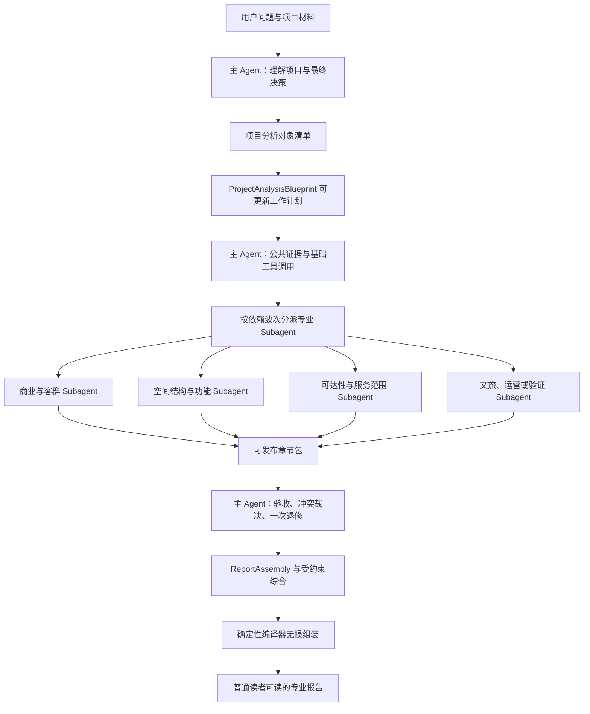

# Spatial Business Analyst：多专家协作式分析报告 Agent 架构决策

> **状态：方向已确认，首轮 Skill 实现与真实数据验证已完成**
>
> **决策日期：2026-07-17**
>
> **适用范围：** `spatial-business-analyst` 的主 Agent 工作流、专业 Subagent 协作、工具调用、章节验收、总编裁决和报告组装。
>
> **与既有文档的关系：** 本文细化《Spatial Business Analyst V4.1：Skill-first 方向调整决策》中“Codex 原生组织专业协作”的具体形态。既有 V4.1 草案继续定义业务理解、指标知识和数据健康目标；本文对多 Agent 报告生产方式具有优先解释权。

## 1. 决策摘要

Spatial Business Analyst 采用一种面向复杂项目报告的多专家协作模式：

> **主分析师规划 + 专业 Subagent 研究并直接成稿 + 主编验收与裁决 + 编译器无损组装**

这不是所有分析 Agent 的一般形态。简单问题仍可由单一 Agent 按“理解问题、调用工具、分析结果、生成答案”的路径完成；只有当任务同时包含多个专业问题、多个项目对象、多个证据来源或需要形成正式报告时，才启用多专家报告模式。

核心链路为：

```text
主 Agent 理解项目和最终决策
→ 建立项目分析对象清单
→ 形成可更新的 ProjectAnalysisBlueprint
→ 主 Agent 获取公共事实和基础证据
→ 按依赖波次分派专业 Subagent
→ Subagent 在授权边界内读取资料并调用工具
→ Subagent 提交可直接进入报告的专业章节
→ 主 Agent 验收、冲突裁决并定向退修一次
→ 主 Agent 生成 ReportAssembly 组装清单和受约束综合
→ 编译器无损组装普通读者可读的专业报告
```

专业 Subagent 不是只交 Memo 或机器字段，再由主 Agent 重写全文。它们必须对自己的专业判断和公开表达负责，交付同时满足“普通读者可读”和“证据可追溯”。

主 Agent 与 Subagent 都具有调用工具的能力，但承担不同层次的工具责任：

- 主 Agent 使用工具理解项目、发现数据、建立共同事实、验证计划和复核交付；
- Subagent 使用工具完成本专业任务所需的深入研究、补充计算和证据核验；
- 工具负责读取真实数据和确定性计算，不负责替 Agent 生成专业判断；
- 已有结果通过稳定 result ID 复用，避免每个 Agent 重复执行同一计算。

## 2. 为什么采用这种形态

### 2.1 复杂项目不是一个连续问题

空间分析、城市更新、园区策划和文旅项目通常同时包含：

- 项目定位与商业模式；
- 建筑、庭院和道路的空间组织；
- 客群、账户和利益相关者；
- POI、人口、夜光、路网和服务范围分析；
- 功能、业态、产品和运营时段；
- 分期实施、成本、风险和验证条件。

如果主 Agent 独自完成所有研究和写作，它既要维持全局决策，又要处理每个专业的证据细节，容易出现上下文过载、专业判断变薄和报告结构失控。

### 2.2 “Subagent 写 Memo，主 Agent 重写全文”会损失专业信息

当 Subagent 只提交研究 Memo，最后由主 Agent重写全部章节时，容易出现：

- 证据和比较基准在改写中丢失；
- 条件性判断被写成确定性结论；
- 专业限制被压缩为通用免责声明；
- 同一信息在多个章节被重复表达；
- 主 Agent 无意中成为所有专业章节的代写者。

因此，Subagent 应提交已经达到发布质量的专业章节模块。主 Agent 负责验收、裁决、排序和综合，而不是重写专业正文。

### 2.3 只允许主 Agent 调用工具会形成研究瓶颈

如果所有数据读取和指标执行都由主 Agent 预先完成，Subagent 只能被动解释现成结果，就无法根据研究过程中出现的新问题继续验证。例如，可达性 Agent 发现两个候选区的服务范围不可比时，应能在授权范围内调整同口径参数并重新执行，而不是让主 Agent代为猜测所需计算。

因此，主 Agent 和 Subagent 都必须具备工具能力，但必须通过任务授权、结果复用和调用边界避免无序探索。

### 2.4 最终报告首先是面向人的产品

`ChapterDeliveryPackage`、证据 ID 和工具结果是质量控制手段，不是最终报告的阅读结构。公开报告必须首先回答：

- 这个项目应该怎么做；
- 每个重要对象分别承担什么角色；
- 为什么这样判断；
- 先做什么、后做什么；
- 哪些建议仍是有条件的；
- 如何验证以及何时停止。

专业参数和证据索引可以保留在后半部分，但不能主导执行摘要和管理层决策表。

## 3. 适用模式

### 3.1 简单分析模式

满足以下特征时，不强制启用多 Subagent：

- 只有一个明确问题；
- 所需资料和工具较少；
- 不需要跨专业裁决；
- 最终交付是简短答案而不是正式项目报告。

路径为：

```text
理解问题
→ 制订计划
→ 搜索或读取资料
→ 调用工具分析
→ 根据结果继续推理
→ 生成答案
```

### 3.2 多专家报告模式

满足任一条件时，应启用多专家协作：

- 需要形成正式报告；
- 同时涉及商业、空间、客群、功能、运营或实施问题；
- 存在多个建筑、地块、候选点或利益相关者；
- 需要多种指标共同解释；
- 专业章节可以并行研究；
- 需要章节验收、冲突裁决或定向退修。

## 4. 总体架构



## 5. 主 Agent 的责任

主 Agent 同时承担首席分析师和总编责任，但不拥有所有专业章节的代写权。

### 5.1 前期分析与规划

主 Agent 负责：

1. 理解用户真正需要推动的决策；
2. 判断项目的 B2C、B2B 或 mixed 属性；
3. 识别付款方、使用者、需求单位、履约方式和关键利益相关者；
4. 建立项目分析对象清单；
5. 明确现有事实、空间代理、缺失数据和暂不回答的问题；
6. 选择必要的专业角色；
7. 设计章节决策问题、证据要求、工具范围、比较基准和依赖；
8. 形成并维护 `ProjectAnalysisBlueprint`；
9. 获取所有章节共同需要的公共事实和基础结果；
10. 按依赖波次分派 Subagent。

### 5.2 验收与总编裁决

主 Agent 对每份交付检查：

- 是否回答了章节决策问题；
- 是否使用真实且已授权的证据；
- 指标是否有有效比较基准；
- 专业结论是否已经用普通语言表达；
- 行动是否由前文 finding 推出；
- 未知信息是否转化为验证任务；
- 项目对象是否完整覆盖；
- 是否与 accepted 章节发生冲突。

裁决只能是：

- `accepted`：内容可直接进入报告；
- `revision_required`：给原作者具体、可执行的修改指令；
- `failed`：第二次仍不合格，或必要证据确实不存在。

主 Agent 不得以“统一文风”为由改变专业结论。涉及判断变化的修改必须退回原作者。

### 5.3 受约束综合

主 Agent 可以撰写：

- 执行摘要；
- 项目总体定位；
- 跨章节综合判断；
- 明确的冲突裁决；
- 最终行动优先级；
- 章节之间的衔接文本。

每一条综合判断必须绑定 accepted 章节。主 Agent 不得添加没有专业交付支持的新判断。

## 6. 项目分析对象清单

“完整空间单元清单”只适用于空间对象，不应替代更完整的项目理解。多专家报告模式首先建立 `AnalysisObjectInventory`，其中按项目需要包含：

### 6.1 空间对象

- 项目地块、建筑和构筑物；
- 庭院、道路、路径、花园和公共空间；
- 节点、围墙、门禁和后勤接口；
- 周边街区、等时圈、服务范围和候选点。

### 6.2 业务对象

- 付款方、使用者、居民、游客、企业和机构；
- 功能、业态、产品或服务包；
- 运营时段、活动场景和履约方式；
- 渠道、账户、合作方和责任主体。

### 6.3 证据对象

- 项目文档、图纸、照片和访谈记录；
- POI、人口、夜光、路网、H3 和等时圈结果；
- 经营数据、成本、订单、租金和客流数据；
- EvidenceNode、metric result 和待补充数据。

对象清单的目的不是把所有对象都写入正文，而是确保分析计划知道“必须回答什么、允许分组什么、哪些对象不能静默遗漏”。

城市更新、园区和多建筑项目必须对确认的建筑与非建筑空间逐一标记：

- `planned`：已有建议功能；
- `blocked`：资料不足，暂不能决策；
- `excluded`：有明确理由不纳入当前改造或分析。

## 7. ProjectAnalysisBlueprint

### 7.1 蓝图的作用

`ProjectAnalysisBlueprint` 是主 Agent 在分派前形成的**可更新工作计划**，用于控制专业任务边界和最终报告结构。它至少包括：

```yaml
project_decision:
analysis_objects:
project_hypotheses:
chapters:
  - chapter_id:
    specialist_role:
    decision_question:
    required_evidence:
    metric_candidates:
    comparison_baseline:
    allowed_tools:
    dependencies:
    required_output:
unanswered_questions:
report_outline:
```

### 7.2 不恢复 V3 蓝图锁

这里的蓝图不是 V3 的公开 `AnalysisBlueprint` 工件，也不是不可修改的锁：

- 不新增 blueprint、lock 或 snapshot 公开工件；
- 蓝图内容收敛在现有 `analysis-plan.json` 或主 Agent 工作上下文中；
- 工具结果显示原假设不成立时，主 Agent可以更新计划；
- 更新必须说明改变了哪个任务、证据要求或依赖；
- 已 accepted 的专业判断若受到影响，应定向退回相关原作者，而不是全量重跑。

蓝图的目的是防止 Subagent 接到“分析一下交通”这类模糊任务，不是冻结研究过程。

## 8. 专业 Subagent 的责任

每个 Subagent 是自己专业章节的研究者和作者，负责：

1. 理解本章决策问题和责任边界；
2. 阅读授权项目材料、上游输出和指标知识卡；
3. 检查现有结果是否足以回答问题；
4. 在允许范围内调用工具继续研究；
5. 解释指标的比较基准、空间机制和项目影响；
6. 将结论转成空间、功能、业态、运营或验证动作；
7. 用普通读者能理解的语言直接形成专业章节；
8. 同时保留 finding、证据链接、限制和验证条件；
9. 对退修意见作一次定向修改；
10. 发现超出责任范围的问题时报告边界，不扩写其他专业章节。

Subagent 不交付只供主 Agent参考的散乱 Memo，也不把工具日志或指标结果原样堆入正文。

## 9. 主 Agent 与 Subagent 的工具能力

### 9.1 共同原则

主 Agent 和 Subagent 都可以调用工具。工具能力遵循以下原则：

1. **真实数据优先：** 不根据项目名称、建筑类型或常识补造数值；
2. **授权边界：** Subagent 只能读取任务授权材料和使用允许的工具；
3. **结果复用：** 已有稳定 result ID 时优先复用，不重复计算；
4. **同口径比较：** 候选对象必须使用相同年份、空间范围、分辨率和参数；
5. **先发现后深入：** 使用 `catalog()` 发现工具，只对入选指标读取 `detail()`；
6. **计算与判断分离：** 工具返回事实和指标，Agent 负责专业解释；
7. **缺口显式化：** 工具不可用或数据不足时，写入 limitations 和验证任务；
8. **不得泄漏日志：** 工具调用过程、Provider 日志和完整 source index 不进入公开报告。

### 9.2 主 Agent 的工具责任

主 Agent 主要使用工具完成：

- 读取项目身份、范围、文档目录和已有数据；
- 建立项目分析对象清单；
- 获取多个章节共同依赖的基础事实；
- 发现候选指标及其知识卡；
- 执行高复用、公共口径的基础分析；
- 检查数据健康、年份、范围和可比性；
- 验证 Subagent 引用的 result ID 和证据是否存在；
- 调用编译、run-storage 和验收脚本。

主 Agent 不应为了“统一控制”而代替所有 Subagent 执行全部专业计算。

### 9.3 Subagent 的工具责任

Subagent 可以在 `ChapterAssignment` 授权范围内：

- 读取本章授权文档和 EvidenceNode；
- 查询本章候选指标的 `detail()`；
- 执行本章需要的指标；
- 使用已有 result ID 做二次比较或解释；
- 读取必要的上游 accepted 输出；
- 对异常结果进行有限、同口径的复核；
- 生成本章必要的图表或空间结果引用。

如果研究过程中发现需要新的资料、工具类别或超出授权的项目对象，Subagent 应返回明确的扩权请求或 limitation，由主 Agent决定是否更新蓝图和任务授权。不得自行读取完整项目运行目录。

### 9.4 工具调用分工示例

| 场景 | 主 Agent | 专业 Subagent |
|---|---|---|
| 项目文档和对象盘点 | 读取公共材料，建立完整清单 | 读取本章相关材料并核验对象状态 |
| 指标发现 | 获取 catalog，选择候选知识领域 | 对入选指标读取 detail，判断是否适用 |
| 公共基础分析 | 执行多个章节都需要的同口径基础结果 | 复用 result ID，不重复计算 |
| 专业深入分析 | 决定分析责任和比较框架 | 在授权范围内执行专业指标并解释 |
| 新证据需求 | 更新蓝图、授权范围和依赖 | 提出具体缺口，不自行扩大上下文 |
| 结果验收 | 验证引用、口径、覆盖和冲突 | 修正本章证据或表达 |
| 报告编译 | 调用校验和编译工具 | 不直接修改最终组装结果 |

### 9.5 ChapterAssignment 的工具授权

每个专业任务应明确：

```yaml
chapter_id: accessibility-and-service-area
specialist_role: 可达性与服务范围分析师
decision_question: 哪个候选区和服务范围最适合首期开放？
authorized_resource_ids:
  - project:site-plan
  - result:road-network-base
allowed_tools:
  - metric_catalog.detail
  - metric_catalog.execute:isochrone
  - metric_catalog.execute:road-network
available_result_ids:
  - result:road-network-base
comparison_baseline:
  mode: walking
  thresholds: [5, 10, 15]
  data_year: 2025
tool_boundaries:
  - 不得改变已锁定的候选对象集合
  - 不得使用不同阈值比较同类候选对象
  - 不得将服务范围人口直接解释为实际客流
```

工具授权应表达专业边界，不需要建设新的通用权限系统。Codex 主 Agent通过任务上下文和 Skill 规则控制授权，Python 只验证资源和结果引用。

## 10. 可直接发布的专业章节包

### 10.1 核心原则

专业交付必须同时满足：

- **可直接阅读：** 普通读者不需要理解内部 Schema 才能看懂；
- **可直接组装：** accepted 后不需要主 Agent重写专业正文；
- **可验收：** 主 Agent 能检查任务覆盖、证据、比较和行动闭环；
- **可追溯：** finding、action 和 evidence 之间存在稳定关系。

`ChapterDeliveryPackage` 是交付模板和保存契约，不应把 Subagent 变成只填写机器字段的表单 Agent。

### 10.2 建议结构

```yaml
schema_version: "4.1"
chapter_id:
version:
specialist_role:
decision_question:
reader_content:
  takeaway: 普通读者看完应记住的一句话
  section_title: 可直接进入报告的标题
  opening_judgment: 先结论后依据的开场
  narrative_blocks:
    - heading:
      body:
      finding_ids: []
  decision_tables: []
  spatial_unit_cards: []
  actions: []
  validation_conditions: []
traceability:
  findings: []
  evidence_links: []
  comparison_baselines: []
  covered_object_ids: []
  unresolved_object_ids: []
limitations: []
unmet_dependencies: []
```

实际 Subagent 消息可以使用结构化 Markdown 表达；保存为章节工件时再遵循 V4.1 的确定性 Schema。无论使用 Markdown 还是 JSON，读者内容与追溯信息必须属于同一交付，避免二次转述漂移。

### 10.3 专业章节的写作顺序

每个章节优先采用：

```text
一句话专业判断
→ 为什么这件事重要
→ 对象之间的关键差异
→ 对项目空间、功能或运营的影响
→ 建议行动
→ 验证和停止条件
→ 必要的专业依据与限制
```

不得优先展示工具名称、指标参数、长篇数据健康说明或内部 finding ID。

## 11. 质量验收门槛

主 Agent 至少检查以下七类问题：

| 检查项 | 验收问题 | 不合格示例 |
|---|---|---|
| 任务覆盖 | 是否回答了对应决策问题？ | 只介绍数据，没有作出项目判断 |
| 对象覆盖 | 必须处理的对象是否完整？ | 13栋建筑只分析了8栋，其他没有状态 |
| 证据可靠 | 结论是否有已读取、已授权证据？ | 根据建筑名称猜测未来功能 |
| 指标有效 | 是否说明比较基准并真正改变判断？ | 只写POI占比，没有全区或项目内部基准 |
| 建议闭环 | 行动是否由 finding 推导？ | 前文讨论道路条件，行动突然建议招商 |
| 普通可读 | 普通读者是否先看到结论和影响？ | 执行摘要以 Moran’s I 和 z-score 开头 |
| 跨章一致 | 定位、客群、功能和空间建议是否冲突？ | 一章要求夜间开放，另一章要求居民安静但未裁决 |

退修意见必须定向、可执行。例如：

> 当前只描述了餐饮 POI 占比，没有与全区或相似片区比较，不能支持“餐饮过剩”。请补充有效比较基准，并说明结果会改变哪个业态决策；如果没有可比数据，请将结论降级为待验证假设。

不得只写“内容不够专业，请重写”。

## 12. 跨章冲突处理

主 Agent 发现冲突时，应先区分：

1. **事实冲突：** 两章使用的数据、年份或对象范围不同；
2. **解释冲突：** 对相同证据的机制解释不同；
3. **目标冲突：** 游客活力、居民安静、保护要求或经营效率之间存在真实权衡；
4. **行动冲突：** 两章提出互斥的空间或运营动作。

处理规则：

- 事实冲突退回相关原作者统一口径；
- 解释冲突要求各自说明证据和适用条件；
- 目标冲突可以由主 Agent 明确裁决，但必须展示权衡依据；
- 行动冲突不得在最终组装时静默删除其中一方；
- 所有最终裁决必须绑定 accepted 章节。

## 13. ReportAssembly：组装而非重写

### 13.1 主 Agent 生成组装清单

专业章节 accepted 后，主 Agent 生成 `ReportAssembly`，描述哪些内容按什么顺序进入报告，而不是重新生成全文。

```yaml
report_title:
audience: 项目业主、管理者和普通决策者
executive_summary:
  - statement:
    chapter_ids: []
sections:
  - section_id:
    title:
    source_chapter_id:
    include_blocks: []
    include_tables: []
    include_unit_cards: []
cross_chapter_conclusions:
  - statement:
    chapter_ids: []
final_actions:
  - action:
    chapter_ids: []
appendices:
  - evidence_basis
  - limitations
```

### 13.2 编译器责任

编译器只负责：

- 验证引用章节均为 accepted；
- 验证版本和证据引用；
- 按组装清单排列章节和表格；
- 汇总重复但同义的引用展示；
- 生成目录、编号、图表链接和附录；
- 隐藏工具日志、内部资源索引和未发布工件；
- 保存不可变 run。

编译器不得：

- 调用 LLM；
- 改写专业结论；
- 推断缺失的建筑功能；
- 自动把限制性结论升级为确定性建议；
- 根据模板补造项目行动。

## 14. 面向普通读者的报告结构

最终 `project-report.md` 默认采用：

```text
1. 一句话结论
2. 项目应该形成什么整体
3. 项目分析对象与关键边界
4. 建筑、空间或候选对象决策总表
5. 近期0—180天行动
6. 各专业判断与对象详细卡片
7. 专业空间分析依据
8. 验证条件、风险和数据边界
```

表达规则：

- 先写项目判断，再写技术依据；
- 先解释指标意味着什么，再展示数值；
- 主体使用项目对象名称，不使用内部 result ID；
- 技术参数进入后半部分或附录；
- 每项建议明确服务对象、项目作用和成立条件；
- 数据不足的对象写明 `blocked` 原因，不允许静默消失；
- 报告可以专业，但不能要求读者理解 Agent 工作流才能读懂。

## 15. Python 与 Codex 的职责边界

### 15.1 Codex / Skill 控制面

Codex 负责：

- 项目理解；
- 对象清单和分析蓝图；
- 专业任务规划和依赖；
- 主 Agent 与 Subagent 工具调用决策；
- 原生并行分派和 Agent 复用；
- 专业研究和报告成稿；
- 验收、退修、冲突裁决；
- 受约束综合和 ReportAssembly。

### 15.2 Python / 领域数据面

Python 负责：

- 读取真实项目材料和保存数据；
- 提供指标 `catalog/detail/execute`；
- 处理范围归一化、数据健康和结果复用；
- 校验分析计划、章节包、证据引用和编辑裁决；
- 确定性编译报告；
- 保存不可变 run。

Python 不负责：

- LLM 作者或编辑 Prompt；
- 自建 Subagent 调度器；
- Agent 消息总线；
- 自动退修循环；
- 专业正文改写；
- 根据 Schema 猜测项目结论。

## 16. 明确不采用的做法

本架构不采用：

1. 主 Agent独自完成所有专业分析和全文写作；
2. Subagent 只提交散乱 Memo，最后由主 Agent重写全文；
3. Subagent 自由读取完整 run 和所有项目材料；
4. 只允许主 Agent调用工具、Subagent 被动解释结果；
5. 每个 Subagent 重复执行相同基础指标；
6. 把工具日志、完整 source index 或 EvidenceNode 台账写进公开报告；
7. 把 `ChapterDeliveryPackage` 逐字段机械转成公开长表；
8. 恢复 V3 blueprint、lock、snapshot、lineage 或 audit 工件；
9. 在 Python 中重建通用 Agent 框架；
10. 为旧契约保留双字段、fallback 或兼容分支。

## 17. 后续实施方向

### 17.1 Skill 主流程

更新 `skills/spatial-business-analyst/SKILL.md`：

- 区分简单分析模式和多专家报告模式；
- 将“建立完整空间单元清单”扩展为“建立项目分析对象清单”；
- 明确可更新的 ProjectAnalysisBlueprint；
- 明确主 Agent 与 Subagent 均可调用工具；
- 要求 Subagent 交付可直接进入报告的普通语言专业章节；
- 将最后一步从“主 Agent 合成正文”改为“生成 ReportAssembly 并受约束综合”。

### 17.2 References

同步调整：

- `references/report-orchestration.md`；
- `references/specialist-roles.md`；
- `references/chapter-delivery-contract.md`；
- `references/quality-gates.md`；
- `references/report-contract.md`；
- 新增或扩展工具授权与空间单元策划说明。

### 17.3 确定性契约

后续契约实现应收敛为单一路径：

- `analysis-plan.json` 承载当前分析蓝图，不新增 V3 blueprint 工件；
- 章节工件同时保存 reader content 与 traceability；
- `editorial-review.json` 保存裁决、冲突和受约束综合；
- ReportAssembly 可以作为 `editorial-review.json` 的结构化组成，而不增加公开工件类型；
- 编译器直接组装 accepted reader content。

### 17.4 验收重点

实施后必须使用真实项目验证：

- 主 Agent 和 Subagent 都能按责任调用工具；
- Subagent 无法读取未授权材料；
- 公共结果可以通过 result ID 复用；
- 专业章节在 accepted 前已经适合普通读者阅读；
- 主 Agent 没有重写或替换专业结论；
- 项目分析对象没有静默遗漏；
- 最终报告前半部分不被专业参数和工具日志占据；
- 报告仍保留证据、比较基准、行动和停止条件。

## 18. 最终定义

Spatial Business Analyst 的目标形态定义为：

> **主 Agent 负责理解、规划、分派、工具统筹、验收、冲突裁决和总编；专业 Subagent 在授权范围内读取真实资料、调用专业工具并直接提交可发布章节；工具负责确定性数据与计算；编译器根据 ReportAssembly 无损组装一份普通读者可读、专业判断可追溯的项目报告。**

这套结构保留专业分工和证据质量，又避免主 Agent 重写全文、Python 重建 Agent 运行时以及最终报告沦为内部结构化工件的直接转储。
