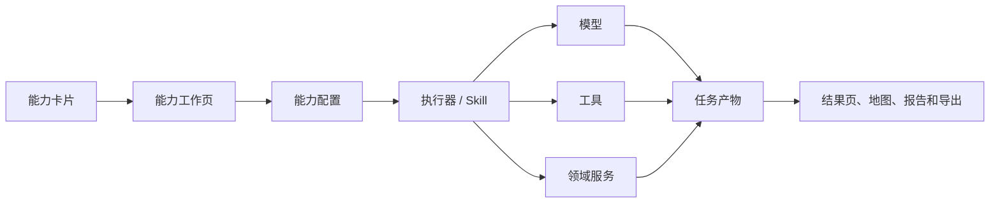
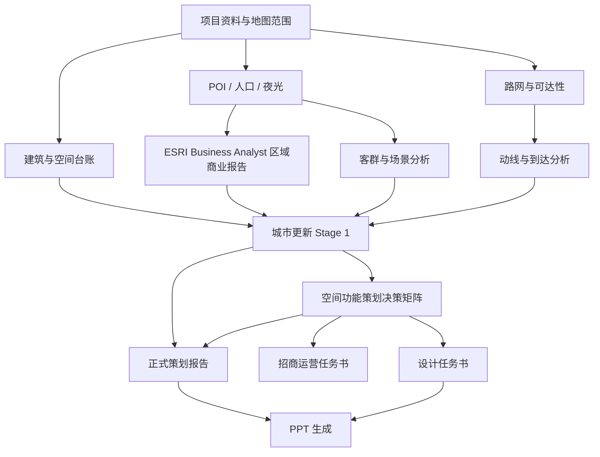

# 分析能力工作台与卡片式导航构想

> 将分散的 PPT、空间功能策划、商业分析及未来专项能力统一为可配置、可运行、可追溯的分析工作台
> 产品构想记录
> 更新时间：2026-07-11

## 1. 想法摘要

将分析界面右侧目前用于展示指令文件、工具入口或零散操作的位置，改造为一个由**能力卡片**组成的导航栏和工作台入口。

现有或规划中的相对独立能力，例如：

- 生成 PPT；
- 生成空间功能策划决策矩阵；
- ESRI Business Analyst 区域商业报告；
- 城市更新 Stage 1 策划报告；
- 选址分析；
- 客群分析；
- 路网与可达性分析；
- 证据审计；
- 报告导出；
- 未来新增的专题分析或生成能力；

不再以散落按钮、隐藏入口、指令文件或只能通过对话记忆使用的形式存在，而是统一成为用户可发现、可配置和可运行的**分析能力（Analysis Capability）**。

右侧栏首先展示能力卡片。用户点击卡片后进入对应能力页面，在页面中完成：

> **了解能力 → 检查输入 → 配置参数 → 选择模型/Skill → 运行任务 → 查看过程 → 检查结果 → 继续编辑或导出**

核心目标不是增加一个“功能菜单”，而是形成一个面向城市空间分析项目的：

# **分析能力工作台（Analysis Capability Workbench）**

---

## 2. 为什么要这样改

## 2.1 当前能力以不同形式分散存在

目前不同能力可能分别存在于：

- 对话指令；
- Skill 文件；
- Agent 工具；
- 独立前端面板；
- 后端接口；
- PPT 工作台；
- 报告生成流程；
- 尚未接入 UI 的脚本或结构化产物；
- 仅存在于方案文档中的规划能力。

这种状态带来几个问题：

1. 用户不知道系统究竟具备哪些能力；
2. 即使能力已经存在，也不知道从哪里进入；
3. 不同能力的输入、参数、运行按钮和结果形式不一致；
4. 对话框承担了过多导航和功能发现责任；
5. 指令文件更像开发者说明，不像面向用户的产品入口；
6. 运行完成后，产物散落在不同面板、历史记录或运行目录中；
7. 新增能力时容易继续增加特殊入口和前端分支。

## 2.2 对话不适合作为所有复杂任务的唯一入口

对话适合：

- 提问；
- 解释结果；
- 临时追问；
- 使用 `/skill-name` 发起明确工作流；
- 对已生成产物进行修改和复盘。

但复杂能力通常需要：

- 多个输入来源；
- 结构化配置；
- 数据完整性检查；
- 多阶段运行；
- 中间产物确认；
- 失败诊断；
- 版本对比；
- 导出设置。

如果全部塞进对话，用户必须记住提示词和参数，系统也难以清楚展示缺口、状态和结果。因此应形成两种互补入口：

- **对话入口**：适合自然语言和斜杠 Skill；
- **能力工作台入口**：适合可配置、可重复和有明确产物的专项任务。

二者应调用同一套领域能力，而不是分别维护两套逻辑。

## 2.3 卡片化能把“系统有什么”变成可见产品能力

能力卡片不仅是按钮，还应回答：

- 这个能力解决什么问题；
- 当前是否可用；
- 需要哪些输入；
- 会生成什么结果；
- 大概经过哪些阶段；
- 当前项目的数据是否足够；
- 最近是否运行过；
- 能否继续上次任务。

这能将隐藏在代码、Skill 和指令中的能力，转化为用户能够理解和操作的产品目录。

## 2.4 对 demo 和评审更友好

卡片式工作台可以清楚展示完整产品链路：

```text
数据准备
  → 专题分析
  → 策划决策
  → 成果生成
  → 证据审计
  → 导出交付
```

评审者不需要通过试探性对话猜测能力，也能看到每项能力的输入、过程、诊断和产物。

---

## 3. 产品定位

分析能力工作台不是普通导航栏，也不是把现有按钮换成卡片样式。它应承担四个角色。

### 3.1 能力目录

统一展示系统已经注册的分析与生成能力，并区分：

- 可直接运行；
- 缺少输入；
- 尚未配置；
- 正在运行；
- 已有结果；
- 规划中或不可执行。

### 3.2 任务配置器

每项能力进入后，都有专属但遵循统一结构的配置页：

- 输入范围；
- 数据来源；
- 参数；
- 模型和 Skill；
- 输出内容；
- 执行强度；
- 缺口检查。

### 3.3 任务运行中心

统一展示：

- 当前阶段；
- 已完成步骤；
- 使用工具；
- 中间产物；
- 警告和失败原因；
- 暂停、取消、重试和继续运行。

### 3.4 成果入口

任务完成后，从同一能力页面进入：

- 结构化结果；
- 地图图层；
- 报告；
- PPT；
- 证据附录；
- 设计任务书；
- 导出文件；
- 历史版本和对比。

---

## 4. 总体界面结构

保持地图为分析主工作区，右侧能力栏不应演变成占据主视野的门户首页。

建议采用三级界面：

```text
分析主界面
├─ 中央：地图与当前分析结果
├─ 左侧：范围、图层、数据和基础分析
└─ 右侧：分析能力卡片栏
    └─ 点击卡片：进入能力工作页
        ├─ 配置
        ├─ 运行
        ├─ 结果
        └─ 历史
```

### 4.1 右侧能力卡片栏

右侧栏默认以紧凑卡片显示，不遮挡地图。支持：

- 分类；
- 搜索；
- 收藏；
- 最近使用；
- 当前运行任务；
- 按项目阶段筛选；
- 按可用状态筛选。

### 4.2 能力工作页

点击卡片后，不建议直接弹出一个小表单。复杂能力应进入完整工作页或主工作区标签页，地图仍可作为关联视图保留。

统一工作页结构：

```text
页头：能力名称、用途、状态、最近运行

步骤一：输入与就绪度
步骤二：配置
步骤三：运行计划
步骤四：执行过程
步骤五：结果与诊断
步骤六：导出和继续操作
```

简单能力可以在右侧抽屉中完成；复杂能力如 PPT、Stage 1 和空间决策矩阵应进入独立工作页。

---

## 5. 能力卡片应该包含什么

卡片不只是图标、名称和“运行”按钮，建议包含以下信息。

| 字段 | 说明 |
|---|---|
| 能力名称 | 用户可理解的中文名称 |
| 能力 ID | 稳定机器标识 |
| 一句话用途 | 解决什么问题 |
| 分类 | 数据、分析、策划、生成、审计或导出 |
| 当前状态 | 可运行、缺少输入、未配置、运行中、已完成、不可执行 |
| 输入摘要 | 当前将使用哪些范围和数据 |
| 主要产物 | 会生成什么 |
| 最近运行 | 时间、状态和版本 |
| 预计阶段 | 是即时计算还是多阶段任务 |
| Skill | 对应的 Skill 或领域执行器 |
| 模型要求 | 是否需要模型、最低能力和当前模型 |
| 操作 | 配置运行、继续、查看结果或修复缺口 |

### 5.1 卡片状态示例

- **可运行**：必要输入已就绪；
- **缺少 2 项输入**：点击查看缺口；
- **模型未配置**：需要选择可用模型；
- **运行中 · 3/7**：显示当前阶段；
- **已完成 · v3**：可查看或重新运行；
- **不可执行**：仅有说明文件但没有注册执行器；
- **规划中**：可以展示路线图，但必须与真实可执行能力明显区分。

### 5.2 卡片示例

```text
┌──────────────────────────────┐
│ 空间功能策划决策矩阵       有条件可运行 │
│ 将项目、客群、路网和运营依据转为         │
│ 可解释的空间功能配置建议。               │
│                                          │
│ 输入：项目资料 ✓  路网 ✓  建筑台账 !     │
│ 产物：诊断表 / 决策矩阵 / 组合校验       │
│ 最近运行：暂无                           │
│                         [检查缺口并配置]  │
└──────────────────────────────┘
```

---

## 6. 首批能力建议

## 6.1 成果生成类

### A. PPT 生成

**用途**：将项目分析、报告和图表编译为可编辑演示文稿。

建议配置：

- 演示对象；
- 汇报目标；
- 页数或时长；
- 选用来源；
- 报告结构；
- 视觉风格；
- 是否生成图表、地图和示意图；
- 模型；
- 输出格式。

运行阶段：

```text
来源检查 → Brief → 叙事结构 → 大纲 → 页面规格 → 视觉生成 → PPT 编译 → 质量检查
```

主要产物：

- deck brief；
- narrative plan；
- outline；
- slide specs；
- 视觉资产；
- PPTX/PDF；
- 来源和审计信息。

### B. 报告生成

**用途**：将结构化分析结果编译为决策摘要、专题报告或正式策划报告。

应区分：

- 快速摘要；
- 商业决策备忘录；
- Stage 1 策划报告；
- 专题分析报告；
- 证据附录。

不能只提供一个“生成报告”按钮。

---

## 6.2 策划决策类

### C. 空间功能策划决策矩阵

**用途**：将项目本体、建筑、客群、路网、运营和工程依据转化为可解释、可验证的空间功能决策。

建议配置：

- 项目定位方案；
- 空间分析范围；
- 参与决策的空间系统、组团和单元；
- 项目资料和证据来源；
- 客群数据；
- 路网和动线数据；
- 建筑与保护资料；
- 运营约束；
- 是否运行候选功能比较；
- 是否生成地图联动结果；
- 模型和 Skill。

运行阶段：

```text
空间台账 → 事实与冲突 → 客群场景 → 路网动线 → 建筑适配
→ 候选功能 → 单元决策矩阵 → 组合与时序校验 → 证据审计
```

主要产物：

- 空间单元基础诊断表；
- 空间功能策划决策表；
- 功能组合与时序校验表；
- 地图功能和风险图层；
- EvidenceNode；
- 设计和招商任务书输入。

详细定义见：`docs/空间功能策划决策矩阵.md`。

### D. 城市更新 Stage 1

**用途**：形成项目资料体检、专业工作包、定位方案、决策矩阵、推荐策略和设计任务书。

建议把它定位为上层综合能力。空间功能策划决策矩阵既可以独立运行，也可以作为 Stage 1 的一个阶段和产物。

关系为：

```text
城市更新 Stage 1
├─ 资料体检与证据台账
├─ 专业工作包
├─ 定位方案与决策矩阵
├─ 空间功能策划决策矩阵
├─ 运营治理与分期
└─ 报告、证据附录和设计任务书
```

---

## 6.3 商业分析类

### E. ESRI Business Analyst 区域商业报告

该能力复用现有 `plan_business_analyst_analysis` 工具与 Business Analyst Model Graph，以模型路径组织报告，而不是将普通地图指标拼成咨询文本。

工作页至少包含：

- 项目或商圈范围；
- 目标业态；
- 客群和人口；
- POI 和竞品；
- 交通与可达性；
- 夜光和活力代理；
- 供需与机会；
- 风险和证据缺口；
- 输出报告类型；
- 模型和分析策略。

核心模型为 Trade Area、Market Potential、Retail Gap、Opportunity Category Screening、Huff Gravity、Customer Profile Fit 和 Site Suitability。缺少证据的模型必须标记为 `partial` 或 `skipped`；人口、夜光、POI 和路网只能作为对应代理证据，不得外推真实消费、客流、销售或市场份额。

### F. 选址与商业机会分析

**用途**：针对明确业态比较候选区域、供需缺口、客群、交通、竞争和风险。

与空间功能策划矩阵的区别：

- 选址分析回答“某个业态适合在哪里”；
- 空间矩阵回答“项目中的某个空间为什么应该配置某种功能”；
- ESRI Business Analyst 报告负责区域商业画像与机会筛选；空间矩阵负责把结论落实到项目空间单元。

---

## 6.4 专题分析类

后续可逐步卡片化：

- 客群与人口画像；
- POI 供给结构；
- H3 供需机会；
- 夜光与活力；
- 路网句法与可达性；
- 公共服务缺口；
- 文旅资源与游线；
- 竞品和市场研究；
- 居民共生与扰动边界；
- 证据完整性与数据审计。

这些能力应区分：

- 独立运行的专题能力；
- 仅供其他能力调用的底层工具；
- 面向用户展示的结果页；
- 只属于内部工作流的中间步骤。

不能把每一个 Agent tool 都做成一张卡片，否则能力目录会退化为工具仓库。

---

## 7. 能力、Skill、工具和页面的关系

必须避免把这几个概念混为一谈。

| 概念 | 定义 | 示例 |
|---|---|---|
| 能力 Capability | 用户可配置运行、产生明确成果的产品单元 | 空间决策矩阵、PPT 生成 |
| Skill | 定义复杂任务的方法、阶段和输出契约 | urban-strategy-stage1 |
| 工具 Tool | 完成单一数据获取或计算动作 | POI 查询、H3 统计、路网计算 |
| 模型 Model | 执行推理、生成和工具选择的模型配置 | 系统或个人模型 |
| 页面 Workbench | 配置、运行和查看某项能力的交互界面 | PPT 工作页、矩阵工作页 |
| 任务 Run | 某项能力的一次不可变执行 | matrix-run-20260711-001 |
| 产物 Artifact | 任务产生的结构化结果、图表和文件 | matrix.json、report.md、deck.pptx |

推荐关系：



### 7.1 一项能力不一定等于一个 Skill

- PPT 生成可能由专用领域服务和多个阶段组成；
- 空间决策矩阵可以由 Stage 1 Skill 的子流程生成；
- 客群分析可能主要是规则和 GIS 计算，不需要 LLM Skill；
- 证据审计可能由规则代码加审稿模型完成。

能力目录应面向用户目标，而不是暴露内部实现结构。

### 7.2 一个 Skill 可以服务多个入口

`urban-strategy-stage1` 可以通过：

- 对话中的 `/urban-strategy-stage1`；
- “城市更新 Stage 1”能力卡片；
- 某个项目模板中的推荐动作；

进入同一个执行器。不同入口只能改变初始配置方式，不能复制工作流实现。

---

## 8. 统一的能力注册契约

为了让卡片和页面可配置扩展，不应在前端为每项能力硬编码一套发现逻辑。后端应提供统一能力目录。

建议能力描述至少包含：

```json
{
  "id": "spatial-programming-matrix",
  "display_name": "空间功能策划决策矩阵",
  "description": "将项目、客群、路网和运营依据转化为空间功能决策。",
  "category": "planning",
  "status": "available",
  "executor_type": "skill",
  "executor_id": "urban-strategy-stage1:spatial-programming",
  "configuration_schema": {},
  "input_requirements": [],
  "output_contract": [],
  "model_requirement": {},
  "supports_map": true,
  "supports_resume": true,
  "supports_versions": true,
  "estimated_stages": 8,
  "ui": {
    "icon": "layout-matrix",
    "accent": "planning",
    "workspace_kind": "full"
  }
}
```

### 8.1 注册规则

- 只有存在真实执行器的能力才能标记 `available`；
- 只有说明文件但没有执行器时标记 `unavailable` 或 `planned`；
- 输入要求和输出契约由领域模块拥有，不由页面重复推断；
- 前端读取能力目录渲染卡片、状态和通用配置结构；
- 复杂能力允许注册专用工作页组件；
- 卡片排序、分组和显示名称可配置，但执行语义必须稳定；
- 不允许能力卡片直接绑定脚本文件路径或运行时目录。

---

## 9. 统一配置与运行流程

## 9.1 第一步：输入就绪度

进入能力页后先检查当前项目是否具备必要输入，而不是直接显示运行按钮。

状态分为：

- 必需输入已满足；
- 可选输入缺失；
- 必需输入缺失；
- 输入存在冲突；
- 数据已过期；
- 输入来源不可读取。

每个缺口都应提供操作：

- 去选择范围；
- 去生成 H3；
- 去运行路网；
- 去选择项目资料；
- 去补充建筑台账；
- 继续以有限模式运行；
- 返回项目分析。

是否允许有限模式由能力执行器决定，不能由前端随意跳过。

## 9.2 第二步：参数配置

配置分为三类。

### 通用配置

- 项目和分析范围；
- 来源选择；
- 模型；
- 输出语言；
- 结果保存和版本说明。

### 能力专属配置

例如矩阵的空间层级和候选比较，PPT 的受众、页数和视觉风格。

### 高级配置

- 分析阈值；
- 算法参数；
- 证据策略；
- 阶段开关；
- 调试与诊断。

高级配置可以折叠，但执行轨迹和方法不能完全隐藏。

## 9.3 第三步：运行前摘要

发送前显示不可变运行摘要：

- 能力；
- 输入范围；
- 选定来源；
- 参数；
- 模型；
- Skill/执行器；
- 预计阶段；
- 缺口和风险；
- 将生成的产物。

用户确认运行后，生成任务快照。运行中的任务不受后来修改配置影响。

## 9.4 第四步：执行过程

统一展示：

- 当前阶段；
- 阶段状态；
- 关键工具调用；
- 中间产物；
- 诊断；
- 耗时；
- 取消和重试；
- 是否可以从失败阶段恢复。

## 9.5 第五步：结果与后续动作

完成后提供：

- 主要结论；
- 结构化结果；
- 地图联动；
- 证据和风险；
- 导出；
- 继续生成报告/PPT；
- 发送到 Agent 对话追问；
- 以当前结果作为其他能力的输入；
- 保存新版本或与旧版本比较。

---

## 10. 能力之间的串联

能力工作台不能只是相互独立的卡片集合。不同能力产生的产物应能成为下游能力的正式输入。

建议形成能力图：



### 10.1 上游产物选择

运行下游能力时，用户应能选择：

- 使用最新成功版本；
- 选择特定历史版本；
- 重新计算上游能力；
- 明确忽略某个可选输入。

不能默认读取某个模糊的“最新 runtime 文件”。

### 10.2 数据血缘

每个产物应记录：

- 来源任务；
- 输入版本；
- 参数快照；
- 模型和 Skill；
- 创建时间；
- 证据引用；
- 上游产物是否后来被更新。

当上游变化时，下游结果标记“可能过期”，但不自动覆盖历史结果。

---

## 11. 任务和产物模型

建议将每次运行定义为统一的 `AnalysisRun`。

```json
{
  "run_id": "run-id",
  "capability_id": "spatial-programming-matrix",
  "project_context": {},
  "configuration_snapshot": {},
  "execution_profile": {
    "model_profile_id": "...",
    "skill_id": "..."
  },
  "input_artifact_refs": [],
  "status": "running",
  "current_stage": "candidate-functions",
  "stage_records": [],
  "diagnostics": [],
  "output_artifact_refs": [],
  "created_at": "...",
  "completed_at": null
}
```

### 11.1 任务状态

建议统一使用：

- draft；
- checking_inputs；
- ready；
- queued；
- running；
- waiting_for_user；
- completed；
- completed_with_warnings；
- failed；
- cancelled；
- stale。

### 11.2 产物类型

- structured_data；
- map_layer；
- table；
- chart；
- report；
- presentation；
- evidence_nodes；
- design_handoff；
- export_file；
- diagnostic_report。

能力工作台展示产物索引，而不是直接依赖各模块内部文件路径。

---

## 12. 与 Agent 对话的协同

卡片工作台和对话不应互相替代。

### 12.1 从对话进入能力

当用户说：

> 帮我生成空间功能策划决策矩阵。

Agent 可以：

- 识别对应能力；
- 检查输入；
- 直接发起默认配置；
- 或打开能力配置页让用户确认。

### 12.2 从能力结果进入对话

结果页提供“继续追问”，自动把以下内容作为上下文：

- 当前能力；
- 任务版本；
- 选中的空间或结论；
- 相关证据；
- 用户问题。

### 12.3 斜杠 Skill 与能力卡片

- `/urban-strategy-stage1` 是熟练用户的快速入口；
- “城市更新 Stage 1”卡片是可发现、可配置入口；
- 两者调用同一执行器；
- 卡片可以提供更完整的参数和就绪度界面；
- 对话保留自然语言修改和解释优势。

---

## 13. 右侧指令文件的去向

原右侧位置中的指令内容不应简单删除，而应重新归类。

### 13.1 面向用户的内容

适合转化为：

- 能力说明；
- 输入要求；
- 使用示例；
- 方法说明；
- 输出预览；
- 常见缺口和风险。

这些内容进入卡片详情或能力帮助页。

### 13.2 面向执行器的内容

例如系统提示、Skill 工作流和内部指令，应保留在：

- Skill；
- prompt registry；
- 领域执行器；
- 输出契约。

不应直接作为普通用户的主要导航内容。

### 13.3 面向开发者的内容

实现说明、字段契约和调试信息放在 docs 或高级诊断区，不占据默认工作界面。

---

## 14. 配置化边界

“通过配置进行跑”不意味着做一个无限通用的低代码流程编辑器。首版应控制复杂度。

### 14.1 应配置的内容

- 卡片显示信息；
- 分类和排序；
- 输入要求；
- 参数 schema；
- 执行器 ID；
- 模型最低能力；
- 输出契约；
- 是否支持地图、恢复和版本；
- 通用状态和结果动作。

### 14.2 不应放进配置的内容

- 复杂业务规则；
- 证据判断；
- 空间计算；
- 工作流恢复策略；
- 质量审计；
- 任务事务和失败处理。

这些应由对应领域模块或 Skill 执行器内部拥有。配置用于声明能力，不用于重新发明编程语言。

### 14.3 专用页面与通用页面

- 简单专题能力可使用 schema 驱动的通用配置页；
- PPT、Stage 1、空间矩阵等复杂能力应注册专用页面；
- 专用页面仍使用统一的任务、状态、产物和审计契约；
- 不为每项能力复制任务管理和历史逻辑。

---

## 15. 分类与导航建议

首版建议按用户目标分类，而不是按代码模块分类。

### 数据与诊断

- 数据完整性检查；
- 项目资料与证据台账；
- 空间单元台账。

### 空间与客群分析

- 客群与人口；
- POI 供给；
- H3 机会；
- 夜光活力；
- 路网与可达性。

### 商业与选址

- ESRI Business Analyst 区域商业报告；
- 商业机会；
- 选址比较；
- 竞品研究。

### 城市更新策划

- 城市更新 Stage 1；
- 空间功能策划决策矩阵；
- 居民共生与运营边界；
- 设计任务书。

### 成果与交付

- 报告生成；
- PPT 生成；
- 证据审计；
- 导出成果包。

右侧栏首屏优先展示：

- 最近使用；
- 当前项目推荐下一步；
- 正在运行；
- 已有结果可继续。

完整目录可以搜索和展开，避免卡片数量过多挤占地图。

---

## 16. “推荐下一步”机制

能力工作台可以基于当前项目状态提示下一步，但不能自动替用户做高风险决定。

示例：

- 已有 POI、人口和夜光，但没有路网：推荐“路网与可达性分析”；
- 已有项目资料和四类工作包：推荐“城市更新 Stage 1”；
- 已确定首选定位：推荐“空间功能策划决策矩阵”；
- 已有完整报告：推荐“PPT 生成”；
- 上游数据更新：提示相关报告和 PPT 已过期。

推荐必须说明原因：

> 空间矩阵需要定位方案、建筑台账、客群和路网依据。当前定位与客群已就绪，但建筑工程条件缺失，因此建议先补充建筑台账。

---

## 17. 设计原则

### 17.1 地图仍然是主工作区

右侧能力卡片应服务地图和分析流程，不能把分析页改成营销式应用商店。

### 17.2 卡片代表成果能力，不代表底层工具

避免将几十个 API 和 Agent tool 全部变成卡片。用户关心的是任务目标和交付物。

### 17.3 复杂度下沉到能力模块

路由层只处理请求和响应；前端不复制后端分析规则；能力模块负责输入归一化、就绪度、运行和结果契约。

### 17.4 不伪装能力状态

- 有卡片但无执行器：不可执行；
- 输入不足：显示缺口；
- 只有 prompt 没有工作流：不能称为完整能力；
- 任务失败：保留诊断，不能展示旧结果冒充成功。

### 17.5 结果可解释和可追溯

每项能力都要展示：

- 使用了什么；
- 怎么运行；
- 得到什么；
- 有什么局限；
- 下一步如何验证。

### 17.6 同一领域能力只实现一次

卡片、对话、斜杠 Skill 和其他页面共享执行器和产物，不维护平行版本。

---

## 18. 建议实施阶段

## P0：能力盘点与统一目录

1. 盘点现有页面、接口、Skill、工具、脚本和规划能力；
2. 将其分类为能力、底层工具、中间步骤或尚未实现；
3. 为首批真实能力建立稳定 ID；
4. 定义能力目录、输入要求、状态和产物契约；
5. 接入 ESRI Business Analyst 模型路径、证据边界和报告契约。

首批建议只纳入：

- PPT 生成；
- 空间功能策划决策矩阵；
- 城市更新 Stage 1；
- 一个已能真实运行的商业分析能力；
- 证据/数据就绪度检查。

## P1：右侧卡片导航和能力壳

1. 将右侧指令区改为紧凑能力卡片栏；
2. 增加分类、搜索、最近使用和状态；
3. 建立统一能力工作页壳；
4. 接入输入就绪度和运行前摘要；
5. 保持地图在真实视口下可用。

## P1：接入首批真实工作流

优先接入现有成熟度较高的 PPT 工作台，再接入空间矩阵和 Stage 1。每项接入都必须使用统一任务和产物模型，不能只是页面跳转。

## P2：能力串联和数据血缘

1. 支持上游产物作为下游输入；
2. 支持版本选择；
3. 标记过期下游结果；
4. 从结果页一键进入报告或 PPT；
5. 支持能力任务对比。

## P3：项目推荐与模板

1. 根据项目状态推荐下一步；
2. 提供城市更新、商业选址等项目模板；
3. 支持保存配置预设；
4. 在不增加低代码编排器复杂度的前提下，支持常用能力链。

---

## 19. 首版验收场景

### 场景一：生成空间功能策划决策矩阵

1. 用户在分析界面右侧看到矩阵卡片；
2. 卡片显示当前建筑台账缺失；
3. 用户补充或选择建筑资料；
4. 配置空间范围、客群、路网、定位方案和模型；
5. 查看运行前摘要并执行；
6. 页面展示各阶段进度；
7. 结果呈现管理层总表、单元详情、地图图层和证据；
8. 用户将结果发送到设计任务书或 PPT 能力。

### 场景二：生成 PPT

1. 用户在 PPT 卡片看到已有 Stage 1 报告和矩阵结果；
2. 选择受众、页数、风格和来源版本；
3. 运行 Brief、叙事、大纲、页面和视觉阶段；
4. 查看每页来源和诊断；
5. 导出 PPTX/PDF；
6. 历史中保留输入和模型快照。

### 场景三：能力不可执行

1. 能力只有概念或说明，没有执行器；
2. 卡片明确显示“待定义/不可执行”；
3. 用户可以查看计划能力和所需输入；
4. 系统不能显示可运行按钮或偷偷调用普通 Agent。

### 场景四：从对话进入能力

1. 用户在 Agent 中说“生成空间功能策划矩阵”；
2. Agent 识别能力并检查输入；
3. 输入完整时发起任务，输入复杂时打开配置页；
4. 结果写入统一能力历史；
5. 从卡片和对话看到的是同一次运行。

---

## 20. 需要进一步确认的产品决策

后续正式实施前仍需确认：

1. ESRI Business Analyst 报告的导出格式与正式版本确认机制；
2. 右侧栏展开宽度及复杂能力是占据主区还是新建标签；
3. 首批卡片数量和优先级；
4. 能力运行是否全部绑定当前分析历史/项目；
5. 长任务是否支持离开页面后台运行；
6. 能力配置预设是项目级还是全局级；
7. 哪些产物允许用户人工编辑后作为下游正式输入；
8. 结果版本、草稿和已确认版本如何区分；
9. 复杂能力是否需要阶段性人工确认；
10. 成本、Token 和预计耗时是否在运行前展示。

---

## 21. 最终结论

这个新想法的本质不是把右侧指令区换成一组更好看的卡片，而是将当前以不同形式存在的分析和生成能力，统一提升为：

> **可发现、可配置、可运行、可追踪、可串联、可复用的项目能力。**

它能解决当前能力分散、入口隐蔽、运行方式不统一、产物难以串联的问题，并形成清楚的产品路径：

```text
地图与数据
    ↓
专题分析能力
    ↓
商业与策划决策能力
    ↓
空间功能与实施成果
    ↓
报告、PPT 与交付
```

右侧卡片栏负责能力发现和状态导航；能力工作页负责配置、运行和结果；Agent 对话负责自然语言发起、解释和追问；Skill、领域服务和工具负责真实执行。四者共享统一的任务、产物和证据契约。

在实现上，应先盘点并接入少量真实能力，而不是一次性建立大量空卡片。首批建议围绕 PPT、空间功能策划决策矩阵、城市更新 Stage 1、一个明确的商业分析能力和证据就绪度展开，形成从分析到策划再到交付的最小完整链路。
