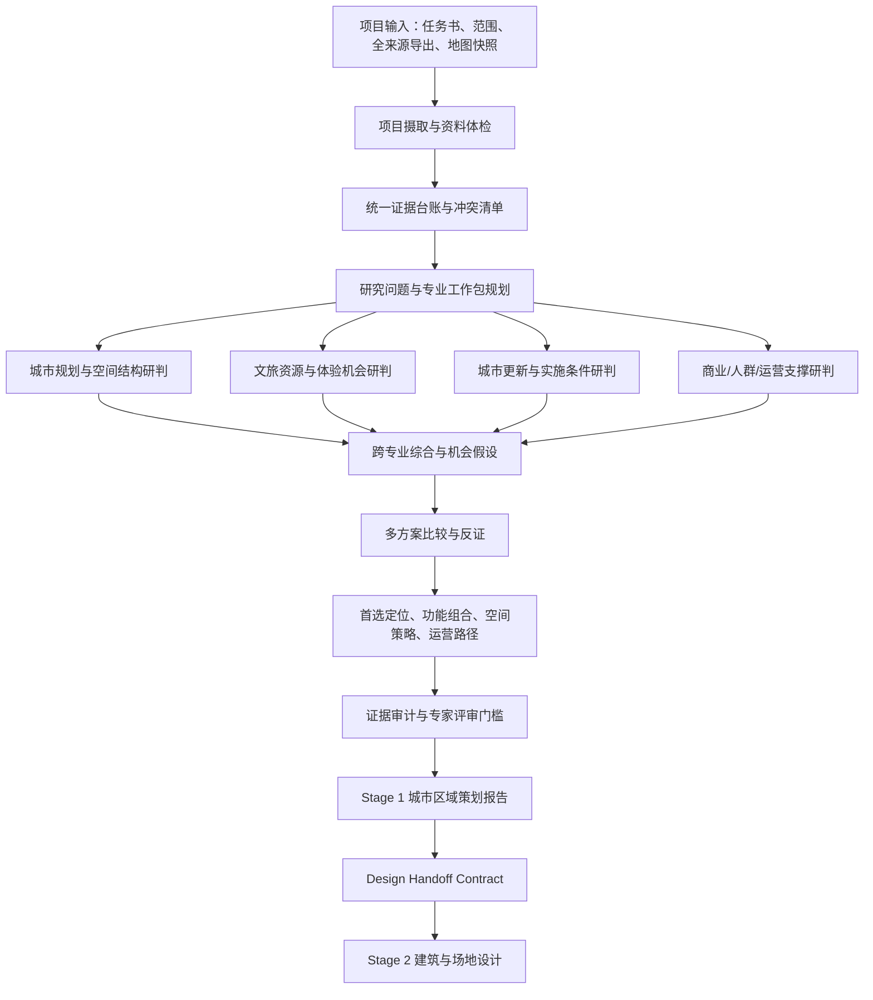

# 城市区域策划 Agent 与第一阶段报告链路设计

## 1. 结论

可以把当前问答链路抽出来，在独立工作区中基于“全来源导出包 + 项目任务书”复建一套专业城市策划团队式工作流，并产出城市分析第一阶段文档。

但不建议把现有聊天循环原样搬成“多角色连续聊天”。当前主 Agent 更适合回答单轮或连续追问；专业策划报告需要的是一个**项目级、可复跑、分阶段、有证据台账和评审门槛的分析工作流**。

这套链路的第一阶段应回答：

> 这个地方在现实约束下，最适合服务什么人、解决什么问题、承载什么功能、形成什么空间与运营模式，以及为什么。

第一阶段不直接回答建筑立面、结构、材料和施工做法。它应形成下一阶段建筑与场地设计可以直接消费的《策划定位与设计任务书》。

因此建议把产品分成两个明确阶段：

1. **Stage 1：区域研判与项目策划**——决定“这里具体做什么”。
2. **Stage 2：建筑与场地设计**——决定“这些功能具体怎么建”。

二者之间使用稳定的 `Design Handoff Contract`，而不是让第二阶段重新阅读全部聊天记录并猜测第一阶段结论。

## 2. 当前仓库已经具备的基础

当前实现并非从零开始，已有能力已经覆盖目标链路的大部分基础设施。

| 已有能力 | 当前实现 | 对目标链路的价值 |
|---|---|---|
| 快速问答 | `context-ask` | 对一个已有结果、图表或来源做低延迟解释 |
| 深度 Agent | `main-loop/stream` + LangGraph ReAct | 按需调用工具补充证据，形成带诊断的综合回答 |
| 当前分析上下文 | `analysis_snapshot`、地图快照、范围数据 | 提供研究范围、GIS 结果和地图视觉上下文 |
| 统一来源 | document / image / web / database / package | 将项目资料、网页、图片和分析包放入同一来源区 |
| 证据节点 | `EvidenceNode` 与检索工具 | 支撑“先检索、再读取、后引用”的证据链 |
| 项目文档档案 | `project_evidence_dossier` | 区分项目事实、设计意图、参考资料、冲突和待核实项 |
| BA 模型骨架 | `plan_business_analyst_analysis` | 为商圈、需求、供给、机会和选址问题规划分析路径 |
| 全来源导出 | `ppt_sources_full_export.json` | 已能把来源、AI payload、transport 和 evidence nodes 导出到工作区 |
| 报告/PPT规划 | `ppt_planning` | 已能从来源清单、证据包、指标上下文生成报告/PPT内容计划 |
| 会话和执行轨迹 | session、thinking、audit、citations | 支撑复盘、过程解释和来源审计 |

这意味着当前最重要的工作不是再造一个通用 Agent，而是增加一个位于现有来源层之上的**城市策划项目编排层**。

## 3. 为什么现有问答链路不能直接等同于专业策划流程

### 3.1 当前链路以“一个问题的回答”为完成条件

现有主链路大致是：

```text
用户问题
→ 上下文构建
→ Gate
→ 工具循环
→ 执行审计
→ 最终证据包
→ 自然语言回答
→ 会话持久化
```

它的优势是灵活、自然、适合继续追问；但专业策划项目还需要：

- 固定研究问题集合，而不是仅依赖用户当轮问题；
- 明确的资料完整性检查；
- 多专业视角的分工和交叉评审；
- 多方案比较，而不是直接给唯一建议；
- 从事实、解释到建议的完整证据链；
- 报告章节级中间产物；
- 项目版本、评审状态和可复跑能力；
- 给建筑设计阶段的结构化任务书。

### 3.2 “多个角色提示词”不等于“模拟专业团队”

如果只是依次让“规划师、文旅策划师、更新顾问”各写一段话，容易产生：

- 三份内容重复但口径不同的长文；
- 各角色分别创造事实和指标；
- 没有共享证据台账；
- 冲突结论无人裁决；
- 最终编辑只做文字拼接；
- 无法解释某个建议为何进入最终方案。

真正的专业团队模拟，应依靠**共享项目状态 + 专业工作包 + 评审门槛 + 结构化交付物**。角色是分析视角，不应拥有彼此独立的事实世界。

### 3.3 现有全来源导出接近离线输入包，但还不是完整项目包

当前 `ppt_sources_full_export.json` 已包含：

- 来源分组；
- 来源元信息；
- 完整 AI payload；
- transport 信息；
- EvidenceNode；
- full source。

它已经可以作为“把网站资料交给 Codex/Skill 分析”的主要数据载体。但若用于正式项目级运行，还应补充：

- 项目 ID、项目名称和版本；
- 明确的研究范围和几何口径；
- 用户任务书与关键决策问题；
- 资料截止日期和分析日期；
- 当前地图可视化快照清单；
- 数据年份、空间精度、许可和来源等级；
- 已知约束、不可触碰条件和目标偏好；
- 本次需要生成的交付物类型；
- 导出包校验值和缺失项清单。

建议将其升级或包装为 `UrbanProjectAnalysisPackage`，而不是把 PPT 来源包同时承担所有项目语义。

## 4. 目标系统定位

建议将系统定义为：

> 一个基于项目资料、GIS 分析、外部证据和专业知识框架，模拟城市策划团队完成“资料审查—区域诊断—机会推演—项目定位—空间与运营策略—设计任务书”的城市区域分析系统。

它不是：

- 自动替代法定规划审批的系统；
- 仅根据 POI 数量生成业态推荐的系统；
- 只会生成漂亮 PPT 的系统；
- 把 GIS proxy 写成客流、收入和投资回报事实的系统；
- 直接从区域数据跳到建筑效果图的系统。

它的核心产品不是一段回答，而是一个可追溯的**决策档案（Decision Dossier）**。

## 5. 总体工作流



### 5.1 项目摄取与资料体检

系统先判断“资料是否足以开工”，而不是立即生成建议。

检查内容包括：

- 研究边界是否唯一；
- 坐标、年份和空间范围是否一致；
- 项目核心文档是否读取成功；
- 项目事实与设计愿景是否被区分；
- 是否存在相互冲突的面积、功能、权属或目标描述；
- GIS 数据能支持什么，不能支持什么；
- 是否缺少决定项目方向的关键资料。

输出：

- `source_readiness`；
- `missing_critical_inputs`；
- `conflicts`；
- `analysis_allowed`；
- `assumptions_requiring_confirmation`。

### 5.2 统一证据台账

所有角色只消费同一份证据台账。建议最小结构为：

```json
{
  "claim_id": "claim-001",
  "topic": "现状功能/空间结构/人群/文旅资源/更新条件",
  "statement": "证据支持的最小事实陈述",
  "source_id": "document:xxx",
  "evidence_node_id": "node-xxx",
  "locator": "文件名，第 12 页，图 3",
  "evidence_class": "project_fact",
  "confidence": "high",
  "status": "confirmed",
  "spatial_scope": "项目红线/15分钟圈/35分钟圈",
  "time_scope": "2024",
  "limitations": []
}
```

证据类别建议收敛为：

- `project_fact`：项目文件明确陈述的现状与约束；
- `policy_or_plan`：政策、上位规划或法定依据；
- `measured_spatial_result`：系统计算得到的 GIS 结果；
- `observed_visual_evidence`：地图、照片、图纸中可观察的现象；
- `external_reference`：案例、市场或公开资料；
- `design_intent`：用户或设计文件表达的目标，不是现状事实；
- `inference`：由多项证据推导的分析判断；
- `hypothesis`：待验证的机会假设。

建议状态包括：

- `confirmed`；
- `pending_verification`；
- `conflicting`；
- `not_available`；
- `not_applicable`。

### 5.3 专业工作包

每个角色接收同一证据台账，但回答不同问题，输出稳定结构，而不是自由散文。

#### A. 城市规划分析专家

负责：

- 区域层级和城市关系；
- 用地、交通、公共服务和生态结构；
- 空间骨架、节点、廊道、界面和断裂；
- 服务半径、可达性和区域协同；
- 规划约束与空间机会；
- 应在哪些位置承载哪些功能，而非建筑造型。

输出：`spatial_diagnosis`、`planning_constraints`、`spatial_opportunity_zones`。

#### B. 文旅策划专家

负责：

- 地方文化资源、故事线和独特性；
- 本地居民、学生、游客等客群的体验路径；
- 日间、夜间、平日、周末和季节差异；
- 内容产品、活动产品、消费产品和传播主题；
- 文旅吸引物与城市日常生活的关系；
- 避免把“文化标签”直接包装成同质化文创街区。

输出：`cultural_assets`、`audience_journeys`、`experience_programs`、`tourism_risks`。

#### C. 城市更新顾问

负责：

- 保留、修缮、改造、拆除和新建的初步原则；
- 存量空间适配性；
- 权属、搬迁、工程、消防、噪声和邻里风险；
- 分期、临时使用、低成本试运营和长期更新路径；
- 公共价值、商业可持续与治理机制；
- 确认哪些建议可立即试验，哪些需前置审批或工程论证。

输出：`renewal_actions`、`implementation_constraints`、`phasing_strategy`、`governance_model`。

#### D. 商业与运营分析专家

负责：

- 人群需求 proxy、现状供给、竞争和互补关系；
- 业态机会筛选，而非伪精确收入预测；
- 主力功能、配套功能、活动功能和公共功能组合；
- 时段运营、坪效前置条件、招商与自营业态边界；
- 运营主体、合作资源和验证指标。

输出：`demand_signals`、`supply_gaps`、`program_mix_options`、`operating_assumptions`。

#### E. 总规划师 / Lead Strategist

不重新创造证据，负责：

- 合并专业工作包；
- 识别相互支持和相互冲突的结论；
- 形成 2—4 个真正不同的定位方案；
- 建立比较标准；
- 选择推荐方案或提出条件式推荐；
- 产出 Stage 1 文档和设计交接合同。

#### F. 证据审计与反方评审

负责检查：

- 每个关键判断是否有来源；
- 是否把 proxy 写成事实；
- 是否把设计愿景写成现状；
- 是否出现资料未提及的具体地名或数据；
- 推荐方案是否忽略明显约束；
- 是否存在“全国任何地方都能套用”的空泛建议；
- 是否给出可验证的下一步动作。

## 6. 从“分析”到“这里做什么”的推理骨架

建议所有项目使用统一的五层推理链：

```text
事实层：这里现在有什么、缺什么、受什么限制
→ 结构层：这些事实共同形成什么空间与人群结构
→ 机会层：哪些未满足需求与独特资源可以被组合
→ 选择层：不同定位方案的收益、代价、风险和前提
→ 策略层：首选方案如何落到功能、空间、运营和分期
```

禁止直接使用：

```text
POI 多 / 夜光亮 / 人口高
→ 所以做商业街、文创园、夜经济
```

应改为：

```text
已确认的项目条件
+ 区域空间证据
+ 人群与供给 proxy
+ 地方文化资产
+ 更新实施条件
→ 形成机会假设
→ 与替代方案比较
→ 说明推荐成立的前提和验证动作
```

## 7. 机会方案与决策矩阵

系统不应一开始只输出一个结论。建议先生成 2—4 个定位方案，每个方案均包含：

- 一句话定位；
- 核心服务对象；
- 主要问题；
- 主导功能与辅助功能；
- 空间载体要求；
- 运营模式；
- 与地方资源的独特连接；
- 关键证据；
- 必要前提；
- 主要风险；
- 最小可行验证方式。

比较维度不建议使用来源不明的精确综合分。可以采用有解释的等级：

| 维度 | 解释 |
|---|---|
| 证据支撑度 | 当前资料能否直接或间接支持 |
| 地方独特性 | 是否只能在这个地区成立，而非通用模板 |
| 需求匹配度 | 与已识别人群、时段和区域需求是否匹配 |
| 空间适配度 | 现有地块、建筑和交通条件能否承载 |
| 更新可实施性 | 权属、工程、审批、扰民和分期难度 |
| 运营可持续性 | 是否有可识别的运营主体和持续内容机制 |
| 公共价值 | 是否改善公共空间、社区服务和地方认同 |
| 可验证性 | 是否能通过低成本试点验证关键假设 |

推荐结论应写成：

> 在当前证据与约束下，方案 A 为首选；其成立依赖 X、Y 两项前提。若 Z 无法满足，则应切换到方案 B。

这比输出一个看似科学的 `87.3 分` 更可信。

## 8. Stage 1 交付物：城市区域策划与设计前置报告

推荐文档名称：

**《[项目名] 区域研判、项目定位与设计前置策划报告》**

### 8.1 建议目录

1. **执行摘要**
   - 最核心判断；
   - 推荐定位；
   - 关键依据；
   - 三项优先动作；
   - 重大缺口与决策条件。

2. **任务与研究边界**
   - 项目问题；
   - 项目红线与分析圈层；
   - 数据时点；
   - 本报告能回答和不能回答的问题。

3. **资料系统与证据可信度**
   - 来源清单；
   - 数据年份与质量；
   - 项目事实、设计意图、外部参考的区别；
   - 冲突和待核实项。

4. **区域结构研判**
   - 城市关系；
   - 交通与可达性；
   - 功能、公共服务、生态和空间结构；
   - 核心节点、廊道、界面和断裂。

5. **人群、活动与需求线索**
   - 服务人群；
   - 日常与访客需求；
   - 日夜、工作日/周末、季节差异；
   - 已满足和未满足需求。

6. **地方文化与文旅资产**
   - 有证据的文化资源；
   - 体验路径与叙事机会；
   - 可产品化内容；
   - 同质化和过度旅游化风险。

7. **存量空间与更新条件**
   - 现状建筑与空间适配；
   - 保留/改造/新建初步原则；
   - 实施、工程、权属和治理风险；
   - 渐进更新机会。

8. **机会主题与备选定位**
   - 2—4 个方案；
   - 每个方案的逻辑、功能、运营和风险；
   - 决策矩阵与条件式选择。

9. **推荐定位与功能组合**
   - 定位陈述；
   - 服务对象；
   - 主导功能、配套功能、公共功能；
   - 不建议引入的功能；
   - 面积只给区间、比例或待设计验证值，避免伪精确。

10. **空间策略**
    - 分区与节点；
    - 动线与到达；
    - 开放空间和公共界面；
    - 日夜使用；
    - 与周边街区、校园、社区、山水或交通节点的关系。

11. **内容、运营与治理策略**
    - 年度内容主题；
    - 日常活动和事件活动；
    - 招商、自营、合作机制；
    - 社区参与；
    - 运营主体与资源需求。

12. **分期与验证计划**
    - 0—3 个月资料补齐与试验；
    - 3—12 个月轻量激活；
    - 中长期改造；
    - 每阶段的决策门槛。

13. **设计任务书**
    - 建筑设计需要解决的问题；
    - 必须承载的功能；
    - 关键空间关系；
    - 容量、弹性、开放时间和后勤要求；
    - 保留与更新原则；
    - 尚未确定、需要建筑师比较的选项。

14. **证据附录**
    - Claim—Evidence 对照表；
    - 来源目录；
    - 方法与限制；
    - 缺失数据和下一步调查清单。

### 8.2 第一阶段必须产生的结构化产物

除了 Markdown/PDF 报告，还应保存：

- `project_brief.json`；
- `source_readiness.json`；
- `evidence_ledger.jsonl`；
- `conflict_register.json`；
- `expert_workpacks/*.json`；
- `strategy_options.json`；
- `decision_matrix.json`；
- `stage1_report.md`；
- `design_handoff.json`；
- `run_manifest.json`。

这些中间产物使报告可以复跑、局部重算和追溯，而不是只剩一份最终长文。

## 9. Stage 1 到 Stage 2 的交接合同

建议 `DesignHandoffContract` 至少包含：

```json
{
  "project_identity": {},
  "preferred_positioning": {
    "statement": "",
    "target_users": [],
    "problems_to_solve": [],
    "success_conditions": []
  },
  "program": {
    "must_have": [],
    "should_have": [],
    "optional": [],
    "excluded": [],
    "area_ranges": [],
    "shared_space_rules": []
  },
  "spatial_strategy": {
    "zones": [],
    "anchors": [],
    "connections": [],
    "public_interfaces": [],
    "day_night_requirements": []
  },
  "renewal_principles": {
    "retain": [],
    "adapt": [],
    "replace": [],
    "temporary_use": []
  },
  "operational_requirements": {
    "hours": [],
    "service_flows": [],
    "back_of_house": [],
    "event_modes": [],
    "operator_assumptions": []
  },
  "hard_constraints": [],
  "open_design_questions": [],
  "evidence_refs": [],
  "items_requiring_survey_or_approval": []
}
```

第二阶段建筑 Agent 应围绕这份合同工作，并输出：

- 场地与建筑空间方案；
- 功能面积和邻接关系；
- 体量、界面、动线和开放空间；
- 新旧关系和改造策略；
- 分期建造方案；
- 材料、结构、机电、消防等后续专业任务；
- 不同设计方案对第一阶段策略目标的响应对照。

## 10. 建议的数据包契约

建议在现有全来源导出外包一层项目语义：

```json
{
  "package_type": "urban_project_analysis_package",
  "version": "v1",
  "project": {
    "project_id": "",
    "name": "",
    "location": "",
    "analysis_date": "",
    "source_cutoff_date": ""
  },
  "brief": {
    "decision_questions": [],
    "goals": [],
    "non_goals": [],
    "known_constraints": [],
    "stakeholders": [],
    "preferred_report_language": "zh-CN"
  },
  "scope": {
    "project_boundary": {},
    "analysis_areas": [],
    "coordinate_system": "",
    "scope_ids": []
  },
  "sources_export": {},
  "visual_snapshots": [],
  "analysis_artifacts": [],
  "quality": {
    "missing_items": [],
    "known_conflicts": [],
    "checksums": []
  },
  "requested_deliverables": [
    "stage1_report",
    "design_handoff"
  ]
}
```

该契约应由一个底层项目包模块负责归一化、校验和补默认值，调用方不需要分别理解 document、PPT source、history artifact、map snapshot 的内部结构。

## 11. 适配当前仓库的模块边界

遵循当前仓库的 ownership 约束，建议新增一个深模块，而不是把流程继续堆进 `modules/agent/runtime.py` 或 `modules/ppt_planning/service.py`。

```text
modules/
  urban_strategy/
    schemas.py              # 项目包、证据台账、工作包、方案、交接合同
    package_service.py      # 导入并归一化 UrbanProjectAnalysisPackage
    evidence_service.py     # 建立证据台账、冲突和缺口
    workflow.py             # Stage 1 状态机与评审门槛
    expert_workpacks.py     # 生成各专业工作包，不承载通用 LLM client
    option_service.py       # 机会假设、方案比较和条件式推荐
    report_service.py       # 报告章节与设计交接合同生成
    review_service.py       # 证据审计、反证、完成度判断
    prompts.py              # 各阶段 prompt，输入输出均绑定 schema
```

建议路由层仅提供：

```text
POST /api/v1/analysis/urban-strategy/projects
POST /api/v1/analysis/urban-strategy/projects/{id}/runs
GET  /api/v1/analysis/urban-strategy/runs/{run_id}
GET  /api/v1/analysis/urban-strategy/runs/{run_id}/artifacts
POST /api/v1/analysis/urban-strategy/runs/{run_id}/review
```

路由层不应知道证据等级、专业角色 prompt、方案评分规则或报告章节拼装细节。

### 11.1 与现有模块的关系

- `modules/documents/`：继续拥有文档解析和项目证据档案；
- `modules/retrieval/` 与 `modules/evidence_index/`：继续拥有召回和 EvidenceNode；
- `modules/agent/`：继续承担开放式问答、工具治理和会话；
- `modules/urban_strategy/`：拥有项目级 Stage 1 分析状态机和专业策划产物；
- `modules/ppt_planning/`：消费已经审计通过的 Stage 1 报告结构，生成汇报材料；
- 后续 `modules/design_brief/` 或独立设计系统：消费 `DesignHandoffContract`。

这能避免把“问答运行时”“专业分析方法”“报告生成”“PPT版式”混成一个大模块。

## 12. Skill 与 Agent 的建议关系

### 12.1 推荐做法

建立一个项目级 Skill，例如：

```text
urban-strategy-stage1/
  SKILL.md
  references/
    evidence-policy.md
    planning-lens.md
    tourism-lens.md
    renewal-lens.md
    option-review-rubric.md
    report-template.md
    design-handoff-schema.json
  scripts/
    validate_package.py
    build_evidence_ledger.py
    validate_report_refs.py
```

Skill 负责：

- 规定执行顺序；
- 规定每一步读取什么文件；
- 规定专业工作包 schema；
- 规定证据等级和禁用推断；
- 规定报告目录；
- 运行校验脚本；
- 生成稳定的 Stage 1 输出目录。

Agent 负责在 Skill 的约束下：

- 调用已有分析工具；
- 检索来源；
- 完成专业判断；
- 处理冲突和证据缺口；
- 生成、修订和审查产物。

### 12.2 不推荐做法

- 让每个专家角色拿到全部原始文件和完整聊天记录；
- 把每个角色都做成永久独立服务；
- 用角色对话次数代表分析深度；
- 先写完整报告，再事后补引用；
- 直接用 PPT 页面结构驱动专业分析；
- 把最终报告文本作为第二阶段唯一输入。

## 13. 在 Codex 工作区中的实际运行方式

当用户把项目包放入工作区后，可以按以下方式执行：

```text
workspace/project-a/
  input/
    urban_project_analysis_package.json
    ppt_sources_full_export.json
    documents/
    images/
    maps/
  work/
    source_readiness.json
    evidence_ledger.jsonl
    conflict_register.json
    expert_workpacks/
    strategy_options.json
    decision_matrix.json
  output/
    stage1_report.md
    stage1_report.docx
    stage1_report.pdf
    design_handoff.json
    evidence_appendix.md
```

可使用的能力包括：

- 文档/PDF 读取与结构化；
- 表格与空间结果检查；
- 图片和地图快照视觉审查；
- 必要时进行带来源的外部资料研究；
- 使用项目 Skill 组织专业分析；
- 生成 Markdown、Word、PDF 和后续 PPT；
- 对 Claim—Evidence 引用做自动检查。

因此“导出全部来源到这里，再由 Skill 生成地区分析”在技术上和产品流程上都可行，而且现有 `ppt_sources_full_export.json` 已经是很接近可用的起点。

## 14. 推荐落地路线

### Phase 0：先做一次真实项目的离线试跑

目的不是立即开发新页面，而是验证报告方法。

1. 从当前网站导出 `ppt_sources_full_export.json`；
2. 补一份 1—2 页的 `project_brief.md`；
3. 补项目范围 GeoJSON 和关键地图快照；
4. 在 Codex 工作区执行 Stage 1 Skill；
5. 生成报告、证据附录和设计交接合同；
6. 由人工规划/策划人员审阅并记录问题。

### Phase 1：固化项目包和报告 schema

优先实现：

- `UrbanProjectAnalysisPackage`；
- `EvidenceLedger`；
- `ExpertWorkpack`；
- `StrategyOption`；
- `DesignHandoffContract`；
- 报告引用校验器。

这一阶段先不做复杂多 Agent UI。

### Phase 2：实现后端项目工作流

- 新增 `modules/urban_strategy/`；
- 将离线 Skill 的稳定规则下沉到领域模块；
- 支持创建 run、查看阶段、重跑单个工作包；
- 保存每一步产物和版本；
- 加入人工确认门槛。

### Phase 3：接入 `/analysis` 工作台

建议前端新增“生成第一阶段策划报告”入口，工作流为：

```text
选择范围
→ 选择来源
→ 填写项目任务书
→ 资料体检
→ 确认研究问题
→ 运行专业分析
→ 比较定位方案
→ 人工确认首选方向
→ 生成报告与设计任务书
→ 进入 PPT 或 Stage 2
```

### Phase 4：连接建筑设计阶段

第二阶段只消费通过评审的 `DesignHandoffContract` 和必要的图纸/现场资料，不默认重新读取第一阶段的全部内部轨迹。

## 15. 验收标准

第一阶段系统是否成功，不应只看“文档是否很长”，而应至少满足：

1. 每个核心项目事实有可定位来源；
2. 项目事实、GIS 结果、外部参考、推断和假设被明确区分；
3. 能说明为什么推荐这个方向，以及为什么不推荐其他方向；
4. 推荐体现当地独特条件，不是通用文旅/商业模板；
5. 结论包含成立前提、风险和验证动作；
6. 功能建议能落到空间载体和运营机制；
7. 不把 POI、人口、夜光等 proxy 写成客流或收益事实；
8. 冲突与缺口不会被隐藏；
9. 报告能生成结构化 `DesignHandoffContract`；
10. 建筑设计团队不需要重新猜“这个地方到底要做什么”。

## 16. 当前最值得做的下一步

当前最合理的下一步不是继续扩充主 Agent prompt，而是选择一个现有区域作为样板，把以下三样文件放在同一工作目录中：

1. `ppt_sources_full_export.json`；
2. `project_brief.md`；
3. 项目范围 GeoJSON 与关键地图快照。

然后先离线跑出：

- `stage1_report.md`；
- `evidence_appendix.md`；
- `design_handoff.json`。

通过这次真实试跑，才能判断：

- 当前来源包还缺哪些字段；
- 哪些专业工作包最有价值；
- 哪些分析仍然停留在模板化表达；
- 哪些环节应产品化进后端；
- Stage 2 真正需要什么输入。

这条路径能最大程度复用当前已完成的来源、EvidenceNode、项目档案、GIS 工具和报告基础，同时把新复杂度放进一个职责清晰的项目级领域模块中。

## 17. 已落地的离线试跑 Skill

仓库现已增加项目级 Skill：

```text
skills/urban-strategy-stage1/
```

包含：

- `SKILL.md`：第一阶段完整执行顺序与完成门槛；
- `references/evidence-policy.md`：证据类型、状态、冲突和禁用推断；
- `references/expert-workpacks.md`：规划、文旅、更新、商业运营四类专业工作包；
- `references/report-template.md`：第一阶段报告结构；
- `assets/urban_project_analysis_package.schema.json`：项目输入包契约；
- `assets/design_handoff.schema.json`：第二阶段设计交接契约；
- `assets/project_brief.template.md`：项目任务书模板；
- `scripts/validate_project_package.py`：输入包和核心来源可读性校验；
- `scripts/validate_stage1_outputs.py`：报告、证据台账、专业工作包和设计交接校验。

输入检查示例：

```powershell
python skills/urban-strategy-stage1/scripts/validate_project_package.py `
  <run-dir>/input/urban_project_analysis_package.json `
  --write-readiness <run-dir>/work/source_readiness.json
```

输出检查示例：

```powershell
python skills/urban-strategy-stage1/scripts/validate_stage1_outputs.py <run-dir>
```

已使用最小样例验证：

- Skill 元数据校验通过；
- JSON schema 与示例 JSON 可解析；
- Python 脚本可编译；
- 完整样例输入检查返回 `ready`；
- 第一阶段产物检查返回 `passed`。

下一次真实项目试跑时，只需要用网站导出的真实 `ppt_sources_full_export.json`、项目任务书和范围文件替换样例输入，不需要重新设计工作流。

初始化真实项目运行目录：

```powershell
python skills/urban-strategy-stage1/scripts/prepare_project_run.py `
  --sources-export <ppt_sources_full_export.json> `
  --out <run-dir> `
  --project-name "<项目名>" `
  --boundary <project_boundary.geojson>
```

该脚本不会覆盖非空目录，会复制来源导出、范围文件和任务书模板，并生成统一项目包。生成后需要人工补全 `project_brief.md`，再进入输入检查。
