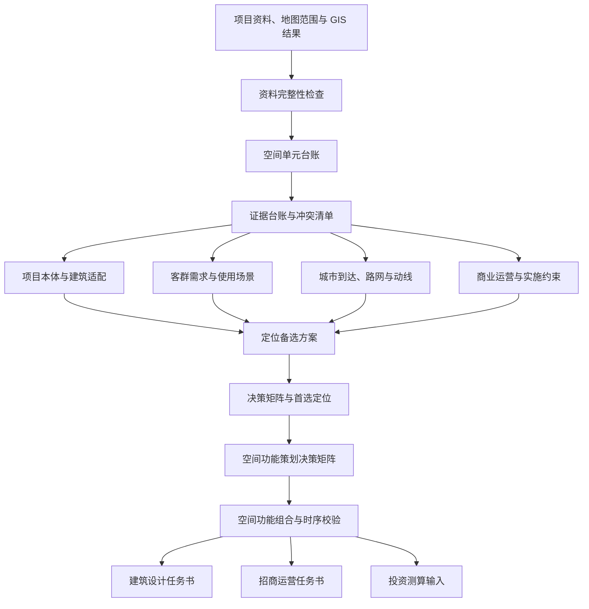

# 空间功能策划决策矩阵

> Spatial Programming Decision Matrix
> 城市更新 Stage 1 核心中间成果与 Skill 输出规范
> 更新时间：2026-07-11

## 1. 核心定义

**空间功能策划决策矩阵**是城市更新项目中，承接“项目诊断与定位决策”、并向“建筑设计、招商运营和投资测算”传递要求的核心中间成果。

它以项目中的空间系统、功能组团和建筑单体为对象，综合：

- 项目定位与更新目标；
- 历史文化价值；
- 建筑和场地条件；
- 产权、居民与保护约束；
- 客群需求与使用场景；
- 城市到达、路网和内部动线；
- 商业运营与公共价值；
- 工程改造和分期实施条件；
- 证据等级、风险与待验证事项。

对候选功能进行比较，形成：

> **现状诊断 → 改造目标 → 候选功能 → 首选与排除理由 → 空间配置 → 运营方式 → 实施条件 → 证据与验证动作**

它回答的不是简单的“这里放什么”，而是：

> **为什么需要从现状改成这样、为什么这个空间适合该功能、为什么选择它而不是其他功能，以及在什么条件下推荐才成立。**

---

## 2. 在城市更新工作流中的位置

空间功能策划决策矩阵不应在资料读取后直接生成。它位于定位决策之后、建筑设计之前，必须使用前序分析的结构化成果。



系统层次可表达为：

```text
数据与资料层
    ↓
城市和项目分析层
    ↓
空间理解与定位决策层
    ↓
空间功能策划决策矩阵
    ↓
建筑设计 / 招商运营 / 投资测算
```

---

## 3. 与普通“功能表”的区别

### 3.1 普通功能表

普通功能表通常只有：

| 空间 | 建议功能 | 客群 | 运营 | 改造 |
|---|---|---|---|---|
| 礼堂 | 文化中心 | 青年、居民 | 演出活动 | 声光升级 |

这种表可以用于汇报摘要，但不能充分支持决策，因为它没有说明：

- 当前状态和问题是什么；
- 为什么必须改变；
- 为什么该空间适合该功能；
- 为什么不选择其他功能；
- 客群是否真的会来；
- 路网和动线是否支持；
- 建筑、产权、消防和居民约束是否允许；
- 推荐在哪些条件下才成立；
- 判断依据来自事实、代理指标还是策划假设。

### 3.2 决策矩阵

决策矩阵必须形成完整因果链：

```text
项目事实与更新目标
    +
空间和建筑适配条件
    +
客群需求与使用场景
    +
城市到达与内部动线
    +
运营价值和实施约束
    ↓
候选功能比较
    ↓
首选、兼容、备选与排除功能
    ↓
成立条件、风险和验证动作
```

因此：

- **简表是展示层**；
- **完整矩阵是决策层**；
- **证据台账是可信度基础**。

---

## 4. 空间对象的三级体系

“一路”“一院”“一园”和礼堂、县委楼等建筑不属于同一抽象层级，不能直接作为同类对象进行评分和比较。矩阵应建立三级空间体系。

### 4.1 系统层

系统层描述项目总体空间结构和开放逻辑，例如：

- **一路**：城市界面、公共到达和项目认知系统；
- **一院**：历史院落、公共文化和核心体验系统；
- **一园**：住宅花园、居民日常和社区共生系统。

系统层重点回答：

- 三个系统分别承担什么总体角色；
- 游客、居民、后勤和消防如何分流；
- 白天、夜间和平时、活动时的开放边界；
- 三者如何连接为完整体验。

### 4.2 组团层

组团层描述多个空间单元如何协同，例如：

- 礼堂—三个庭院公共文化组团；
- 县委楼—档案楼历史内容组团；
- 沿街轻消费和服务组团；
- 住宅花园社区共生组团。

组团层重点回答：

- 核心功能、配套功能和后勤功能是否完整；
- 客群是否能形成连续体验；
- 引流、收入、公共服务和品牌功能是否平衡；
- 组团能否在某一实施阶段独立运营。

### 4.3 单元层

单元层描述具体建筑、庭院、入口或公共空间，例如：

- 礼堂；
- 县委楼；
- 民政楼；
- 宣教楼；
- 农水楼；
- 档案楼；
- 活动中心；
- 潘家坪路入口；
- 三个庭院；
- 住宅花园。

单元层重点回答具体功能、建筑适配、运营方式、工程改造和实施条件。

示意结构：

```text
项目总体
├─ 一路：城市界面与到达系统
├─ 一院：历史院落与公共文化系统
│  ├─ 县委楼
│  ├─ 礼堂
│  ├─ 宣教楼
│  ├─ 民政楼
│  └─ 三个庭院
└─ 一园：住宅花园与社区共生系统
   ├─ 住宅楼
   ├─ 宿舍楼
   ├─ 社区花园
   └─ 居民出入系统
```

---

## 5. 输出成果：三张关联表

不建议将所有信息塞入一张超宽表。Skill 应输出三张通过稳定空间单元 ID 关联的表。

## 5.1 表一：空间单元基础诊断表

该表描述“空间本身是什么”，不直接给出未经比较的功能结论。

| 字段组 | 字段 | 说明 |
|---|---|---|
| 识别 | 空间单元 ID、名称、类型、所属系统、所属组团 | 建立稳定空间对象 |
| 现状 | 当前功能、使用状态、开放状态、产权状态 | 区分空置、使用中、低效使用和权属不清 |
| 建筑 | 面积、层数、结构、层高、开间、出入口 | 判断物理适配性 |
| 保护 | 保护等级、历史价值、特色要素、允许改造范围 | 判断保存与介入边界 |
| 空间 | 临路条件、庭院关系、可见性、公共性、界面条件 | 判断空间角色 |
| 工程 | 结构、消防、水电、排污、暖通、无障碍 | 识别功能落地条件 |
| 约束 | 居民、噪声、后勤、审批、成本和施工影响 | 识别不可忽略的硬约束 |
| 证据 | 来源、页码、年份、证据等级、冲突事项 | 保证可追溯性 |

### 表一输出原则

- 事实未知时明确标记“待核验”，不得模型补全；
- 多份资料冲突时保留冲突项，不得自行选择一个数字；
- GIS 数据和项目文件使用不同来源类型；
- 建筑适配结论必须能追溯到具体建筑条件。

---

## 5.2 表二：空间功能策划决策表

这是 Spatial Programming Decision Matrix 的核心表。

### A. 空间现状与变化逻辑

| 字段 | 回答的问题 |
|---|---|
| 空间单元 ID | 决策对象是谁？ |
| 当前角色 | 现在承担什么作用？ |
| 当前功能与状态 | 当前如何使用，是否空置或低效？ |
| 核心价值 | 哪些历史、建筑或空间价值必须保留？ |
| 核心问题 | 当前为什么不适配未来使用？ |
| 改造必要性 | 为什么需要改变，而不是维持现状？ |
| 改造目标 | 此次更新希望解决什么问题？ |
| 未来空间角色 | 在项目总体定位中承担什么战略作用？ |
| 功能变化摘要 | 从什么状态转变为什么状态？ |

### B. 候选与推荐功能

| 字段 | 回答的问题 |
|---|---|
| 候选功能 | 该空间有哪些合理方向？ |
| 首选功能 | 综合比较后推荐什么？ |
| 配套功能 | 首选功能需要哪些辅助功能？ |
| 兼容功能 | 哪些功能可以复合或分时使用？ |
| 排除功能 | 明确不建议什么？ |
| 排除理由 | 为什么不建议？ |
| 备选功能 | 首选条件不成立时采用什么？ |
| 功能切换条件 | 什么变化会导致推荐方案改变？ |

### C. 项目本体依据

| 字段 | 回答的问题 |
|---|---|
| 总体定位依据 | 如何服务项目首选定位？ |
| 历史文化依据 | 原有功能、历史事件和集体记忆如何支撑？ |
| 建筑适配依据 | 面积、结构、层高、开间和出入口是否适合？ |
| 保护适配依据 | 是否符合最小干预和可逆更新原则？ |
| 空间关系依据 | 与入口、庭院、道路和其他建筑如何协同？ |
| 产权使用依据 | 是否具备开放、改造和统一运营条件？ |
| 工程审批依据 | 消防、结构、机电和保护审批是否允许？ |
| 项目矛盾响应 | 如何响应保护、商业、居民和公共价值矛盾？ |

### D. 客群与需求依据

“青年、游客、居民”等宽泛标签不足以支持决策，必须形成具体使用场景。

| 字段 | 回答的问题 |
|---|---|
| 核心客群 | 主要为谁服务？ |
| 次级客群 | 还可能服务谁？ |
| 到访动机 | 为什么来？ |
| 到访时间 | 工作日、周末、白天还是晚间？ |
| 到访方式 | 步行、公交、地铁、网约车还是自驾？ |
| 停留时长 | 短停、1小时、半日还是全天？ |
| 使用频率 | 每日、每周、偶发还是节庆型？ |
| 需求场景 | 到达后具体做什么？ |
| 支付方式 | 公共免费、低客单、高频消费、课程或活动付费？ |
| 空间需求 | 对座椅、遮阴、亲子、安静、卫生间等有什么要求？ |
| 客群证据 | 哪些人口、POI、访谈、观察或竞品数据支撑？ |
| 需求状态 | 已验证、强信号、代理信号还是待验证假设？ |
| 需求缺口 | 还需要补充什么调查？ |

建议使用场景化描述，例如：

> 周末白天陪同儿童参加文化课程、预计停留 1—2 小时的周边社区家庭。

而不是只写：

> 亲子家庭。

### E. 城市到达、路网与内部动线依据

路网节点总数、道路密度等宏观指标不能直接证明某个空间适合商业或文化功能。路网判断必须落到真实到达路径和空间关系。

| 字段 | 回答的问题 |
|---|---|
| 城市到达角色 | 是入口、目的地、转换节点还是途经空间？ |
| 周边锚点联系 | 与省博、医院、公园、办公和社区如何连接？ |
| 公共交通可达 | 距公交、地铁和落客点多远？ |
| 步行路径 | 用户从哪个入口、沿哪条路线到达？ |
| 绕行与阻隔 | 是否存在过街、围墙、坡度或不连续界面？ |
| 项目入口角色 | 游客、居民、后勤分别使用哪个入口？ |
| 内部游线角色 | 位于主轴、支线、游线高潮还是居民日常动线？ |
| 可见性与识别性 | 首次到达时是否容易发现？ |
| 停留与聚集条件 | 是否适合排队、等候、休息和活动集散？ |
| 后勤可达 | 货运、装卸、设备和垃圾清运是否可达？ |
| 消防与疏散 | 消防车道和活动散场是否满足要求？ |
| 无障碍连续性 | 从入口到空间是否连续无障碍？ |
| 动线冲突 | 游客、居民、后勤和消防是否冲突？ |
| 路网证据 | 等时圈、整合度、选择度、路径分析和实地观察 |
| 路网缺口 | 哪些路径必须现场验证？ |

允许使用的分析指标包括：

- 步行等时圈；
- 路网整合度与选择度；
- 绕行系数；
- 主要路径经过率；
- 入口到核心节点距离；
- 界面连续度；
- 道路过街阻抗；
- 无障碍连续性。

但指标只能作为空间潜力证据，不能跳过建筑、客群和运营条件直接生成确定性功能结论。

### F. 运营与价值逻辑

| 字段 | 回答的问题 |
|---|---|
| 价值角色 | 主要承担引流、收入、公共服务、品牌还是内容生产？ |
| 运营主体 | 政府、平台公司、专业机构、商户还是社区？ |
| 运营方式 | 自营、租赁、联营、合作还是公共采购？ |
| 内容来源 | 谁持续提供展览、活动、课程或商品？ |
| 时间策略 | 白天、夜间、工作日和周末如何使用？ |
| 活动频率 | 日常、高频、周末、月度还是节庆型？ |
| 收益方式 | 租金、票务、课程、活动、零售或品牌合作？ |
| 公共价值 | 提供哪些非直接收益的城市或社区价值？ |
| 协同空间 | 与哪些建筑、庭院和商业形成体验闭环？ |
| 运营成本项 | 人员、安保、维护、内容、设备和协调成本有哪些？ |
| 运营风险 | 招商、成本、扰民、季节性和内容供给风险是什么？ |
| 运营验证 | 需要访谈、试运营或市场测试什么？ |

### G. 改造与实施条件

| 字段 | 回答的问题 |
|---|---|
| 改造原则 | 保护、修缮、可逆植入还是弹性更新？ |
| 必要工程 | 结构、消防、机电、排污、声学和无障碍需要什么？ |
| 改造强度 | 低、中还是高？ |
| 改造成本等级 | 相对成本压力如何？ |
| 实施阶段 | 先导、一期、二期还是远期？ |
| 前置条件 | 哪些条件不满足就不能实施？ |
| 试运营方式 | 是否可先用临时活动验证？ |
| 监测指标 | 试运营观察什么？ |
| 退出或调整机制 | 验证失败后如何调整？ |

### H. 决策解释与可信度

| 字段 | 回答的问题 |
|---|---|
| 推荐理由 | 为什么推荐该功能？ |
| 不选其他功能的原因 | 为什么不是其他候选功能？ |
| 关键证据 | 最关键的 3—5 条证据是什么？ |
| 关键假设 | 哪些判断尚未得到证实？ |
| 主要风险 | 什么最可能导致建议失败？ |
| 推荐强度 | 强推荐、有条件推荐、备选、暂缓或不建议？ |
| 证据等级 | 当前依据可靠程度如何？ |
| 综合置信度 | 对推荐结论的可靠程度如何？ |
| 下一步验证 | 需要完成什么才能形成正式决策？ |

---

## 5.3 表三：空间功能组合与时序校验表

单个空间功能合理，不代表项目整体组合合理。该表从项目和组团层检查功能结构、运营闭环和实施时序。

| 字段 | 说明 |
|---|---|
| 空间系统或组团 | 被校验的整体对象 |
| 核心功能 | 组团主要承担什么？ |
| 引流功能 | 哪些内容吸引首次到访？ |
| 收入功能 | 哪些空间承担持续收入？ |
| 公共功能 | 哪些空间承担社区和城市公共服务？ |
| 高频日常功能 | 什么保证平日持续使用？ |
| 低频活动功能 | 什么承担演出、发布和节庆？ |
| 内容生产功能 | 谁持续生产文化和活动内容？ |
| 配套与后勤 | 管理、设备、仓储、卫生间和装卸是否完整？ |
| 日间场景 | 白天形成什么体验？ |
| 夜间场景 | 夜间形成什么体验？ |
| 核心客群组合 | 各空间是否服务互补客群？ |
| 动线组织 | 客流是否形成连续体验？ |
| 居民边界 | 哪些空间、时间和活动不得干扰住宅？ |
| 一期闭环 | 一期能否独立形成到达、体验、消费和离场闭环？ |
| 功能重复 | 是否出现多个同质展馆或商业空间？ |
| 功能缺口 | 是否缺少收入、后勤、休息或公共服务？ |
| 实施时序 | 哪些先做，哪些等待前置条件？ |
| 组合结论 | 通过、有条件通过或需重新配置 |

该表应防止：

- 全部空间都做展馆；
- 全部空间都是低收益公共文化；
- 餐饮商业比例过高；
- 缺少管理、仓储、设备和公共卫生间；
- 夜间活动集中在居民住宅附近；
- 一期只有单点改造，无法形成完整体验；
- 不同建筑争夺同一客群和同一运营内容。

---

## 6. “为什么这么改”的标准解释框架

每项功能建议必须按照统一顺序解释，避免 AI 只给出顺滑但不可审计的理由。

### 6.1 标准因果链

```text
现状是什么
    ↓
什么价值必须保留
    ↓
当前存在什么问题
    ↓
项目总体希望解决什么
    ↓
该空间具备哪些适配条件
    ↓
哪些客群在什么场景下需要它
    ↓
城市到达与内部动线是否支持
    ↓
功能如何产生公共或商业价值
    ↓
为什么首选该功能
    ↓
为什么排除其他功能
    ↓
推荐在哪些条件下成立
```

### 6.2 必须分别说明的五类依据

1. **项目依据**：定位、历史、建筑、保护、产权和项目矛盾；
2. **客群依据**：人群、动机、时间、停留、支付和需求证据；
3. **路网依据**：城市到达、入口、内部游线、停留、后勤和冲突；
4. **运营依据**：价值角色、主体、内容、频率、收益和成本；
5. **实施依据**：工程、审批、居民、分期和验证条件。

缺少任一关键依据时，不得输出无条件的确定性推荐。

---

## 7. 证据类型与表达规则

每条关键依据应关联 EvidenceNode，并标明证据类型。

| 标记 | 类型 | 示例 |
|---|---|---|
| F | 项目事实 | 建筑面积、保护身份、产权和现状使用 |
| G | GIS 或空间分析 | 等时圈、路径、人口和 POI 统计 |
| P | 代理指标 | 夜光、POI 密度、H3 gap_score |
| H | 策划假设 | 游客可能延长停留、活动可能带来复访 |
| V | 待验证事项 | 实际客流、支付意愿、结构和消防条件 |

### 7.1 EvidenceNode 建议字段

```json
{
  "evidence_id": "ev-001",
  "type": "F",
  "subject_id": "space-auditorium",
  "claim": "礼堂具有原行政集会公共属性",
  "source_name": "原长沙县政府历史建筑调查资料",
  "source_locator": "第 18—21 页",
  "data_year": "2025",
  "analysis_scope": "项目红线内",
  "method": "文档事实抽取",
  "confidence": "high",
  "limitations": []
}
```

### 7.2 禁止事项

- 不得把夜光解释为消费金额；
- 不得把 POI 密度解释为经营坪效；
- 不得把 H3 gap_score 解释为开店成功概率；
- 不得把周边人口直接解释为项目客流；
- 不得把靠近省博物馆直接解释为能够承接游客；
- 不得用多个弱代理指标堆叠成高置信度结论；
- 不得隐藏资料冲突或使用无来源精确数字；
- 不得把策划假设写成已确认事实。

---

## 8. 推荐强度与决策状态

推荐结果应使用稳定枚举，而不是只有“推荐/不推荐”。

| 状态 | 含义 |
|---|---|
| 强推荐 | 关键证据充分，主要硬约束已确认可满足 |
| 有条件推荐 | 方向合理，但必须满足明确前置条件 |
| 备选 | 具备部分适配性，优先级低于首选方向 |
| 暂缓判断 | 关键事实或工程条件缺失，当前不能决策 |
| 不建议 | 与保护、建筑、客群、动线或运营条件明显冲突 |

置信度应与推荐强度分开：

- 推荐强度表示“是否值得选择”；
- 置信度表示“判断依据是否可靠”。

例如：

> 礼堂复合公共文化空间：有条件推荐，当前置信度中等。

这意味着方向值得优先验证，但仍需结构、消防、声学和运营需求证据。

---

## 9. Skill 的硬性生成规则

空间功能策划决策矩阵应作为 `urban-strategy-stage1` 或相应城市更新 Skill 的强制输出契约。

### 规则 1：禁止从资料直接跳到功能

每项首选功能必须具备：

- 项目本体依据；
- 客群与场景依据；
- 路网与动线依据；
- 建筑和保护适配依据；
- 运营价值依据；
- 前置条件与验证事项。

关键项缺失时，只能输出候选功能或暂缓判断。

### 规则 2：关键空间至少比较两个候选功能

每个关键空间单元必须包含：

- 一个首选功能；
- 至少一个备选功能；
- 至少一个排除功能；
- 首选和淘汰理由。

### 规则 3：客群必须场景化

禁止只写“青年、游客、居民、亲子”。必须描述：

- 到访动机；
- 到访时间；
- 停留时长；
- 使用频率；
- 支付或公共服务方式；
- 需求是否经过验证。

### 规则 4：路网必须落实到真实路径

禁止只写“交通便利、路网密度高、可达性好”。必须说明：

- 从哪个城市锚点和入口到达；
- 沿哪条路径进入；
- 位于主游线还是支线；
- 是否存在绕行和阻隔；
- 是否适合停留和集散；
- 是否与居民、后勤、消防冲突。

### 规则 5：明确事实、代理指标和假设

所有关键依据必须标记 F、G、P、H 或 V。代理指标不得越界为经营事实。

### 规则 6：所有推荐附带成立条件

例如：

> 礼堂有条件推荐复合公共文化功能；成立条件为结构、疏散、声学、装卸和夜间噪声边界满足运营要求。

不得只写“推荐文化中心”。

### 规则 7：项目整体必须做功能平衡检查

至少检查：

- 引流、收入、公共服务和品牌功能；
- 高频日常与低频活动；
- 白天与夜间；
- 游客与居民；
- 前台体验与后台配套；
- 一期独立运营能力。

### 规则 8：过期计划必须转换为当前状态

历史资料中的计划日期如果早于当前日期，必须标记为：

- 已完成并补充成果；
- 未完成并说明延期；
- 状态未知并列为核验事项。

不得继续将历史计划写成未来动作。

### 规则 9：审计失败不得伪装成完成

如果矩阵缺少关键证据、候选比较或前置条件，Skill 应返回结构化缺口和补充任务，不得生成确定性功能配置表。

---

## 10. 项目示例：原县政府礼堂

以下示例用于说明矩阵深度，不代表未经验证的最终项目结论。

| 决策项 | 内容 |
|---|---|
| 空间单元 | 原县政府礼堂 |
| 当前状态 | 历史行政集会建筑；当前使用和结构安全状态待核验 |
| 核心价值 | 大院集体记忆、公共仪式性、大跨空间、项目视觉与精神焦点 |
| 核心问题 | 原行政集会功能消失；消防、设备、声学、无障碍和后勤可能不符合现代运营要求 |
| 改造必要性 | 单一低频行政使用难以支撑更新后的公共开放与持续运营 |
| 改造目标 | 保留礼堂公共性与集体记忆，转化为可持续使用的复合公共文化空间 |
| 未来角色 | 项目文化锚点与主要目的性到访节点 |
| 候选功能 | 静态县史展馆、文化演艺空间、发布会议中心、社区文化中心、复合活动空间 |
| 首选功能 | 复合公共文化与活动空间 |
| 兼容功能 | 小型演出、城市发布、主题展览、社区活动和周末室内活动 |
| 备选功能 | 以公共展览和社区活动为主的低设备负荷文化空间 |
| 排除功能 | 重餐饮、大型夜店和高设备荷载娱乐 |
| 项目依据 | 礼堂具有较强公共属性和象征性，未来公共文化使用与原功能存在连续性 |
| 建筑依据 | 大空间适合弹性活动，但结构、疏散、后台和设备安装条件必须复核 |
| 核心客群 | 周末参与社区文化活动的家庭；参加小型演出和发布活动的青年及机构客群 |
| 客群缺口 | 缺少活动付费意愿、机构租赁需求和可持续活动频率调查 |
| 城市到达角色 | 项目内部目的地，不宜仅依赖自然经过客流 |
| 内部游线角色 | 位于东西向院落序列的重要节点，可作为游线高潮 |
| 路网缺口 | 西侧入口可用性、潘家坪路到礼堂的识别性和无障碍连续性需实测 |
| 运营价值 | 文化引流、项目品牌和活动收入，不应独自承担全部现金流 |
| 运营方式 | 统一运营；公共文化时段与商业活动时段分开 |
| 时间策略 | 白天展览和参观，晚间小型活动；大型夜间活动受居民噪声边界约束 |
| 改造原则 | 保留原空间尺度和历史界面；设备可逆植入；优先补齐消防、声学和无障碍 |
| 前置条件 | 结构鉴定、消防疏散、噪声评估、后台装卸方案和运营主体确认 |
| 为什么首选 | 延续原礼堂公共属性，形成项目目的地，提高空间复用率，并可与三个庭院联动 |
| 为什么不做纯展馆 | 纯静态展览的复用率和重复到访可能不足，且其他建筑可承担部分历史展示 |
| 为什么不做重商业 | 保护、消防、油烟、设备和居民扰动条件不支持高强度商业 |
| 推荐强度 | 有条件推荐 |
| 当前置信度 | 中等 |
| 验证动作 | 建筑检测、活动需求访谈、噪声测试和临时文化活动试运营 |

### 10.1 示例中的证据边界

- 礼堂的历史公共属性属于项目事实或文档证据；
- 其作为游线高潮需要平面、入口和现场路径验证；
- 青年演出需求属于待验证的客群假设；
- 活动收入属于运营假设，不能在缺少频率和成本时计算确定收益；
- 最终功能建议必须根据结构、消防、居民和运营主体调查更新。

---

## 11. 项目整体组合示例

| 字段 | 礼堂—三院公共文化组团示例 |
|---|---|
| 核心功能 | 公共文化、历史体验和复合活动 |
| 引流功能 | 项目历史展示、礼堂主题活动和院落公共事件 |
| 收入功能 | 活动租赁、轻餐、文创和课程；具体比例待测算 |
| 公共功能 | 社区文化、休息、导览和公共活动 |
| 高频日常功能 | 展示、阅读、茶饮、社区使用 |
| 低频活动功能 | 演出、发布、节庆和主题市集 |
| 配套与后勤 | 管理、仓储、设备、卫生间、装卸和垃圾清运待落实 |
| 日间场景 | 历史参观、研学、休息和轻消费 |
| 夜间场景 | 小型演出和社区活动，开放范围不进入住宅花园 |
| 核心客群 | 社区家庭、文化游客、青年和机构活动客群 |
| 动线组织 | 城市入口—院落体验—礼堂目的地—配套消费—离场 |
| 居民边界 | 控制夜间时间、声级、散场路径和后勤路线 |
| 一期闭环 | 需同时具备入口识别、核心活动、基础服务和公共卫生间 |
| 主要缺口 | 运营主体、停车接驳、后勤、活动需求和居民管理边界 |
| 组合结论 | 有条件成立，需先完成建筑与运营前置验证 |

---

## 12. 前端呈现建议

完整矩阵字段较多，不应直接显示为一张横向超宽表。建议采用“管理层总表 + 单元展开详情 + 证据抽屉”。

### 12.1 管理层总表

| 空间单元 | 未来角色 | 首选功能 | 核心客群 | 动线角色 | 价值角色 | 推荐强度 | 关键前提 |
|---|---|---|---|---|---|---|---|
| 礼堂 | 文化锚点 | 复合公共文化空间 | 社区家庭、青年、机构 | 主游线目的地 | 引流+活动 | 有条件推荐 | 结构、消防、噪声 |
| 县委楼 | 历史内容核心 | 县史与行政记忆展示 | 游客、研学 | 院落主节点 | 内容+品牌 | 有条件推荐 | 内容和工程条件 |
| 一园 | 社区共生系统 | 居民共享花园 | 居民家庭 | 居民日常动线 | 公共服务 | 待产权核验 | 权属与管理边界 |

总表用于快速比较，不代替完整决策信息。

### 12.2 单元展开详情

点击空间单元后依次展示：

1. 现状、价值和改造目标；
2. 候选、首选、兼容和排除功能；
3. 项目本体依据；
4. 客群与使用场景；
5. 城市到达、路网和内部动线；
6. 运营和价值逻辑；
7. 改造与实施条件；
8. 证据、假设和冲突；
9. 推荐强度、风险和验证动作。

### 12.3 地图联动

- 点击表格行，高亮对应建筑、庭院或路径；
- 点击地图空间，定位到矩阵详情；
- 在地图中区分系统层、组团层和单元层；
- 展示主要游客、居民、后勤和消防动线；
- 支持切换“现状”“建议功能”“推荐强度”“风险”和“实施阶段”图层。

### 12.4 证据抽屉

关键结论旁显示证据标记。点击后展示：

- 来源文件和页码；
- GIS artifact；
- 数据年份和分析范围；
- 计算方法；
- 证据等级；
- 局限和冲突；
- 待验证动作。

---

## 13. 建议的结构化输出契约

Skill 内部应先生成结构化数据，再编译为 Markdown 报告和前端视图。示例结构：

```json
{
  "matrix_version": "1.0",
  "project_id": "project-id",
  "positioning_option_id": "preferred-option-id",
  "spatial_hierarchy": [],
  "space_diagnostics": [],
  "space_decisions": [
    {
      "space_id": "space-auditorium",
      "current_state": {},
      "change_logic": {},
      "candidate_functions": [],
      "preferred_function": {},
      "compatible_functions": [],
      "excluded_functions": [],
      "project_rationale": {},
      "audience_scenarios": [],
      "access_and_movement": {},
      "operation_strategy": {},
      "renovation_and_delivery": {},
      "decision_explanation": {},
      "evidence_refs": [],
      "assumptions": [],
      "validation_actions": [],
      "recommendation_status": "conditional",
      "confidence": "medium"
    }
  ],
  "portfolio_checks": [],
  "evidence_ledger_ref": "evidence-ledger-id",
  "audit": {}
}
```

### 13.1 稳定契约原则

- 使用稳定 ID 关联空间、证据和定位方案；
- 不在表格单元格里保存无法解析的混合长文本；
- 推荐状态、证据类型和置信度使用受约束枚举；
- 事实、推演、风险和验证事项分开存储；
- 报告、地图和设计任务书都从同一结构化结果生成；
- 不为旧的临时字段保留双字段兼容。

---

## 14. 质量审计清单

矩阵生成后必须执行以下检查。

### 14.1 空间完整性

- 是否覆盖全部关键空间系统、组团和单元；
- 是否存在抽象层级混用；
- 是否遗漏入口、庭院、后勤和公共配套；
- 是否给每个空间分配了稳定 ID。

### 14.2 决策完整性

- 每个关键空间是否有至少两个候选功能；
- 是否有首选、备选和排除理由；
- 是否解释从现状改变的必要性；
- 是否列出成立条件和失败后的调整方式。

### 14.3 客群完整性

- 是否将客群写成具体使用场景；
- 是否说明到访时间、频率和停留；
- 是否区分已验证需求和策划假设；
- 是否把周边人口直接等同于项目客流。

### 14.4 路网完整性

- 是否描述城市锚点、入口和内部路径；
- 是否说明游客、居民、后勤和消防动线；
- 是否检查道路阻隔、绕行和无障碍；
- 是否使用宏观节点数替代真实路径判断。

### 14.5 运营完整性

- 是否明确空间的价值角色；
- 是否说明运营主体和内容来源；
- 是否考虑日常与活动、白天与夜间；
- 是否讨论运营成本和居民扰动；
- 是否将收入类别清单伪装为商业可行性。

### 14.6 证据完整性

- 所有关键结论是否有 EvidenceNode；
- 是否标记 F、G、P、H、V；
- 是否包含来源、页码、年份和范围；
- 是否暴露资料冲突；
- 是否存在无来源的精确数字；
- 是否把代理指标越界解释为经营事实。

### 14.7 组合完整性

- 引流、收入、公共服务和后勤是否平衡；
- 是否出现功能重复；
- 一期能否形成独立运营闭环；
- 夜间功能是否与住宅边界冲突；
- 各组团是否服务项目首选定位。

---

## 15. 验收标准

一个合格的空间功能策划决策矩阵应满足：

1. 能解释每个关键空间“为什么要改”；
2. 能解释“为什么改成这个功能”；
3. 能解释“为什么不是其他功能”；
4. 能明确推荐成立的前置条件；
5. 能将项目本体、客群、路网、运营和工程依据分别展示；
6. 能区分事实、GIS 结果、代理指标、策划假设和待验证事项；
7. 能从总表下钻到空间单元和 EvidenceNode；
8. 能在地图上对应到具体建筑、庭院、入口和路径；
9. 能检查项目整体功能组合和实施时序；
10. 能直接转化为建筑设计、招商运营和投资测算的输入，而不要求下游重新猜测策划逻辑。

---

## 16. 最终结论

空间功能策划决策矩阵不是普通的建筑功能分配表，也不是 AI 根据经验生成的业态清单。它是城市更新项目从分析走向设计和运营的决策桥梁。

其核心价值在于把：

> **空间载体、项目价值、客群需求、路网动线、运营逻辑、实施约束和证据可信度**

转化为：

> **可比较、可解释、可验证、可追溯、可下游执行的空间功能决策。**

对本项目而言，“一路—一院—一园”可以作为总体空间结构，但必须进一步拆分系统层、组团层和单元层。礼堂、县委楼、庭院、沿街界面和住宅花园的功能不能仅凭建筑名称或策划经验指定，而应通过统一矩阵解释其现状、改变原因、客群场景、真实动线、运营角色、排除方案和成立条件。

最终对外可以展示一张简洁的管理层功能总表，但 Skill 内部必须保留完整决策矩阵和证据链。只有这样，后续建筑设计、招商运营和投资测算才能基于同一套清晰、稳定且可审计的项目逻辑继续推进。
