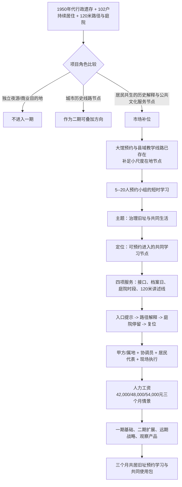

# 长沙县政府原址城市更新：从共居旧址到可运行文化节点的决策推演

## 执行摘要

**项目命题。** 将长沙县政府原址建设为**居民共生、可预约进入的县城治理旧址解释与共同学习节点**。一期不以商业街区或大馆开业为目标，而以一条 120 米旧址讲述线、一处可排期庭院、四项服务单元和一套共同使用机制，服务 5--20 人的组织化小组与院内居民。

**一期建议。** 批准三个月“共居旧址预约学习与共同使用包”：由甲方或属地授权、具名协调员统筹、居民代表参与排期，交付故事卡、预约导览、档案日和庭院时段。两名人员的三个月工资参考为 42,000 元、48,000 元、54,000 元三个情景；导视、移动家具、内容编目与预约工具以明确规格进行本地询价后纳入总概算。

### 项目为什么值得做

长沙县政府原址并不是一组等待填充业态的老建筑。这里保留了 1950 年代行政及配套遗存、从县政府大门到县委楼约 120 米的连续路径、礼堂西侧三处庭院，以及仍高入住率的 102 户住宅。若只把它当作闲置资产，历史建筑会继续与居民生活彼此消耗；若直接导入夜游、餐饮街区或大体量固定展陈，又会把一处共同生活的院落推向不相称的使用强度。

项目的机会在于：让治理旧址不再只是被动保存的背景，而成为周边社区、学校、机关和党群组织可以预约使用的现场。它为居民带来有秩序的共同使用与参与机会，为组织学习网络补上一段不被大馆替代的在地场景，也为甲方提供一条从轻量运营开始、再逐步配置专业资源的更新路径。

### 项目建成后如何运转

以一个拟定工作日下午为例：一支 12 人的社区与学校联合学习小组提前预约“治理旧址与共同生活”主题。协调员确认人数、时段和庭院安排；成员抵达入口后完成核验，沿 120 米路径阅读故事卡、听取导览，在排期庭院内讨论一段居民授权的生活记忆。现场执行人员收拢可移动物料、恢复庭院，组织者提交反馈并预订下一次活动。居民不是被活动绕开的背景，而是通过同一张时间表参与内容确认与共同使用。

### 方案作为一个系统

主题“治理旧址与共同生活”把行政建筑、居民记忆和当下使用串成一件事；故事卡、档案日、庭院时段与 120 米导览把主题变成可体验服务；入口提示、路径解释和可复位庭院让服务有落点；甲方、协调员、居民代表与现场执行人员通过“预约 -> 确认 -> 现场 -> 复位 -> 反馈”共同交付。附近成熟的餐饮、购物与日常服务承接短停需求，项目将自身资源聚焦在独有的解释与共同学习体验上。

### 请决事项

请甲方、政府或投资主体批准一期主角色与三个月服务范围，明确授权与协调主体、居民协同名单、可使用的入口/路径/庭院时段、预约规则和轻量采购事项；以两名人员工资情景作为人力询价基准，并在三个月结束时审阅预约、使用、授权、复位和反馈记录，决定二期课程化、线路协作和专项空间投入。

## 顶层决策推演图

## 1. 项目角色：先做一处可共同使用的治理旧址节点

项目起点是让保护建筑、三栋高入住率住宅和老化设施共同发挥价值，而不是为既定业态寻找理由。场地既有 120 米连续步行路径与三处庭院，也有 102 户居民的日常生活。把它直接塑造成独立文旅目的地或夜游商业街区，会把客流、夜间消费和连续商业运营压在仍需解决居住、消防与基础设施问题的院落上；0--500 米范围内旅游 POI 仅 3 个，近域却已有充分的餐饮、购物和公司供给。

“城市历史线路节点”有行政旧址线的资源基础，但还没有已签约线路、专门课程和接待班组。相比之下，潮宗街以共同营造社连接政府、学校、科研、服务与志愿者的实践，提供了“共同使用的历史场所”所需组织机制的参照。因此一期选择居民共生的历史解释与公共文化服务节点，城市历史线路节点作为后续可叠加方向。这一角色要求下一步回答：周边已有服务中，项目要补上什么具体环节。

## 2. 市场补位：不是再造一座展馆，而是补足一段在地学习服务

中国共产党长沙历史馆实行实名预约、提前 1--7 天预约、5 人以上团队预约和到场核验，已形成成熟的到馆服务。长沙县 2025 年形成 24 个县级现场教学点和 18 条主题线路，组织化在地学习已有网络。与此同时，项目 0--500 米范围内已有 227 个餐饮 POI、117 个购物 POI、158 个公司 POI，附近日常服务足以承接短停与餐饮。

项目不必复制大馆或占用有限空间去重复餐饮零售，而应补足一段现有网络中尚未提供的服务：将行政旧址、持续居住与小规模组织学习放到同一场景里，形成可预约、可讲述的短时节点。这个市场选择直接推出下一步的客群结构和到访方式。

## 3. 客群与行为：把一次到访组织成不打扰日常的短时体验

首要使用者是由社区、学校、机关或党群组织带队的 5--20 人小组，触发情境包括基层治理、城市史、保护更新与社区共建的在地学习。一次到访依次完成主题与时段预约、入口核验与导览、120 米旧址讲述、庭院停留、复位与反馈。居民以共同使用者和内容授权者的身份进入同一张排期表。

这条行为链将项目从“等待散客的场所”转成“可被组织使用的服务”：产品按预约、短时和可复位组织，空间和运营也随之聚焦于一条路径、一处停留点和一次清晰的服务交付。它要求主题把行政旧址和今天的共同生活连接起来。

## 4. 主题提炼：让“治理旧址与共同生活”成为可持续更新的叙事

项目材料显示，8 栋保护建筑为 1950 年代行政及配套遗存，2024 年列为一般不可移动文物，2025 年纳入历史建筑；120 米路径、三个庭院与 102 户居民共同构成独有的现场。主题因此定为**“治理旧址与共同生活”**：县城治理如何在这里留下空间秩序，今天的人们又如何继续在同一处院落生活。

这一主题把建筑解读、居民记忆征集和组织学习合为同一条叙事。首批内容以故事卡为核心：每张卡连接一个空间点、一段治理或生活线索与可核对的材料来源。它为下一步的定位提供了可被导览、持续更新和共同参与的内容资产。

## 5. 项目定位：一座可预约进入、与居民共同运行的县城治理旧址

潮宗街共同营造的协同逻辑与长沙历史馆的预约机制，分别提供了共同参与和组织访问的服务参照。长沙县政府原址的不同之处，是连续行政遗存、仍在使用的住宅和可安静停留的庭院同时存在。

据此，项目定位为：**居民共生、可预约进入的县城治理旧址解释与共同学习节点，以小组到访、居民授权内容和可复位庭院服务周边组织网络。** 它让历史建筑从闲置或低效使用的资源转化为公共文化服务，让居民成为共同使用者和内容参与者，也让已有组织学习网络获得一段独有的现场。定位随后必须落实成具体服务单元。

## 6. 产品体系：四个服务单元共同交付一次完整体验

| 服务单元 | 使用者得到什么 | 现场动作与记录 |
| --- | --- | --- |
| 居民共用事项接口 | 组织者与居民知道何时、从何处、以何种方式共同使用院落 | 受理预约和事项，形成时间表与回应记录 |
| 授权记忆档案日 | 居民与参与者把生活记忆转为可使用的故事材料 | 征集、确认、编目故事卡和授权记录 |
| 安静共享庭院时段 | 小组获得可停留、可讨论的在地学习场景 | 分时使用、现场维护、复位与使用记录 |
| 120 米治理旧址讲述线 | 参与者在空间中理解县城治理与共同生活的关系 | 预约导览、路径讲述、反馈记录 |

接口先安排共同使用，档案日持续更新讲述内容，庭院为学习提供停留点，120 米路径把内容组织成可体验的现场。四个单元共同构成服务闭环，而不是相互孤立的活动清单。它们反推一期空间必须具备入口、路径、停留和复位四类能力。

## 7. 空间承载：先把一条路径和一处庭院运行起来

一期空间序列是：**主大门或第二入口的预约提示 -> 120 米主路径的分点解释 -> 一处经排期的庭院停留 -> 原路或分时离开。** 标识、移动家具和可撤除解释框架使入口、路径和庭院成为可运行的公共文化界面，并在每次活动后恢复日常状态。

项目中建筑间距较窄、视线组织受限，消防和首层退让需结构核验；墙体开裂、屋顶渗漏、管线老化及现代水电、排污、消防、无障碍设施不足，也决定一期先采用轻量界面和分时组织。保护修缮、机电消防和高载荷室内展陈由专项工作推进。这样的空间选择要求运营者能将居民事项、内容授权与现场动作排在同一张表中。

## 8. 运营组织：用一张排期表把居民、内容和到访连接起来

一期设置最小组织：甲方或属地负责授权与协调；项目协调员作为居民事项和预约排期的单一窗口；居民代表或楼栋联系人参与时间、事项与内容确认；内容与现场执行人员完成故事卡、导览、庭院复位和当次记录。所有服务共用“预约 -> 确认 -> 现场 -> 复位 -> 反馈”五步 SOP。

这套组织就是产品交付的骨架。接口让居民参与得到回应，内容执行让路径成为可讲述体验，复位让庭院在公共服务与日常生活之间稳定切换。下一步的资源配置首先服务于这两类人力动作。

## 9. 经济校核：先为能让系统运转的人力配置资金

长沙开福区公开招聘的活动策划岗位为 `7,000--9,000 元/月`，职责涵盖活动全流程策划、供应商整合、落地衔接和突发处理；同页关联职位显示长沙城市发展集团运营策划 `4,000--8,000 元/月`、活动策划 `7,000--9,000 元/月`。它可作为一期现场排期、活动执行、供应商协同和复位动作的工资参考。

| 工作包 | 数量与期限 | 低位 | 基准 | 高位 | 来源与口径 |
| --- | ---: | ---: | ---: | ---: | --- |
| 居民接口、预约排期、导览与复位协调 | 2 人 x 3 月 | 42,000 元 | 48,000 元 | 54,000 元 | 长沙开福区活动策划公开招聘，按 `7k/8k/9k 元/月`计算 |
| 故事卡编目与授权、可复位导视/移动家具、预约反馈工具 | 按一期规格 | 本地询价 | 本地询价 | 本地询价 | 本轮未取得与数量、材质或服务期限相匹配的公开成交单价 |

招聘月薪未标示税费，人员工资之外的雇主成本、管理费、专业文物修缮、消防设计与法律审查另行列入对应的采购或专业服务。资源顺序由此明确：先保证协调与交付能力，再依据服务规格配置内容、空间和数字工具。

## 10. 产品分期：把资源投向先能运行的四项基础服务

| 分类 | 产品 | 当前处理 |
| --- | --- | --- |
| 一期基础产品 | 居民共用事项接口、授权记忆档案日、安静共享庭院时段、120 米治理旧址讲述线 | 作为同一套预约学习服务运行 |
| 二期扩展产品 | 稳定的组织学习课程、与历史线路的协作 | 在一期形成使用记录并明确运营伙伴后扩展 |
| 远期战略产品 | 完整展馆、餐饮或酒店、沉浸式数字内容、大规模室内修缮 | 另行配置保护、消防、机电、招商与专业运营资源 |
| 保留观察产品 | 餐饮街区、夜游、大体量固定展陈 | 不纳入当前资源投放 |

分期不是把远期愿景放进一张清单，而是按资源成熟度决定投放顺序：一期先形成完整服务，二期将有效使用方式课程化、线路化，远期再投入重资产和专业运营。由此进入可上会的一期决策包。

## 11. 一期决策包：三个月共居旧址预约学习与共同使用包

| 决策组成 | 一期内容 |
| --- | --- |
| 目标使用者与场景 | 5--20 人预约小组在基层治理、城市史、保护更新或社区共建学习中进入；居民参与同一张排期表 |
| 内容与服务 | 授权故事卡、120 米路径导览、记忆档案日、安静庭院时段 |
| 空间与数字界面 | 入口预约提示、路径解释、可复位庭院界面、预约与反馈记录工具 |
| 运营主体与协同 | 甲方/属地授权协调；项目协调员统筹；居民代表或楼栋联系人确认事项；内容与现场执行人员交付与复位 |
| 三个月人力工资参考 | 低位 42,000 元；基准 48,000 元；高位 54,000 元。内容、轻量空间与数字工具按明确规格询价 |
| 运行记录 | 预约、到场、居民事项、内容授权、空间复位、组织反馈与下一次排期 |

本次请决应一次性确定具名协调责任人及协同名单、可开放的入口/路径/庭院时段、预约与分时规则、三个月轻量采购事项和运行记录审阅节点。三个月后，稳定的组织学习课程和历史线路协作可进入二期；完整展馆、餐饮酒店、沉浸式数字内容与大规模修缮仍按专项资源配置推进。

## 结论与来源

| 结论 | 数据与资料怎样参与判断 | 当前行动 |
| --- | --- | --- |
| 一期主角色是居民共生的治理旧址解释节点 | 102 户高入住住宅、120 米路径与庭院；潮宗街共同营造参照 | 先配置共同使用机制和小尺度公共文化服务 |
| 项目补足组织学习网络中的现场节点 | 长沙历史馆预约机制、长沙县 24 个教学点与 18 条线路；近域日常 POI 供给 | 面向预约小组交付短时学习体验，不复制大馆与餐饮零售 |
| 四项服务成为一期基础产品 | 客群行为链、现场空间条件与最小运营组织相互匹配 | 按预约、档案、庭院、导览四项单元运行 |
| 人力工资可先形成三情景参考 | 长沙开福区活动策划公开招聘 `7k--9k/月` | 以两人三个月 42,000/48,000/54,000 元作为工资询价锚点 |

**主要来源**

- 项目基本情况与改造愿景：`runtime/project-document-extracts.json#81ed6be77be64fee926ad7a2637ae154`、`#2c0d61f18fa3403c90fb5decbdb3b29b`
- 2024 空间结果：`runtime/spatial-metrics-latest-15266dd890faa567070befc1-2024.json`
- [湖南省政府：潮宗街共同营造](http://www.hunan.gov.cn/hnszf/hnyw/szdt/201912/t20191208_10802740.html)
- [中国共产党长沙历史馆参观预约](https://csdsg.com/channel/30482.html)
- [红星网：长沙县党员教育现场教学点与线路](https://www.hxw.gov.cn/content/2026/01/13/14851191.html)
- [开福区不可移动文物公开信息](http://www.kaifu.gov.cn/zfxxgk/fdzdgknr/zdmsxx/ggwhtyfw/202411/t20241112_11651717.html)
- [猎聘：长沙开福区活动策划岗位](https://www.liepin.com/job/1982337973.shtml)
